# New Domain Build — Windows Server 2022 Domain Controller & RBAC File Share — Part 1

| Field | Detail |
|---|---|
| **Ticket Subject** | Project request — set up central user management for a small office with no domain |
| **Category** | Infrastructure / Active Directory |
| **Priority** | P3 — Planned Project |
| **Environment** | Windows Server 2022 Standard Evaluation (Desktop Experience) in VMware Workstation Pro 17 — 2 vCPU, 2 GB RAM, 60 GB disk, NAT networking. Domain `lab.local`, server **RANA-DC01**. Built 10–11 Sep 2025 |

---

## Problem Statement

A small office has been running on stand-alone PCs: every user has a separate local account on every machine, passwords are managed one PC at a time, and shared files sit on individual desktops with no control over who can open them. Management has asked IT to introduce **central user management and controlled file sharing**.

This two-part lab delivers that project:

- **Part 1 (this document)** — build and prepare the server that will become the office's first **domain controller**.
- **Part 2** — install **Active Directory Domain Services**, create the domain, onboard the first user into a security group, and publish a department file share that only that group can read.

---

## Tools Used

- **VMware Workstation Pro 17** (server virtual machine)
- **Windows Server 2022 Setup** (edition selection and installation)
- **Server Manager** (renaming, Add Roles and Features)
- **Network Connections** (IPv4 Properties — static IP and DNS)
- **ipconfig** (confirming the address settings)

---

## Technical Steps

### Part A — Build the Server

### 1. Create the Virtual Machine

Ran the **New Virtual Machine Wizard** in VMware Workstation Pro and selected the **Windows Server 2022 Evaluation** ISO as the installation media.

**Screenshot:**
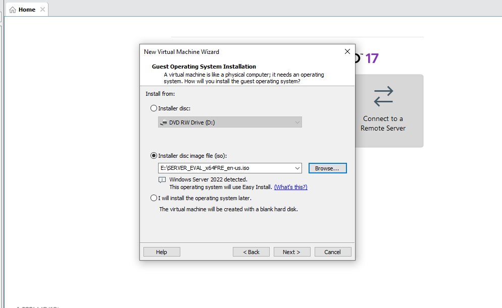

---

### 2. Size the Server

Reviewed the hardware before creating the VM: **2 CPU cores, 2048 MB RAM, 60 GB disk, NAT network adapter**. This meets Windows Server 2022's requirements for a small lab domain controller — in production the sizing would follow the number of users and any other roles on the server.

**Screenshot:**
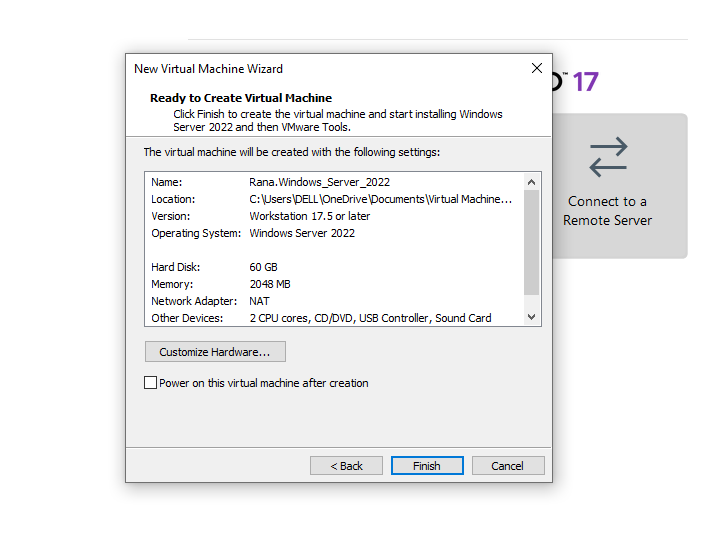

---

### 3. Start the Installation

Booted from the ISO and selected **Install now** in Windows Server Setup.

**Screenshot:**
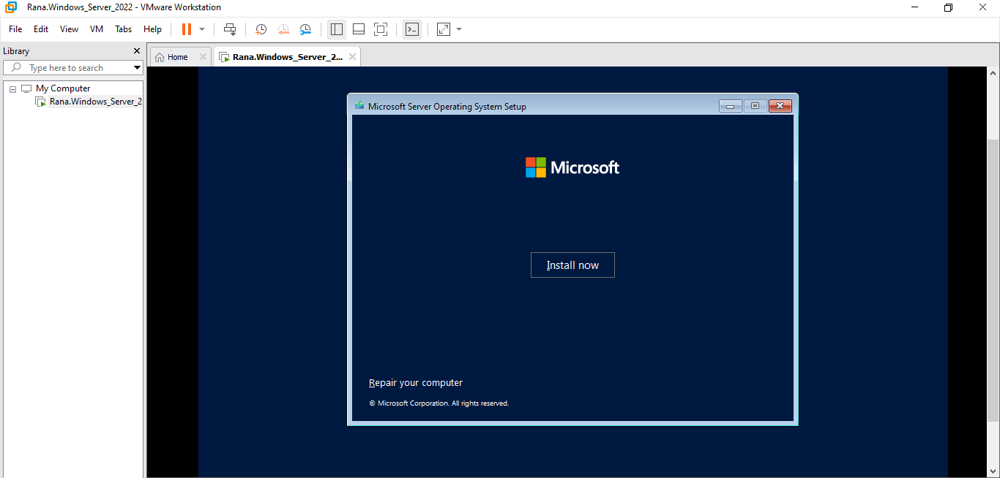

---

### 4. Choose the Edition

Selected **Windows Server 2022 Standard Evaluation (Desktop Experience)**. Desktop Experience installs the full graphical interface, which makes the administrative consoles used in this lab available; Server Core (no GUI) is the leaner, more secure choice once administration is done remotely.

**Screenshot:**
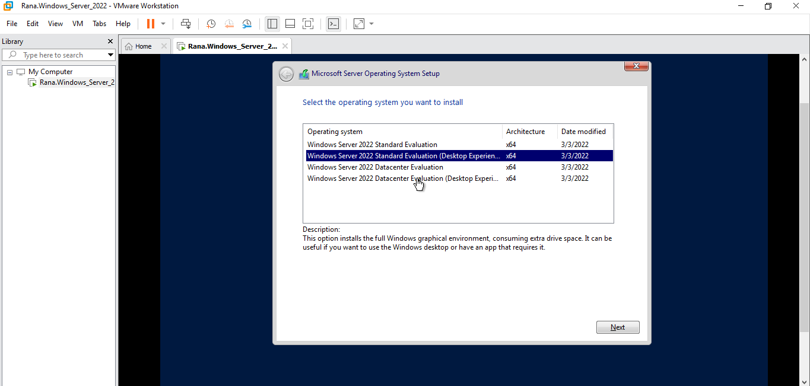

---

### 5. Install the Operating System

Setup copied and installed the Windows files and features.

**Screenshot:**
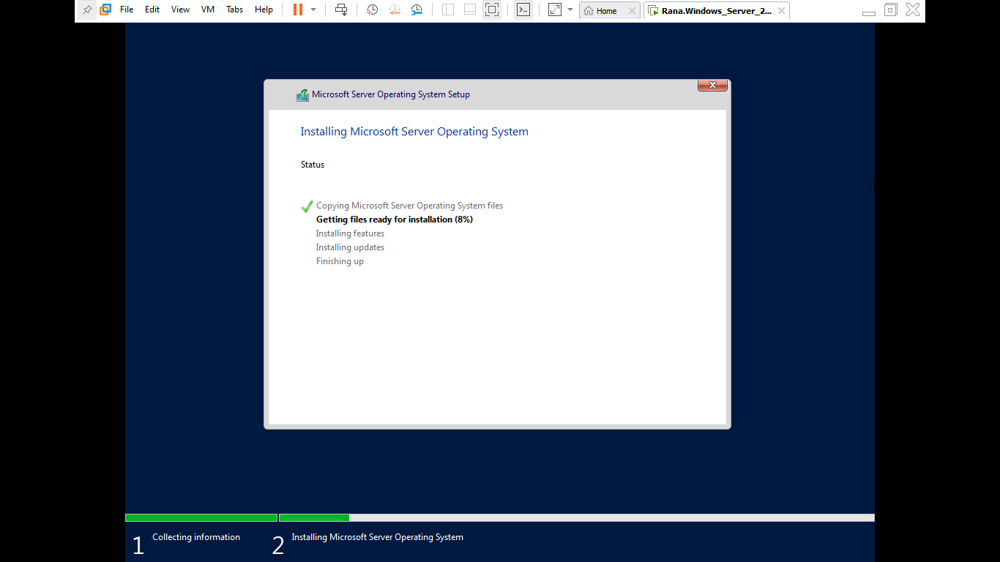

---

### 6. First Sign-In

Set a strong password for the built-in **Administrator** account and signed in to begin post-installation configuration.

**Screenshot:**
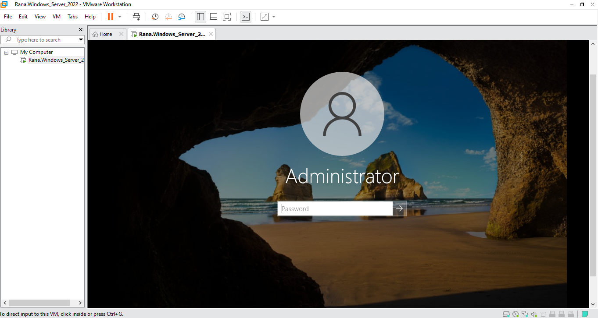

---

### Part B — Prepare It to Become a Domain Controller

### 7. Server Manager

**Server Manager** opened automatically at sign-in. It is the central console for configuring the local server and adding roles.

**Screenshot:**
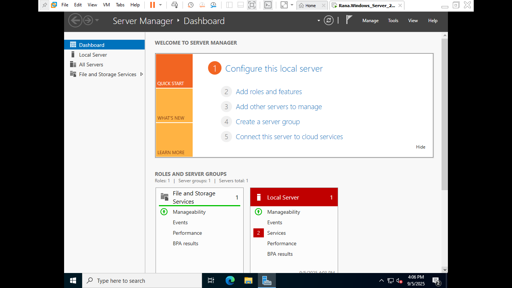

---

### 8. Give the Server a Meaningful Name

Renamed the server from its random default to **RANA-DC01** via **Server Manager → Local Server → Computer name**, then restarted. This has to happen *before* promotion: renaming a domain controller afterwards is possible but far more involved, and the name ends up in DNS records and every user's connection paths.

**Screenshot:**
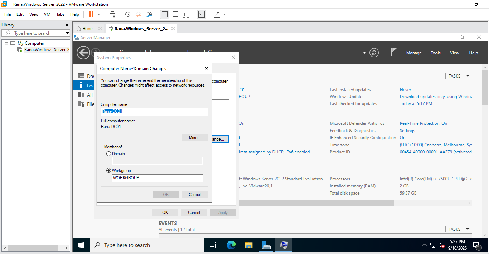

---

### 9. Give the Server a Static IP and Point DNS at Itself

A domain controller must not change address, because every client finds the domain through it. In the adapter's IPv4 properties, replaced DHCP with a static configuration:

| Setting | Value |
|---|---|
| IP address | 192.168.239.129 |
| Subnet mask | 255.255.255.0 |
| Default gateway | 192.168.239.2 |
| Preferred DNS server | **192.168.239.129** (itself) |
| Alternate DNS server | 8.8.8.8 |

The DC will also run the DNS server for the domain, so its preferred DNS is its own address. `ipconfig` confirmed the settings.

**Screenshot:**
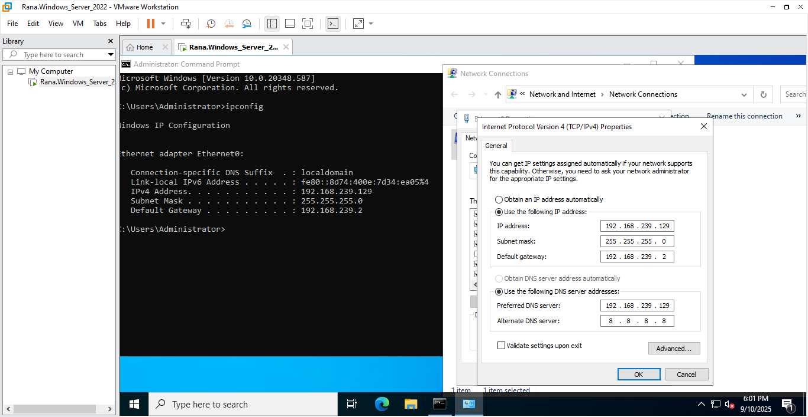

> **What I would change in production:** an external resolver such as 8.8.8.8 should not be listed as a DC's alternate DNS. If the DC ever queries it for `lab.local`, it gets no answer and domain lookups fail intermittently. The correct pattern is to point the DC at itself (and at a second DC when one exists) and configure 8.8.8.8 as a **forwarder** in the DNS Server role, so internet names still resolve.

---

### 10. Start Adding the Role

Opened **Add Roles and Features** and chose **Role-based or feature-based installation** — the option for installing roles such as AD DS on a single server.

**Screenshot:**
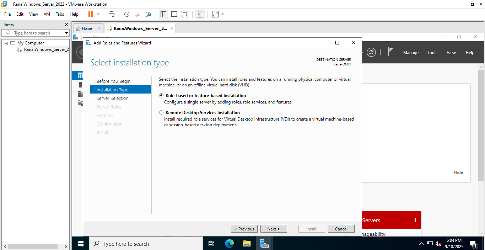

---

### 11. Select the Target Server

Selected **RANA-DC01** from the server pool as the destination, confirming the new name and static IP were in place before the role was installed.

**Screenshot:**
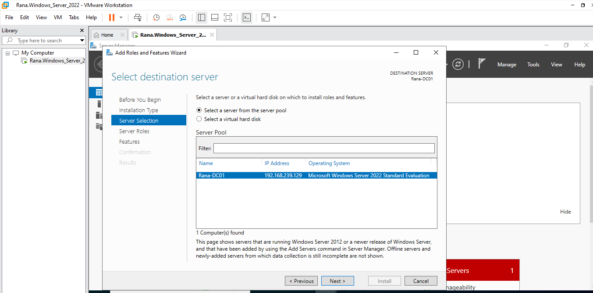

---

## Part 1 Outcome

| Check | Status |
|---|---|
| Windows Server 2022 Standard (Desktop Experience) installed | ✅ |
| Server renamed to RANA-DC01 before promotion | ✅ |
| Static IP 192.168.239.129 configured | ✅ |
| DNS pointing at the server itself | ✅ |
| Add Roles and Features targeted at RANA-DC01 | ✅ |

The server is ready for Active Directory. **Continued in Part 2**, where AD DS is installed and the domain is put to work.

---

## Key Takeaways (Part 1)

- **Name and address come first.** A domain controller's name and IP are baked into DNS and every client's configuration, so they are set before promotion, not after.
- **A DC is its own DNS server.** Active Directory depends on DNS to work; clients and the DC itself must use the domain's DNS server to find domain services.
- **Know the anti-patterns.** A public resolver as a DC's alternate DNS works in a lab but causes intermittent failures in production — forwarders are the correct fix.

---

## Skills Demonstrated

`Windows Server 2022` · `Server Installation` · `VMware Workstation` · `Server Manager` · `Static IP Addressing` · `DNS for Active Directory` · `Domain Controller Preparation`
