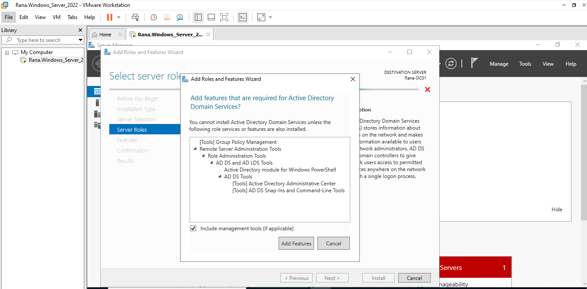
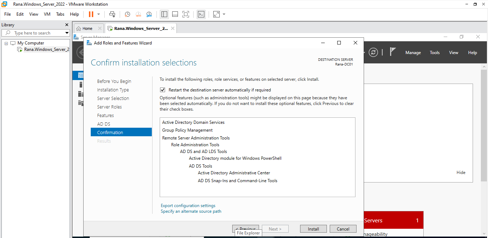
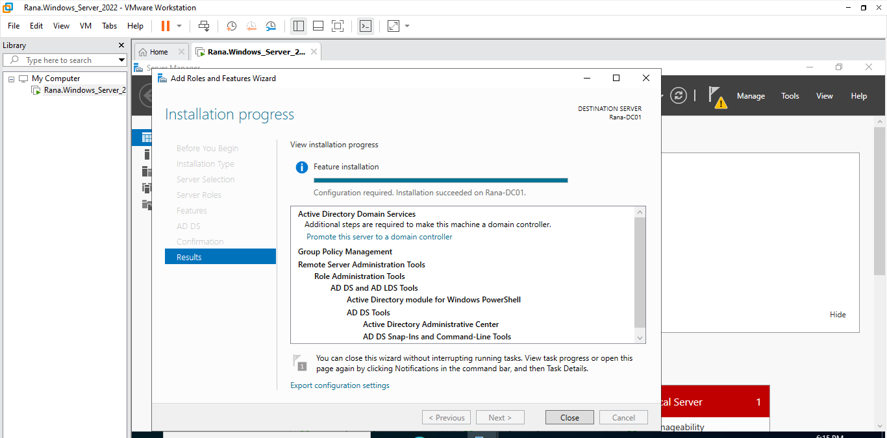
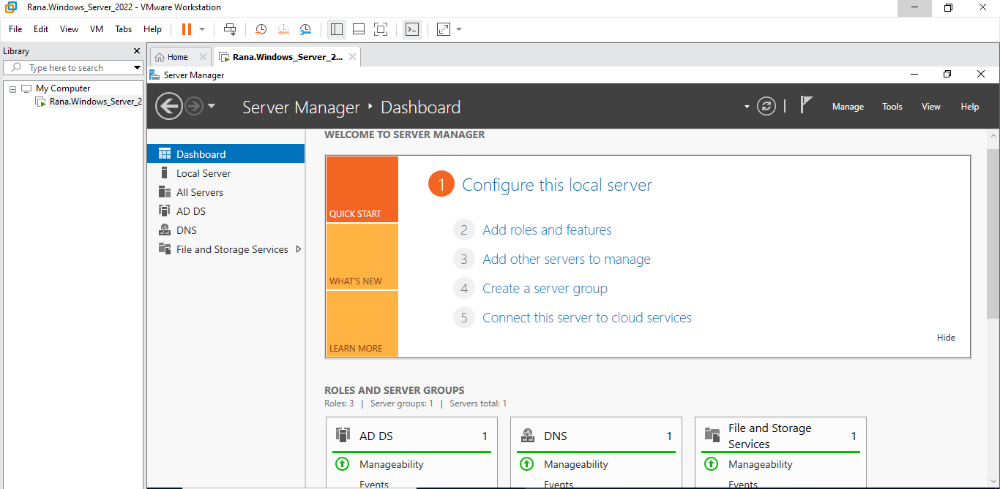
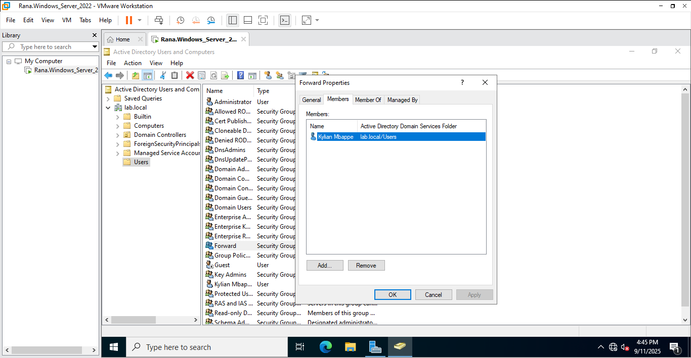
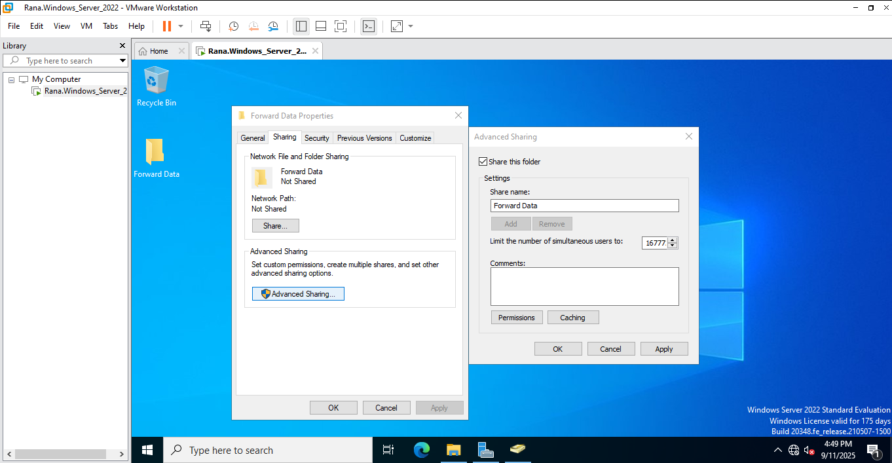
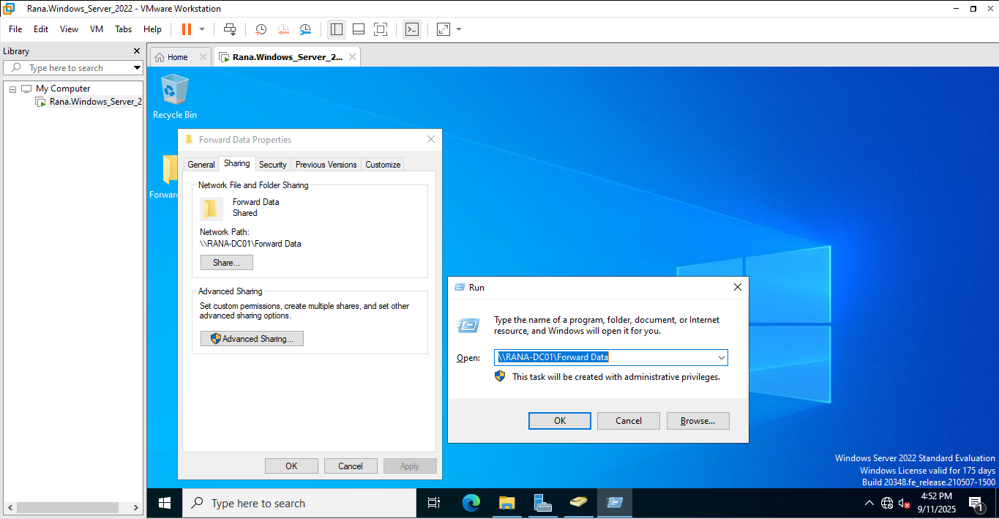
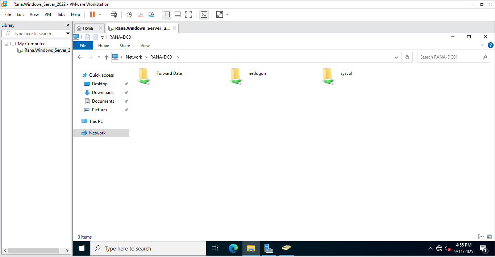
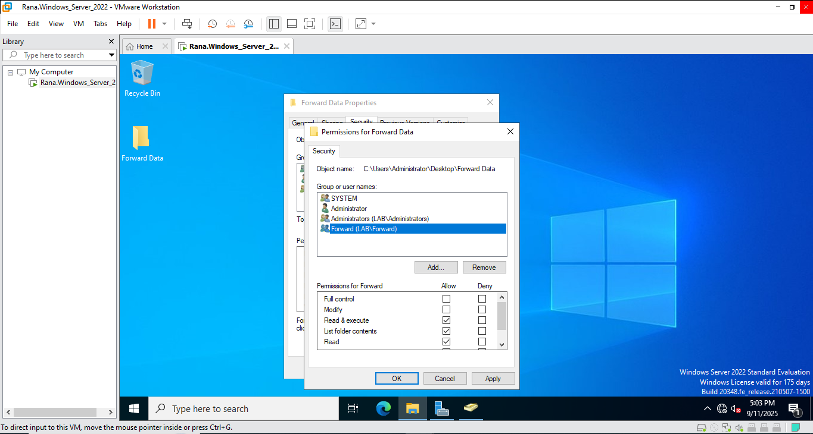

# New Domain Build — Windows Server 2022 Domain Controller & RBAC File Share — Part 2

Continued from Part 1, where **RANA-DC01** was installed, renamed, and given a static IP with DNS pointing at itself.

**Part 2 goal:** turn RANA-DC01 into the domain controller for **lab.local**, onboard the first domain user — **Kylian Mbappe**, a member of the **Forward** team — and publish a **Forward Data** share that only the Forward team can open, and only to read.

---

## Technical Steps (continued)

### Part C — Install Active Directory

### 12. Select the AD DS Role

In Add Roles and Features, selected **Active Directory Domain Services** and accepted the management tools it requires.

**Screenshot:**

---

### 13. Confirm the Selections

Reviewed the confirmation page before installing, to make sure only the intended role and its dependencies were being added to RANA-DC01.

**Screenshot:**

---

### 14. Install the Role

The installation progress page reported **Installation succeeded on RANA-DC01**. Installing the role only adds the software — the server is not yet a domain controller.

**Screenshot:**

---

### 15. Promote the Server and Confirm the Domain Is Running

Used **Promote this server to a domain controller** to create a **new forest** with the root domain **lab.local** (NetBIOS name **LAB**), installing DNS alongside it, then restarted. (The promotion wizard itself was not captured.) After the restart, Server Manager showed three healthy roles — **AD DS**, **DNS**, and **File and Storage Services** — each with a green Manageability status.

**Screenshot:**

---

### Part D — Onboard the First User

### 16. Create the User Account

In **Active Directory Users and Computers → lab.local → Users → New → User**, created **Kylian Mbappe** with the logon name **K.Mbappe@lab.local** (pre-Windows 2000: **LAB\K.Mbappe**). This one account now works on any domain-joined PC, instead of a separate local account on each.

**Screenshot:**
_Named_Kylian_Mbappe.PNG)

---

### 17. Create the Team's Security Group

Created a group named **Forward** with **Group scope: Global** and **Group type: Security**. A *security* group can be granted permissions (a distribution group is for email only), and *global* scope is the standard choice for grouping users by role within a domain.

**Screenshot:**
_Named_Forward.PNG)

---

### 18. Add the User to the Group

Opened **Forward → Properties → Members** and added **Kylian Mbappe** (`lab.local/Users`). From now on, anything granted to Forward applies to him — and to any future team member, simply by being added to the group.

**Screenshot:**

---

### Part E — Publish a Controlled File Share

### 19. Share the Team Folder

Created a **Forward Data** folder and shared it through **Properties → Sharing → Advanced Sharing → Share this folder**, with the share name **Forward Data**.

**Screenshot:**

---

### 20. Confirm the Share Path

The Sharing tab now shows the network path **\\\\RANA-DC01\Forward Data**. Opened that path with **Run** to confirm it resolves by server name.

**Screenshot:**

---

### 21. Confirm the Share Is Published

Browsing **Network → RANA-DC01** listed **Forward Data** alongside **NETLOGON** and **SYSVOL**. Those two shares are created by Active Directory itself for logon scripts and Group Policy, so seeing them is also a quick health check that the promotion completed properly.

**Screenshot:**

---

### 22. Restrict the Folder to the Team (RBAC)

In **Forward Data → Properties → Security**, added the **Forward (LAB\Forward)** group and granted **Read & execute, List folder contents, and Read** — and nothing more. The only other entries are SYSTEM, Administrator and the Administrators group. Access is now decided by **role** (membership of Forward), not by listing individual people: members can open and read the files, cannot change or delete them, and everyone else is not listed and so has no access to the folder.

**Screenshot:**

---

## Project Outcome

| Requirement | Delivered |
|---|---|
| Central user management | Domain **lab.local** on DC **RANA-DC01**, with AD DS and DNS running |
| First domain user | **Kylian Mbappe** — `K.Mbappe@lab.local` |
| Role-based grouping | **Forward** — Global Security group, Mbappe a member |
| Controlled file sharing | `\\RANA-DC01\Forward Data`, NTFS **read-only** for Forward |

---

## Next Steps (Not Covered in This Lab)

- **Test as the user.** Join a Windows client to lab.local, sign in as `LAB\K.Mbappe`, and confirm he can open and read Forward Data but cannot write — and that a user outside Forward is denied. The share was verified from the server here, which proves it is published but not the user's experience.
- **Move data off the DC's desktop.** The folder lives under the Administrator's profile for the lab. In production, shares sit on a dedicated data volume (for example `D:\Shares`), ideally on a file server rather than the domain controller.
- **Use OUs, not the default Users container.** Placing users and groups in Organizational Units by department is what makes targeted Group Policy possible (see the Active Directory GPO lab).

---

## Key Takeaways (Part 2)

- **Installing the role is not the same as promoting the server.** AD DS is added first, then the server is promoted to create the forest and domain.
- **Grant permissions to groups, never to individuals.** When the next Forward team member joins, adding them to the group is the whole job — no folder permissions need to change.
- **Least privilege on data.** The team needed to read the files, so they received read access only. Write or Full Control would have allowed accidental or malicious changes.
- **Share permissions and NTFS permissions both apply.** The effective access is the more restrictive of the two, which is why the NTFS permissions on the folder are where access is controlled precisely.

---

## Skills Demonstrated

`Active Directory Domain Services` · `Domain Controller Promotion` · `DNS` · `Active Directory Users and Computers` · `Security Groups` · `File Sharing` · `NTFS Permissions` · `RBAC / Least Privilege`
