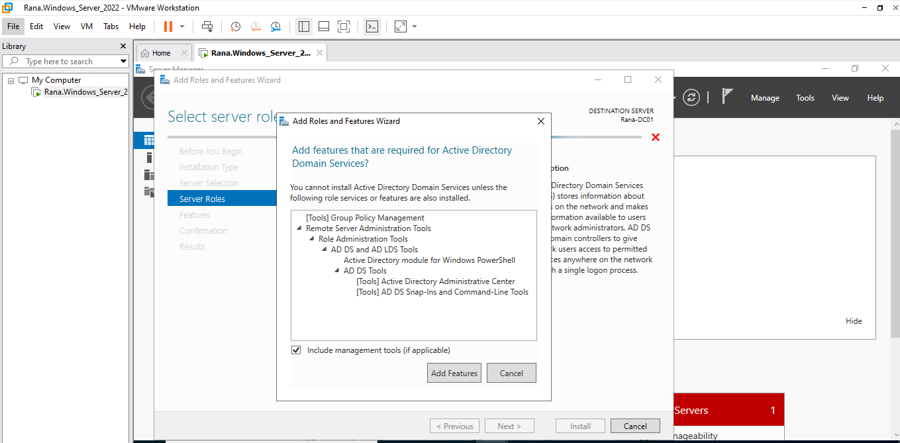
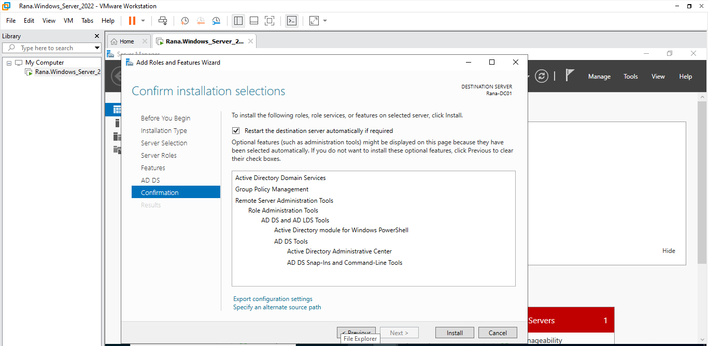
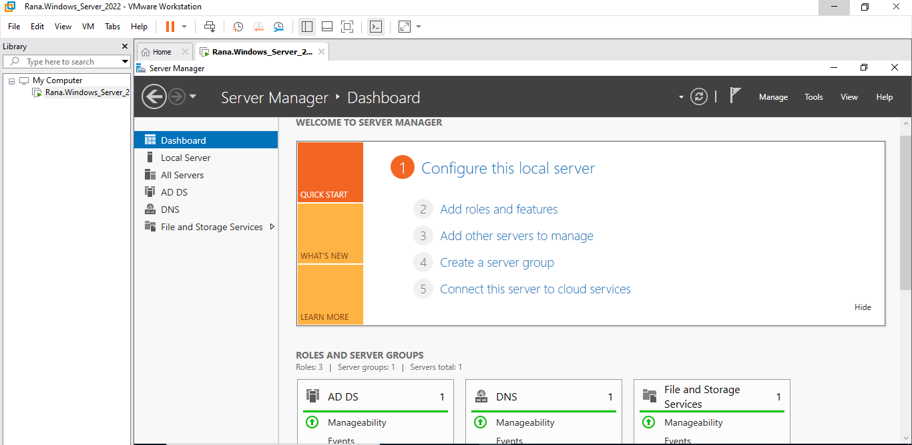
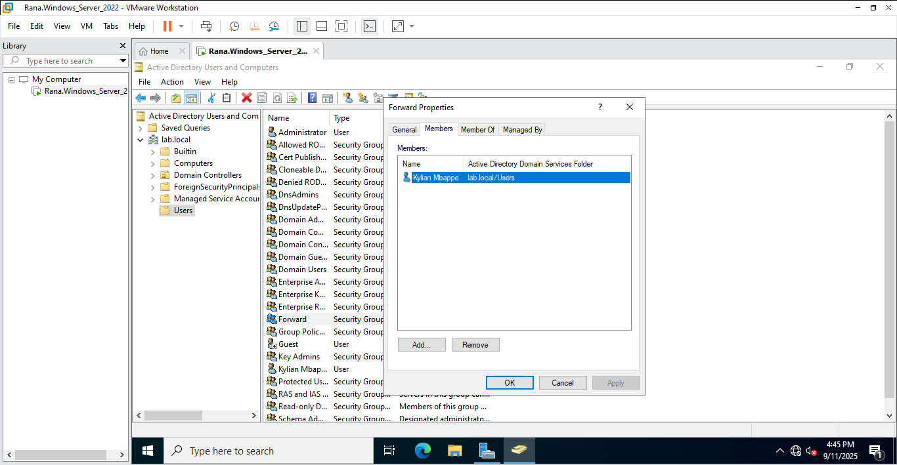
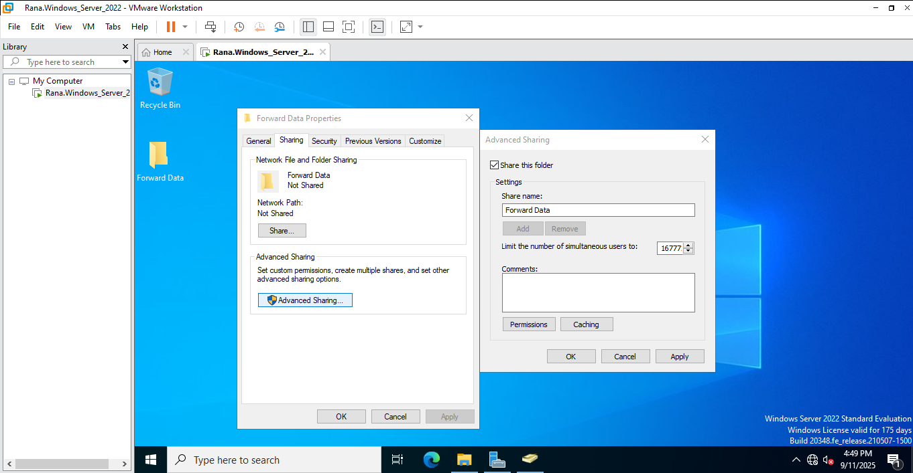
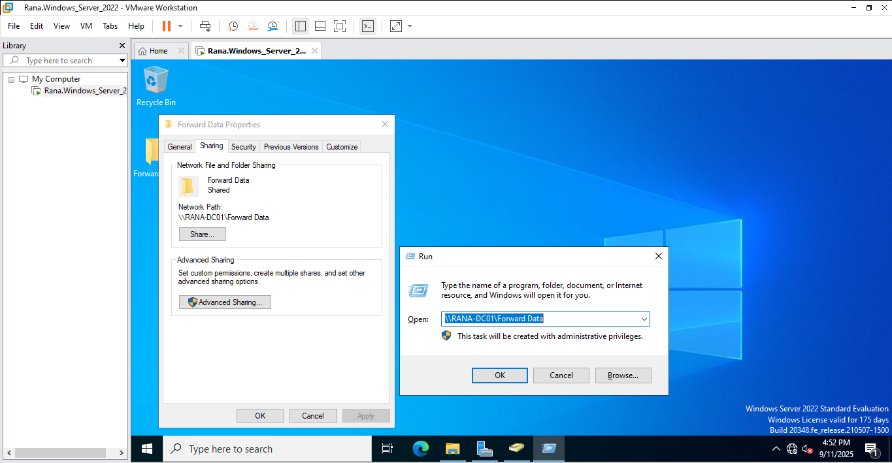
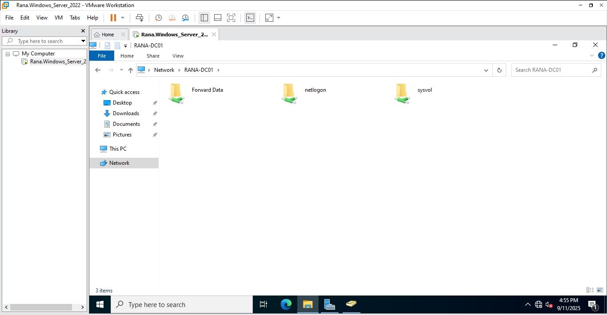
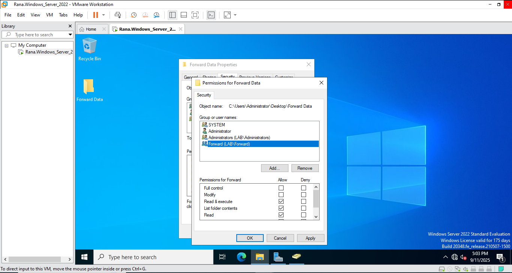

# Active Directory Lab Documentation - Part 2

## Overview
In this section of the lab, I focus on installing Active Directory Domain Services, promoting the server to a Domain Controller, and then creating and managing AD objects.  
Additionally, I configure a shared folder with role-based access control (RBAC) to showcase my understanding of enterprise security practices.

## Steps and Screenshots

### Step 12: Installing AD DS Role

I selected **Active Directory Domain Services (AD DS)** as the server role. 

### Step 13: Confirming Installation Settings

Before installation, I confirmed the selections to ensure the correct role and features were applied.  

### Step 14: Monitoring Installation Progress

The installation was successfully completed as shown here. 

### Step 15: Server Promoted to Domain Controller

After promotion, the Server Manager dashboard displayed the AD DS and DNS roles.  

### Step 16: Creating a User Object

I created a new Active Directory user named **Kylian Mbappe** to demonstrate user management.  

_Named_Kylian_Mbappe.PNG)

### Step 17: Group Membership Management

I created a security group named **Forward Group** and added Mbappe as a member.

### Step 18: Creating a Shared Folder

I created a folder called **Forward Data**, placed it on the server desktop, and shared it across the network.  

### Step 19: Accessing the Shared Folder from Network

Using the Run command and server name, I verified that the folder was accessible over the network.  

### Step 20: Confirming Network Share Availability

The shared folder appeared successfully on the network.  

### Step 21: Applying Permissions via RBAC

Finally, I granted **Forward Group** permissions to the folder, ensuring secure access control.

## Conclusion

By completing these steps, I successfully promoted the server to a Domain Controller, created AD users and groups, and implemented folder sharing with RBAC.  
This part of the lab highlights my ability to manage Active Directory and apply security best practices, which are critical skills for IT support and system administration roles.
