# Active Directory GPO Lab

## Overview  
In this lab, I practiced Group Policy Object (GPO) management within Active Directory.  
The tasks focused on restricting Control Panel access for users and configuring an auto-lock screen policy.  
This helped me understand how GPOs are created, edited, linked to Organizational Units (OUs), and tested using domain users.  

## Steps and Screenshots  

### Task 1: Restricting Control Panel Access  

- I created a new GPO named **Restrict Control Panel Access**. 

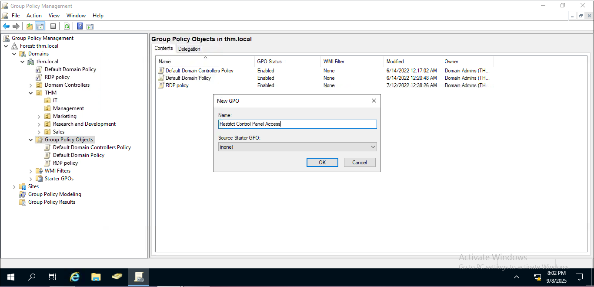  

- Edited the GPO to configure **Prohibit access to Control Panel and PC settings**. 

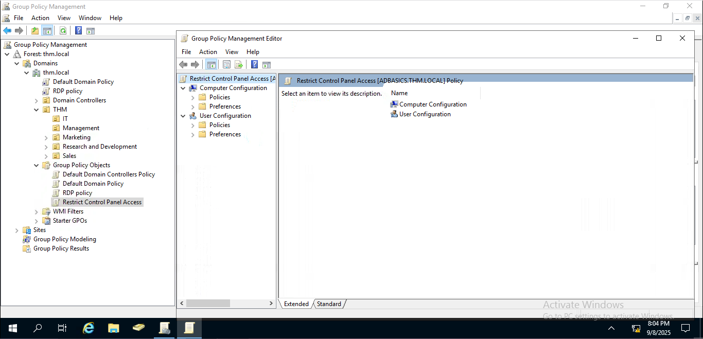  

- Verified the setting before applying – it was initially not configured.  

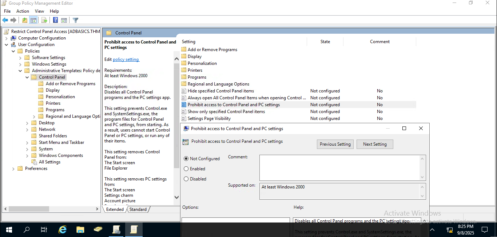  

- Enabled the restriction policy.  

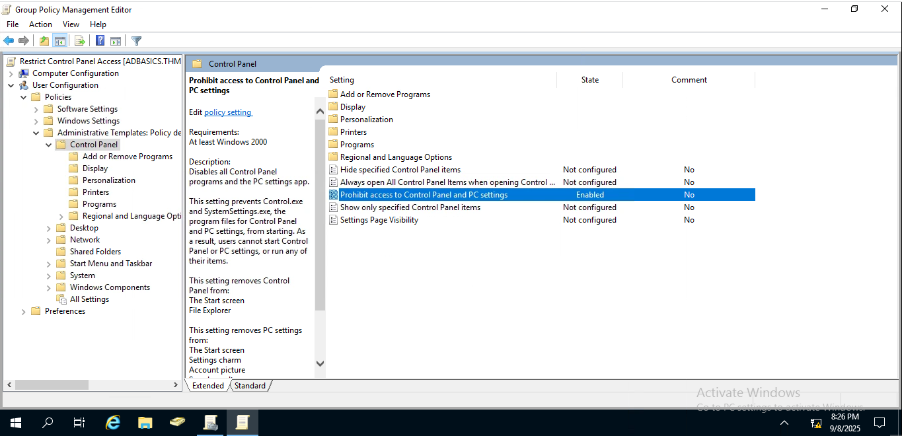  

- Linked the GPO to **Management, Marketing, and Sales OUs**. 

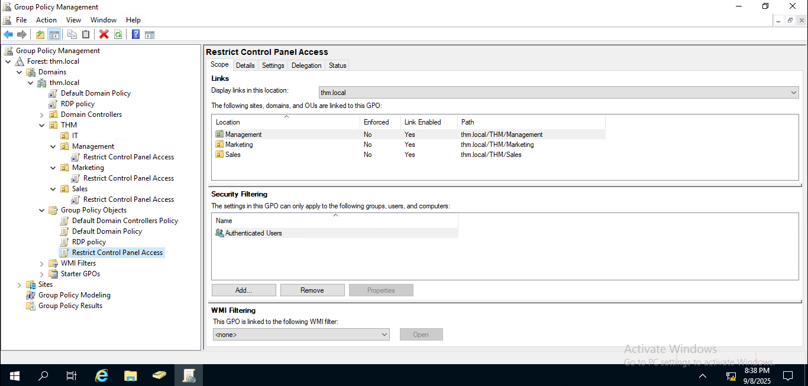  

### Task 2: Configuring Auto-Lock Screen Policy 

- Created a new GPO named **Auto Lock Screen**. 

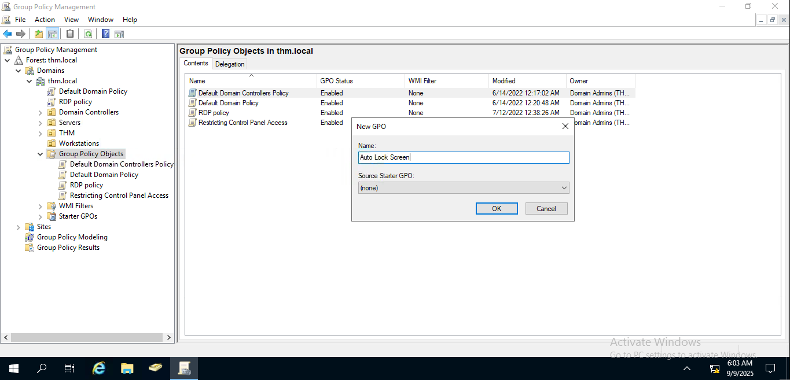  

- Linked it to the **Root Domain**.  

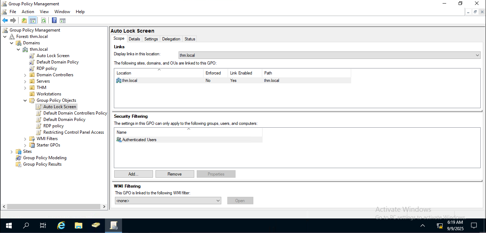  

- Configured the **Machine Inactivity Limit** to 300 seconds (5 minutes). 

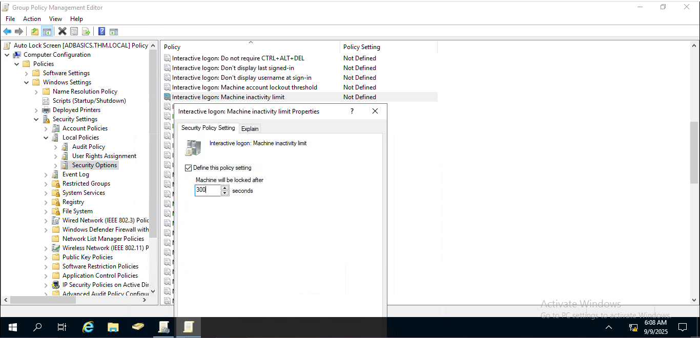  

### Task 3: Testing the Policies  

- Used the domain user **Mark** in the **Marketing OU** for testing.

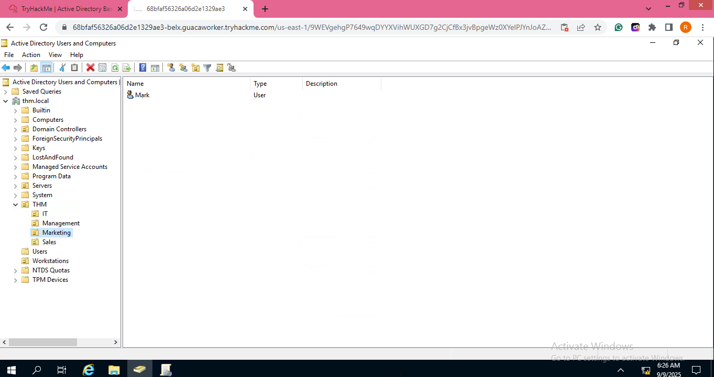  

- Verified domain login via **RDP** using Mark’s credentials.  

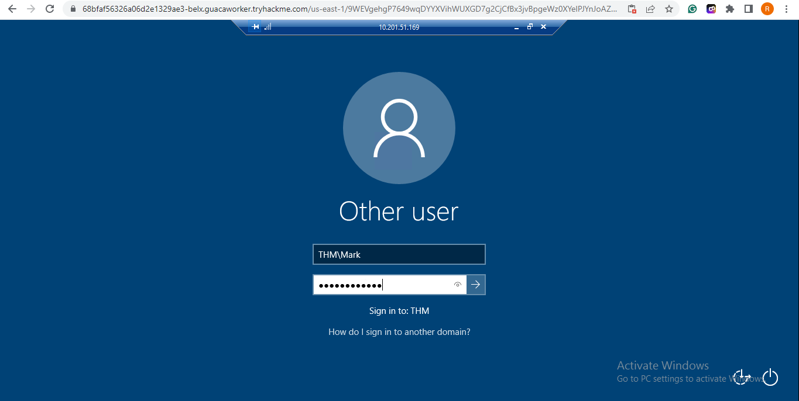  

- Attempted to open Control Panel – restriction worked as expected. 

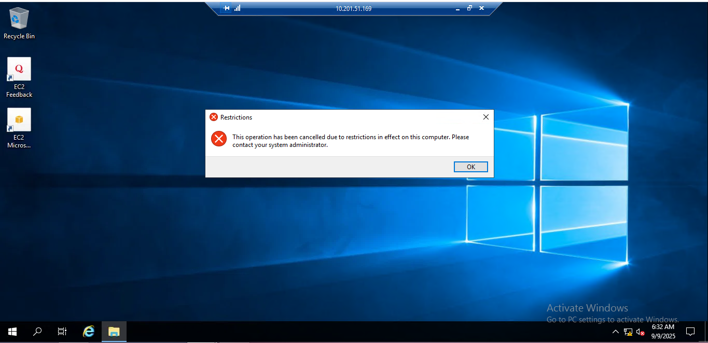  

- Waited for 5 minutes – user session logged out automatically.  

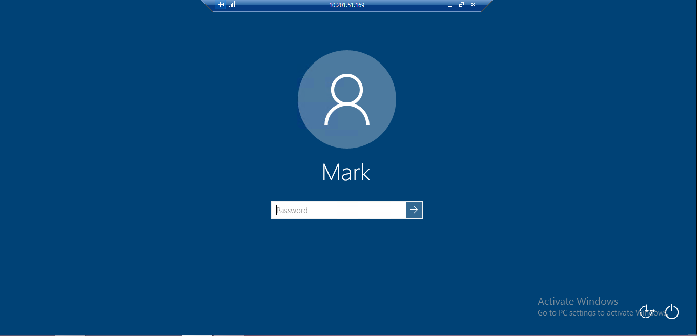  

## Conclusion  

This lab demonstrated how to create and manage Group Policy Objects in Active Directory.  
I successfully implemented policies to restrict Control Panel access and enforce auto-lock after inactivity.  
By linking these policies to OUs and testing with a domain user, I gained hands-on experience in applying security and productivity-related policies within an AD environment.  
