# Staff Changing System Settings — Control Panel Restriction & Screen-Lock GPOs

| Field | Detail |
|---|---|
| **Ticket Subject** | Security request — stop staff changing system settings, and lock unattended computers |
| **Category** | Security / Active Directory Group Policy |
| **Priority** | P3 — Scheduled Change |
| **Environment** | Windows Server domain **thm.local** — TryHackMe "Active Directory Basics" lab environment, accessed over RDP (DC at 10.201.51.169). Completed 8–9 Sep 2025 |

---

## Problem Statement

The service desk has seen a run of tickets caused by staff changing settings they should not — display, network and program settings changed through Control Panel and PC Settings. Separately, a walk-round found several computers left unlocked while their users were away from their desks.

Management has asked for two controls, applied centrally through Group Policy rather than machine by machine:

1. **Block Control Panel and PC Settings** for staff in **Management, Marketing and Sales** — but not for IT, who need them to do their jobs.
2. **Automatically lock any computer in the domain after 5 minutes of inactivity.**

The task is to build both policies, scope each one correctly, and **test them as a real domain user** before closing the request.

---

## Tools Used

- **Group Policy Management Console** (gpmc.msc — creating and linking GPOs)
- **Group Policy Management Editor** (configuring policy settings)
- **Active Directory Users and Computers** (checking the test user's OU)
- **Remote Desktop Connection** (signing in as the test user)
- **ipconfig** (identifying the server's address for RDP)

---

## Technical Steps

### Policy 1 — Restrict Control Panel Access

### 1. Create the GPO

In **Group Policy Management → thm.local → Group Policy Objects**, created a new GPO named **Restrict Control Panel Access**. A descriptive name means anyone reading the GPO list later knows what it does without opening it.

**Screenshot:**
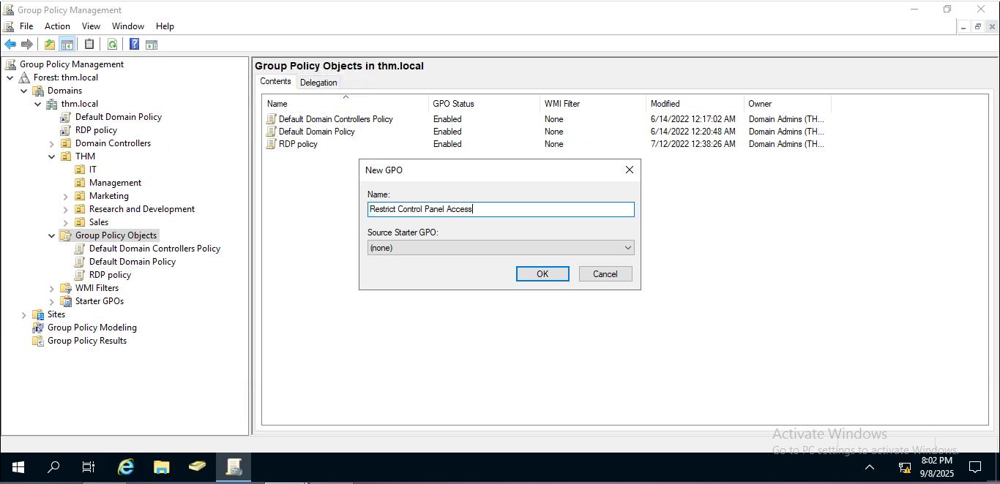

---

### 2. Open It for Editing

Opened the new GPO in the **Group Policy Management Editor**. It has two halves — **Computer Configuration** (applies to machines) and **User Configuration** (applies to people). This restriction is about what *users* can do, so it belongs under User Configuration.

**Screenshot:**
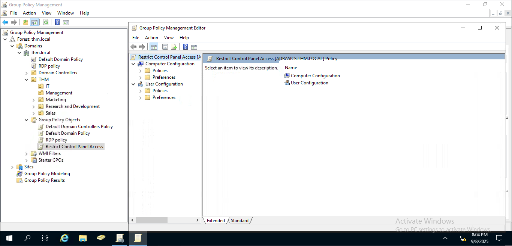

---

### 3. Find the Setting and Check Its Current State

Went to **User Configuration → Policies → Administrative Templates → Control Panel → Prohibit access to Control Panel and PC settings**. It was **Not Configured**. The built-in help confirms what enabling it does: it stops `Control.exe` and `SystemSettings.exe` from starting, and removes Control Panel and PC Settings from the Start screen and File Explorer.

**Screenshot:**
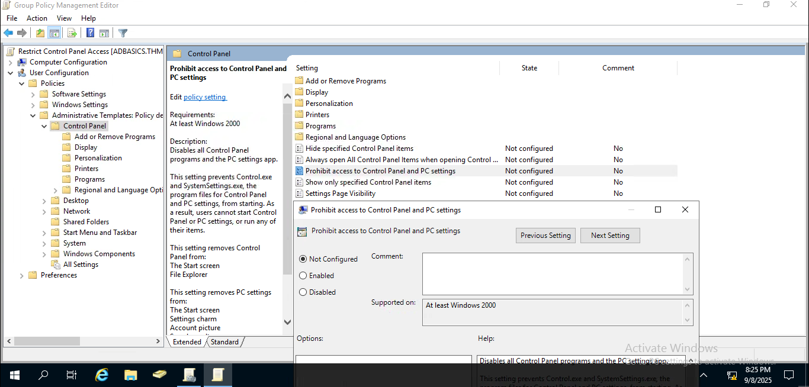

---

### 4. Enable the Restriction

Set the policy to **Enabled**.

**Screenshot:**
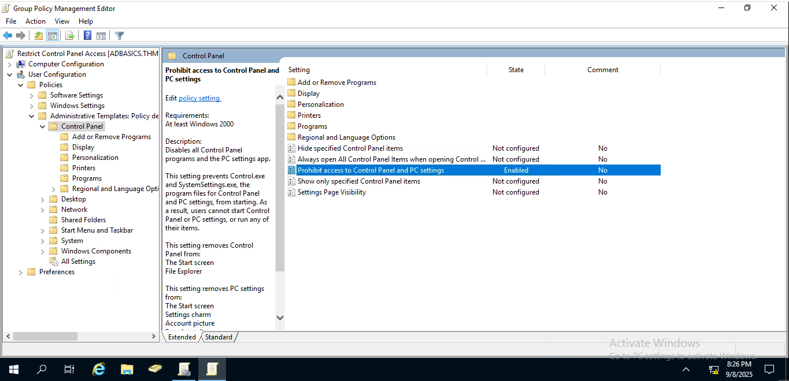

---

### 5. Link It Only Where It Is Needed

Linked the GPO to the **Management**, **Marketing** and **Sales** OUs (`thm.local/THM/...`), with each link **enabled** and **not enforced**, and security filtering left at **Authenticated Users**. The **IT** OU was deliberately **not** linked — IT staff need Control Panel to support everyone else.

**Screenshot:**
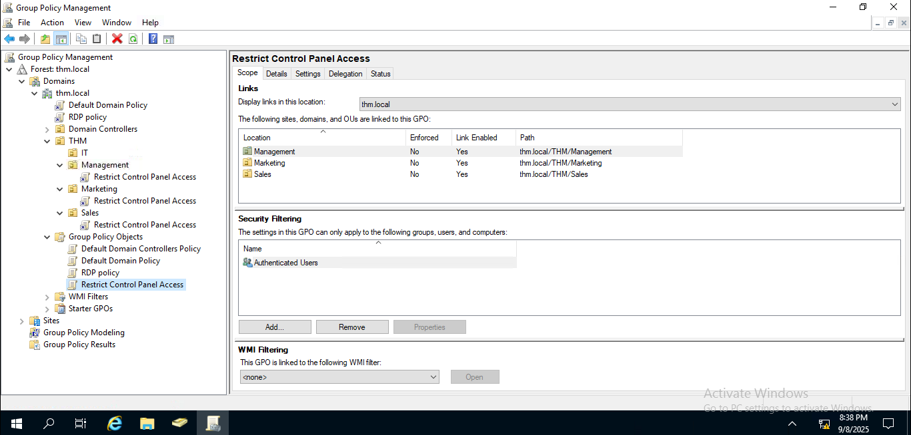

---

### Policy 2 — Lock Inactive Computers

### 6. Create the GPO

Created a second GPO named **Auto Lock Screen**.

**Screenshot:**
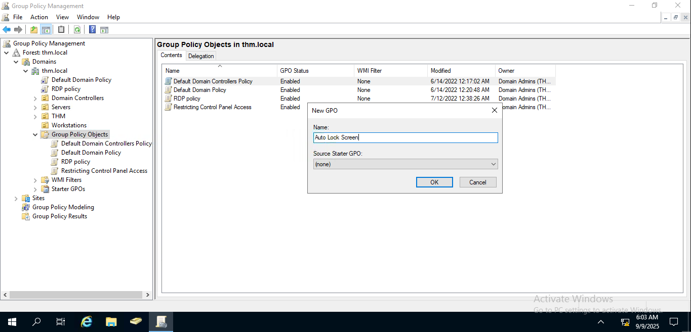

---

### 7. Link It to the Whole Domain

Linked **Auto Lock Screen** to the root of **thm.local**. Unlike the Control Panel restriction, screen locking should apply to every computer in the organisation, so it is linked at the top and inherited by every OU below.

**Screenshot:**
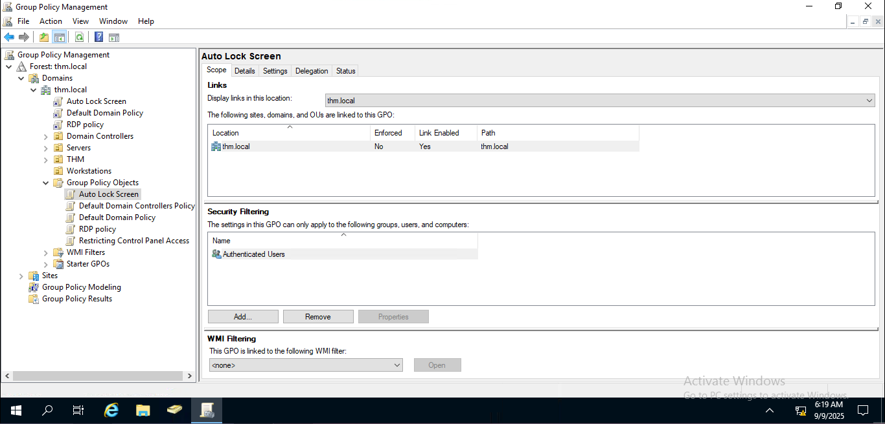

---

### 8. Set the Inactivity Limit

Went to **Computer Configuration → Policies → Windows Settings → Security Settings → Local Policies → Security Options → Interactive logon: Machine inactivity limit**, ticked **Define this policy setting**, and set **Machine will be locked after 300 seconds** (5 minutes). This is a *computer* setting, so it applies to the machine no matter who signs in.

**Screenshot:**
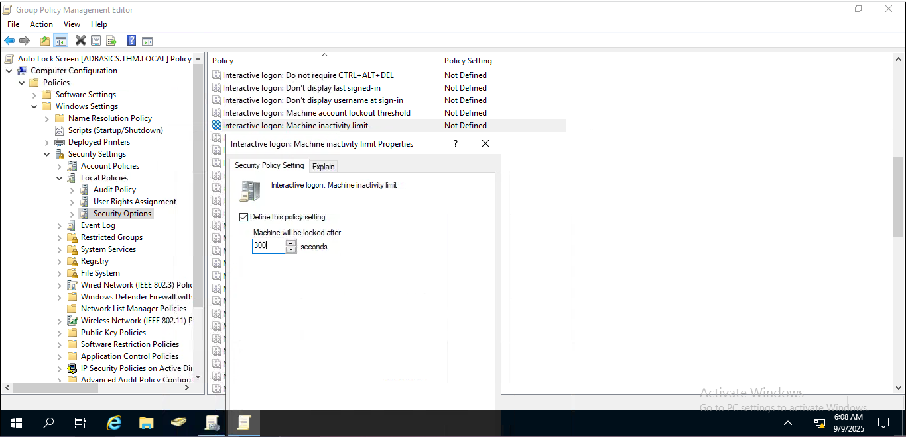

---

### Test Both Policies as a Real User

### 9. Choose a Test User Inside the Target Scope

A policy has to be tested by someone it is meant to apply to. In **Active Directory Users and Computers**, confirmed that the domain user **Mark** is in the **Marketing** OU — inside the scope of the Control Panel restriction.

**Screenshot:**
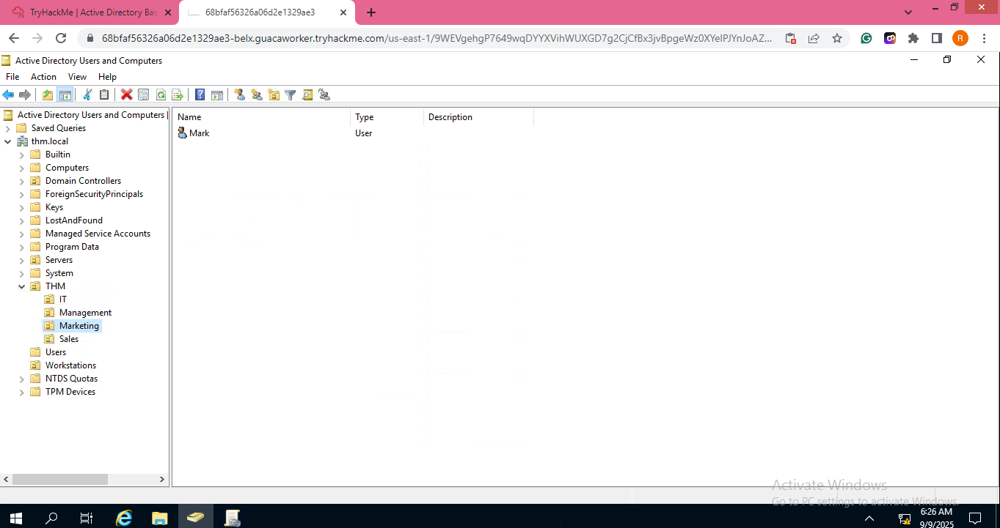

---

### 10. Find the Server's Address

Ran `ipconfig` on the server to get the address to connect to over Remote Desktop: **10.201.51.169**.

**Screenshot:**
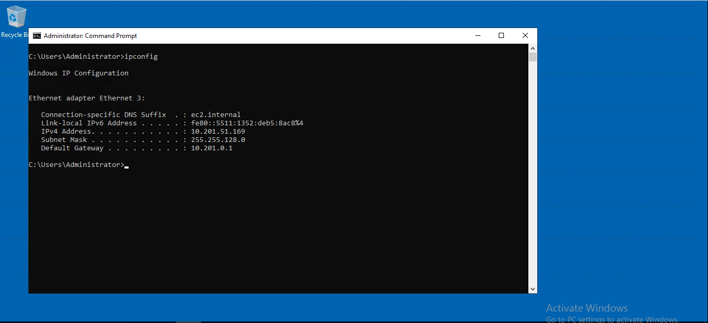

---

### 11. Sign In as the Test User

Connected by Remote Desktop to 10.201.51.169 and signed in as **THM\Mark**, so that his user and computer policies were applied at logon exactly as they would be for him.

**Screenshot:**
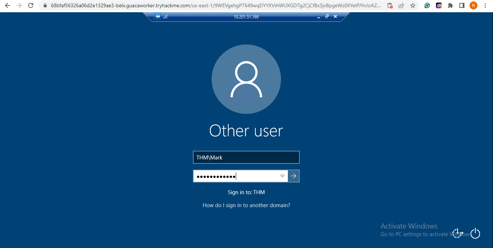

---

### 12. Test Policy 1 — Try to Open Control Panel

As Mark, tried to open Control Panel. Windows blocked it: **"This operation has been cancelled due to restrictions in effect on this computer. Please contact your system administrator."** The restriction works for a Marketing user.

**Screenshot:**
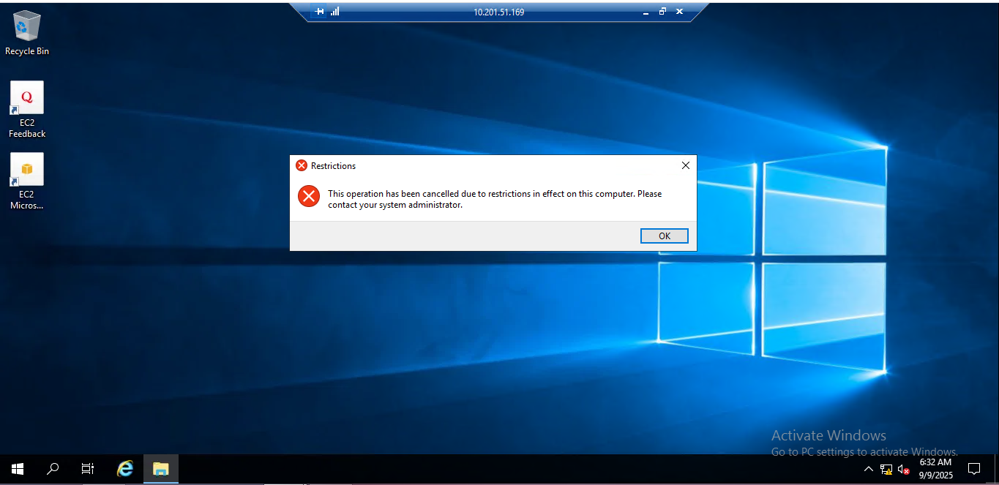

---

### 13. Test Policy 2 — Leave the Session Idle

Left Mark's session untouched for five minutes. The session **locked** and returned to Mark's sign-in screen, asking for his password to continue. The inactivity limit works.

**Screenshot:**
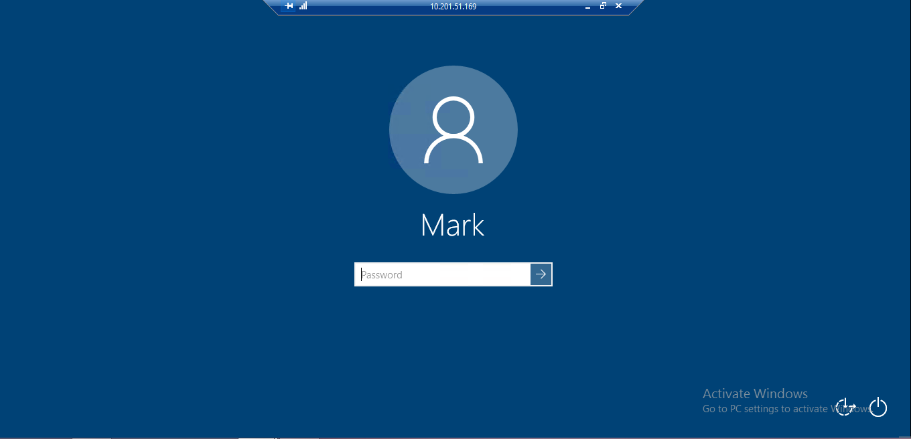

---

## Policy Summary

| GPO | Configuration side | Setting | Linked to | Tested by | Result |
|---|---|---|---|---|---|
| **Restrict Control Panel Access** | User | Prohibit access to Control Panel and PC settings: **Enabled** | Management, Marketing, Sales OUs (not IT) | Mark (Marketing) opening Control Panel | ✅ Blocked |
| **Auto Lock Screen** | Computer | Machine inactivity limit: **300 seconds** | Domain root (thm.local) | Mark's session left idle 5 minutes | ✅ Locked |

---

## Key Takeaways

- **Scope is part of the design.** The same GPO can be right for Sales and wrong for IT. Linking to specific OUs — and deliberately leaving IT out — applies the control only where it is wanted.
- **User settings vs computer settings.** Control Panel access is about the person, so it lives under User Configuration; the inactivity lock is about the machine, so it lives under Computer Configuration. Putting a setting in the wrong half, or linking it where the matching object does not live, is a common reason a GPO "does nothing".
- **Lock, not log off.** The inactivity limit *locks* the session: the user's open work is preserved and they sign straight back in. Logging users off would lose unsaved work and generate complaints.
- **Test as someone the policy targets.** Testing as an administrator, or as a user outside the linked OUs, proves nothing. When a GPO does not apply in real life, `gpresult /r` on the affected machine is the first check.

---

## Skills Demonstrated

`Active Directory` · `Group Policy (GPMC)` · `GPO Scoping & OU Linking` · `User vs Computer Configuration` · `Security Options` · `Endpoint Security` · `Remote Desktop` · `Policy Testing & Verification`
