# Lab 01 — Basic Network Troubleshooting

---

## Overview
In this lab, I practiced:
- Troubleshooting network issues on a Windows 10 VM.  
- I captured a healthy baseline, then intentionally misconfigured DNS and the default gateway to simulate real-world problems.  
- Finally, I documented how each issue was diagnosed and resolved.

---

## Step 1 — Baseline
Commands executed:
```bat
ipconfig /all
ping 127.0.0.1
ping 192.168.40.134
ping 192.168.40.2
ping 8.8.8.8
ping www.microsoft.com
tracert 8.8.8.8
tracert www.microsoft.com
nslookup www.microsoft.com
```
**Observation:** 

All connectivity and DNS resolution worked correctly.  All Text files can be accessed in the [`/Outputs`](./Outputs) folder.

**Screenshot:**

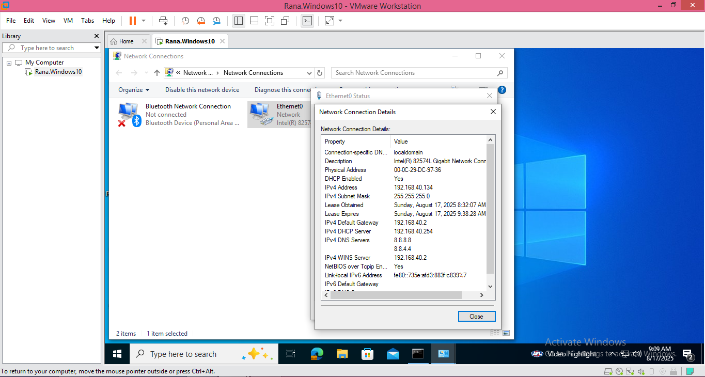 

---

## Step 2 — Fault Injection: DNS Misconfiguration

1. Changed **DNS server** to `10.255.255.10` (invalid).  

   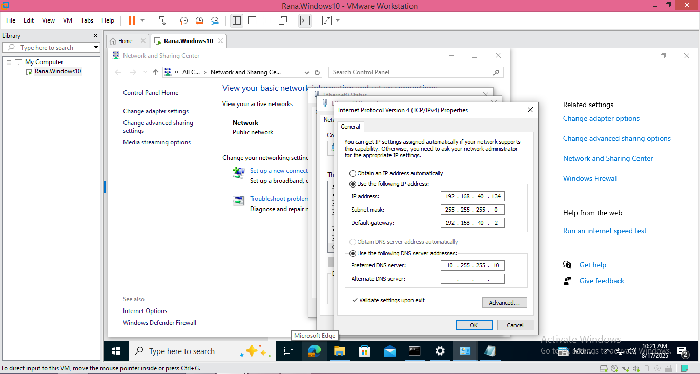  

3. Flushed **DNS cache**:  
   ```bat
   ipconfig /flushdns
   ```
    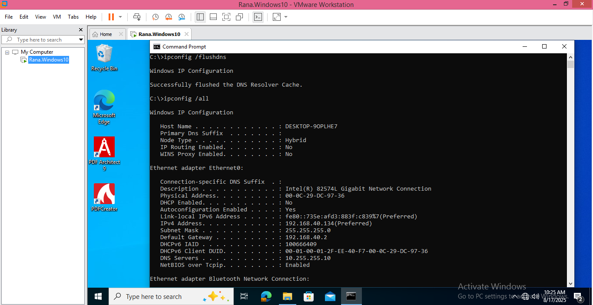

4. Retested with **`ping`** and **`nslookup`**.

    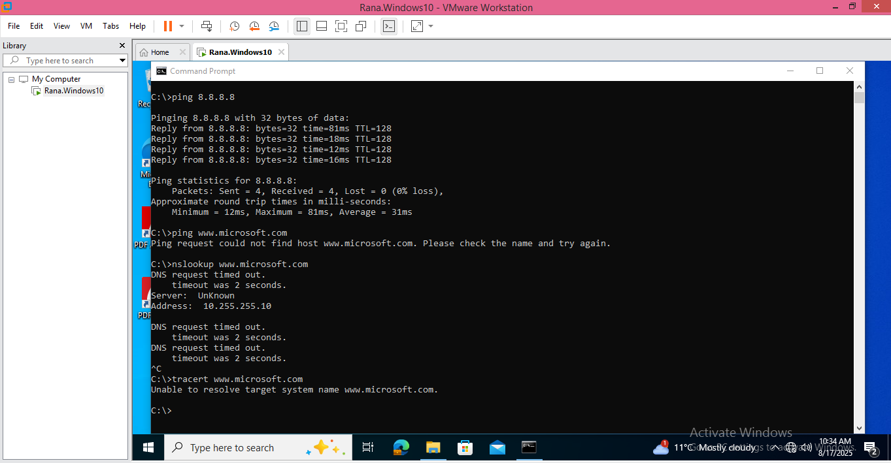   

**Observation:**  
- `ping 8.8.8.8` succeeded (Internet reachable by IP)  
- `ping www.microsoft.com` failed (`could not find host`)  
- `nslookup` failed to resolve  

**Resolution:**

 Restored **valid DNS (8.8.8.8)**. Verified that name resolution worked again.  
   
   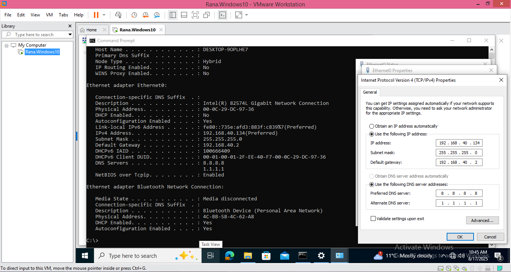
   
   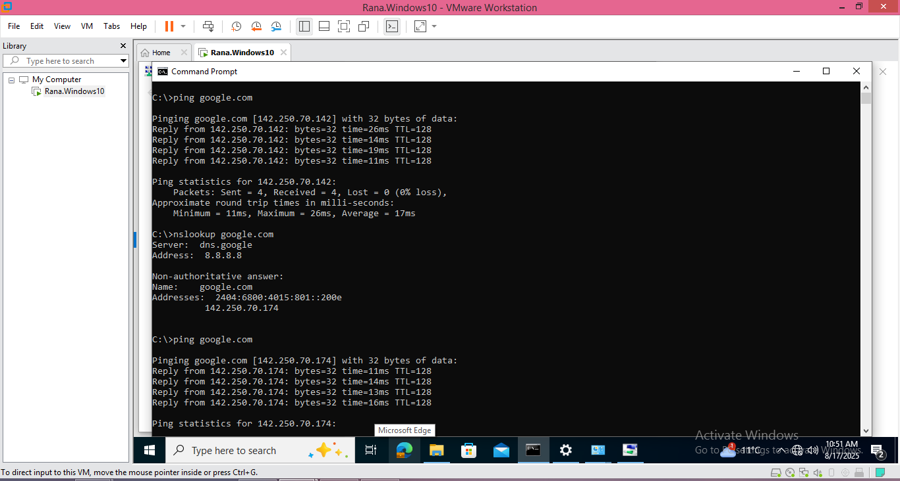

---

## Step 3 — Fault Injection: Missing Gateway

1. Removed **Default Gateway** from IPv4 settings.

    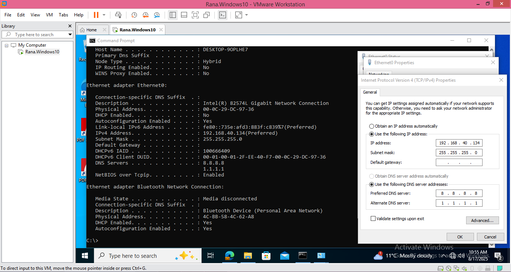

3. Ran tests again.

    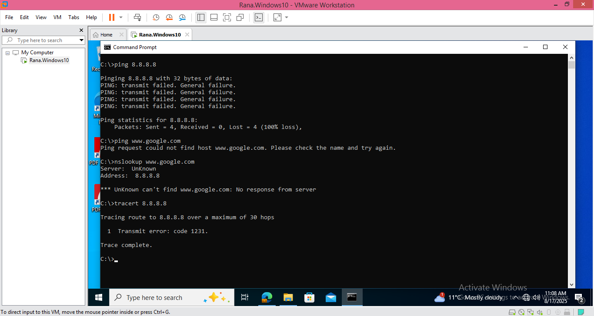  

**Observation:**  
- `ping 8.8.8.8` Failed 
- `ping google.com` Failed (Could Not Find Host)  
- `tracert 8.8.8.8` (Transmit Error)   
   
**Resolution:** 
 
 Restored correct **Default Gateway**. Confirmed Internet access restored. 
   
   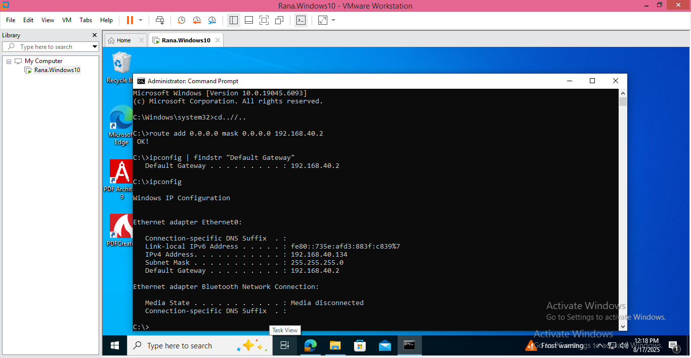
   
   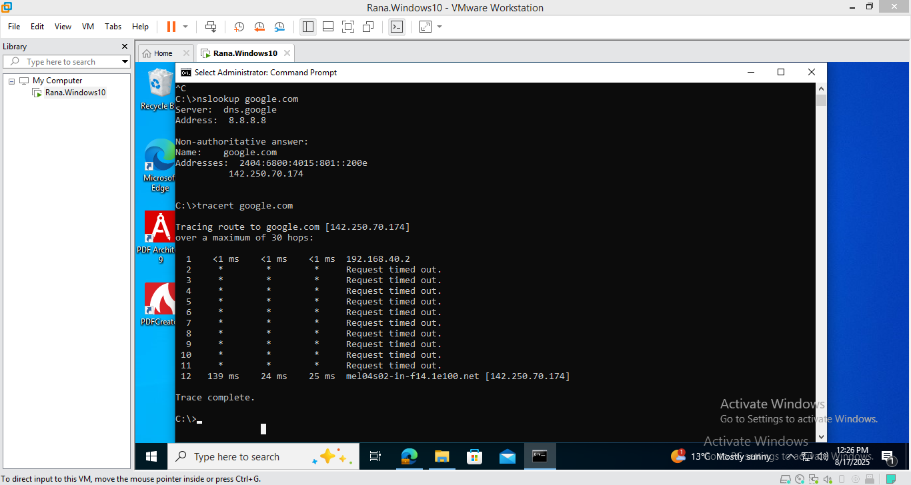 
   
   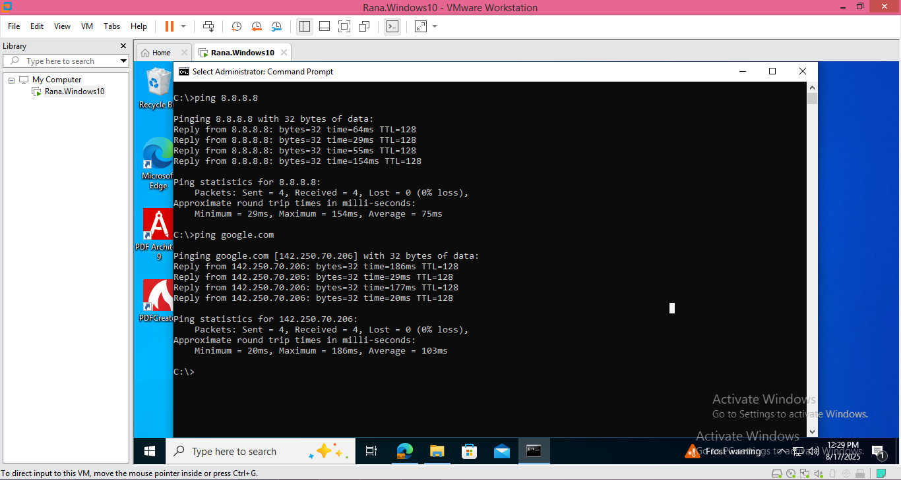 
   

---

## Conclusion
This lab demonstrated how to:
- Use `ipconfig`, `ping`, `tracert`, and `nslookup` to diagnose issues  
- Differentiate between **DNS issues** and **Routing issues**  
- Simulate and fix real-world connectivity problems  

**Key takeaway:* 

- Structured troubleshooting saves time and quickly narrows down the root cause of network issues.
