# No Internet Access — Diagnosing DNS vs Default Gateway Failures on Windows 10

| Field | Detail |
|---|---|
| **Ticket Subject** | "The internet isn't working" — two separate connectivity faults on one workstation |
| **Category** | Network / Connectivity |
| **Priority** | P3 — Single User Impacted |
| **Environment** | Windows 10 VM (DESKTOP-9OPLHE7, 192.168.40.134/24) on VMware Workstation Pro — faults deliberately injected in a home lab to reproduce the tickets |

---

## Problem Statement

A user reports that websites won't load. From the user's side, every network fault looks identical — "the internet is down" — but the fix depends entirely on *which layer* has failed. This lab works two tickets on the same workstation: the first caused by a **bad DNS server**, the second by a **missing default gateway**. The task is to prove the root cause of each with command-line evidence before changing anything, fix only what is broken, and verify the result against a known-good baseline.

---

## Tools Used

- **ipconfig** (adapter configuration, `/all`, `/flushdns`)
- **route** (adding the default route back)
- **ping** (layer-by-layer reachability tests)
- **tracert** (path to the destination, hop by hop)
- **nslookup** (DNS resolution, and which DNS server answered)
- **Network Connections** (IPv4 Properties — Windows GUI adapter settings)

---

## Technical Steps

### 1. Capture a Known-Good Baseline

Before touching anything, recorded what "healthy" looks like on this machine. `ipconfig /all` showed the adapter on DHCP with IP **192.168.40.134/24**, default gateway **192.168.40.2**, and DNS servers **8.8.8.8 / 8.8.4.4**. Then tested each layer in order — the ping sequence is deliberately bottom-up, so the first failure points at the broken layer:

```bat
ipconfig /all
ping 127.0.0.1           :: 1. Is the TCP/IP stack working?
ping 192.168.40.134      :: 2. Is my own adapter up?
ping 192.168.40.2        :: 3. Can I reach the gateway?
ping 8.8.8.8             :: 4. Can I reach the internet by IP?
ping www.microsoft.com   :: 5. Does name resolution work?
tracert 8.8.8.8
nslookup www.microsoft.com
```

All tests passed. The raw output of every baseline command is saved in the [`Outputs`](Outputs) folder so later results can be compared line by line.

**Screenshot:**
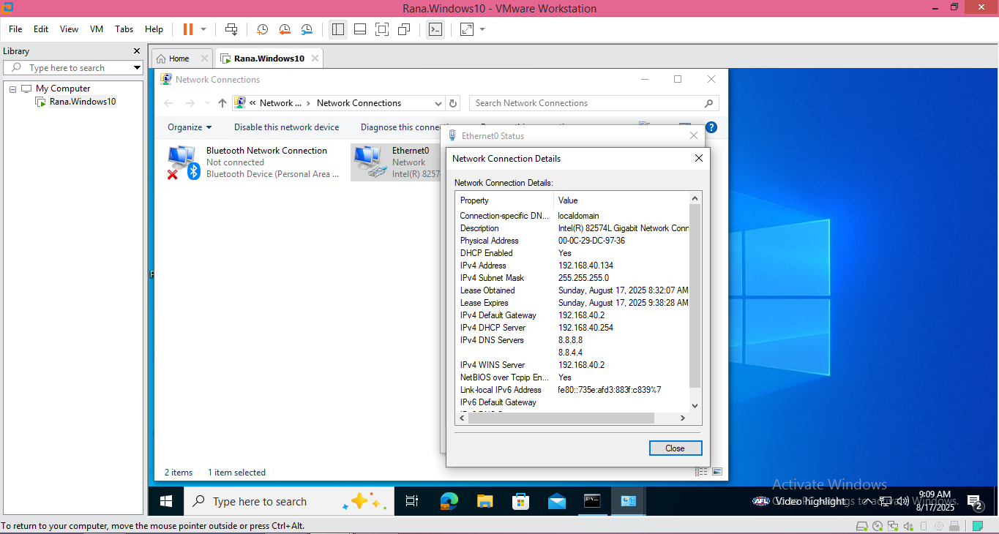

---

### Ticket 1 — Websites Won't Load, but Some Things Still Work

### 2. Reproduce the Fault — Invalid DNS Server

To reproduce the first ticket, the adapter's preferred DNS server was changed to **10.255.255.10**, an address with no DNS service behind it.

**Screenshot:**
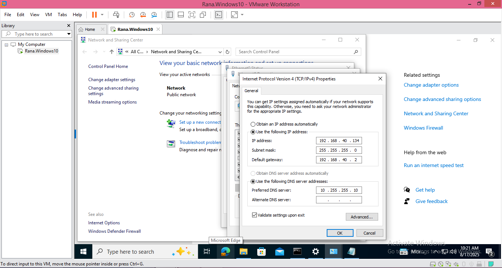

Flushed the local DNS cache with `ipconfig /flushdns` so that previously cached lookups could not mask the fault and every test would hit the configured DNS server.

**Screenshot:**
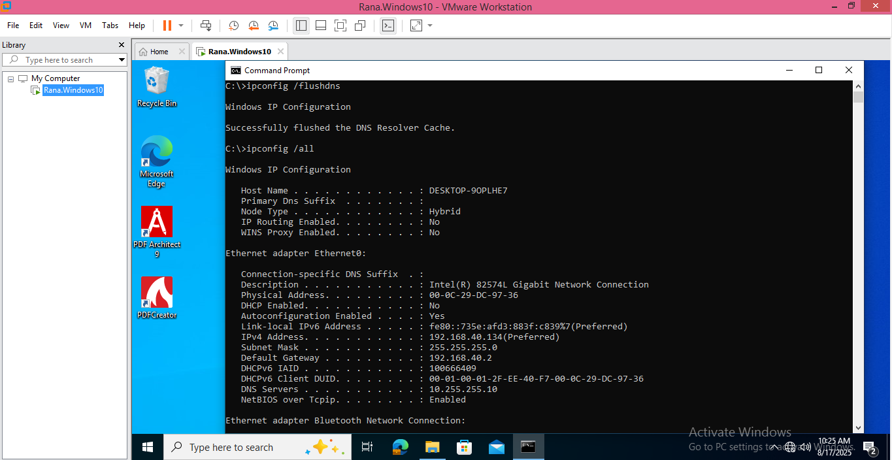

---

### 3. Diagnose — Prove It Is DNS

Ran the layered tests again. The results split cleanly:

| Test | Result | What it tells us |
|---|---|---|
| `ping 8.8.8.8` | **4/4 replies** | Routing and internet access are fine |
| `ping www.microsoft.com` | "could not find host" | The name cannot be turned into an IP |
| `nslookup www.microsoft.com` | "DNS request timed out", server **10.255.255.10** | The DNS server itself is not answering |
| `tracert www.microsoft.com` | "Unable to resolve target system name" | Same failure — resolution, not routing |

**Root cause:** reachable by IP, unreachable by name → the fault is DNS, and `nslookup` names the exact server that is failing.

**Screenshot:**
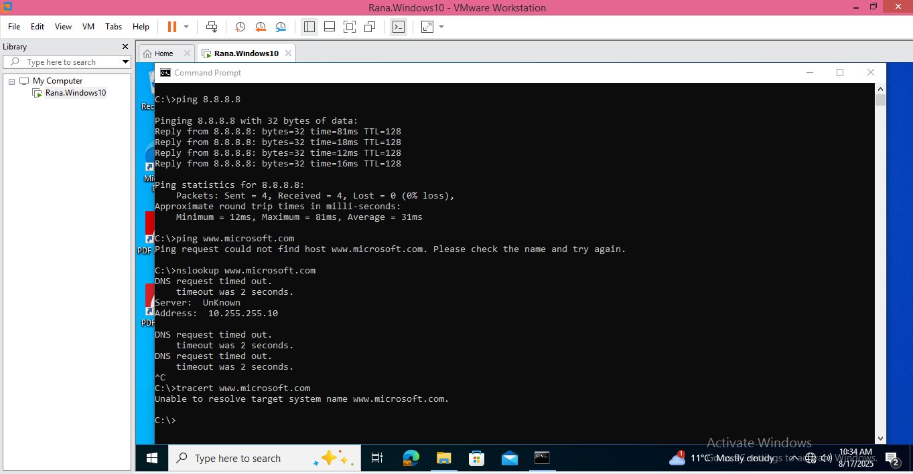

---

### 4. Resolve and Verify — Restore a Valid DNS Server

Set the preferred DNS server back to **8.8.8.8** (alternate **1.1.1.1**).

**Screenshot:**
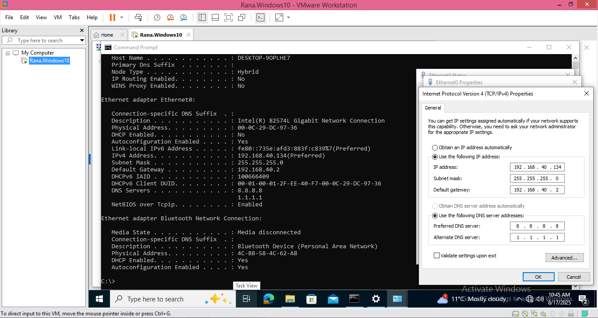

Re-tested: `nslookup google.com` now answered from **dns.google (8.8.8.8)** and `ping google.com` resolved and replied 4/4. Ticket 1 closed.

**Screenshot:**
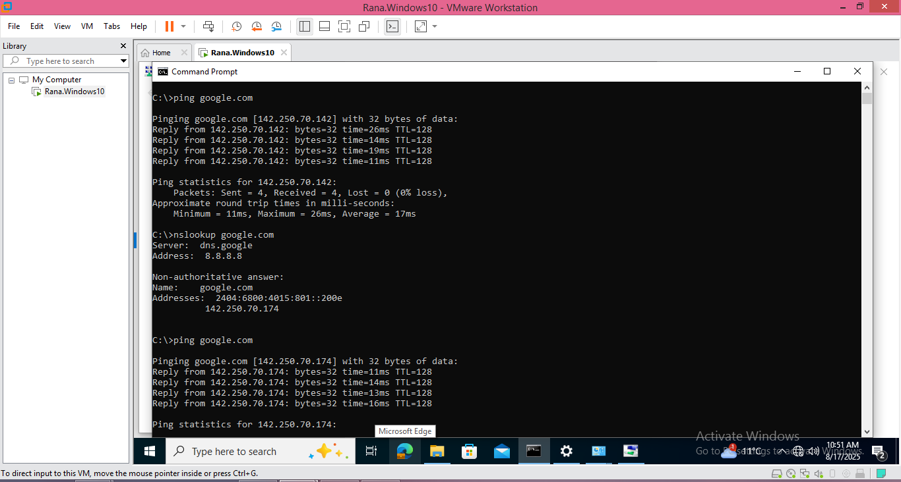

---

### Ticket 2 — Nothing Outside the Office Works at All

### 5. Reproduce the Fault — Missing Default Gateway

For the second ticket the adapter was switched to a static configuration with the IP, subnet mask and DNS servers correct but the **Default gateway field left blank**. `ipconfig /all` confirms it: `Default Gateway . . . :` is empty.

**Screenshot:**
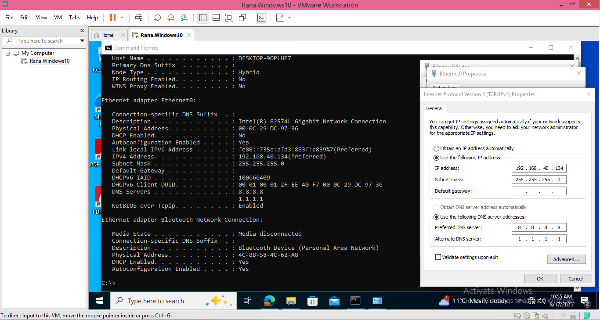

---

### 6. Diagnose — Prove It Is the Gateway, Not DNS

This fault is the one that fools people, because it produces a *DNS-looking* error:

| Test | Result | What it tells us |
|---|---|---|
| `ping 8.8.8.8` | "PING: transmit failed. **General failure**" (100% loss) | Windows has no route off the subnet at all |
| `ping www.google.com` | "could not find host" | Looks like DNS… |
| `nslookup www.google.com` | "No response from server" (8.8.8.8) | …but the DNS server is off-subnet and unreachable too |
| `tracert 8.8.8.8` | "Transmit error: code 1231" at hop 1 | Fails before the first hop — nothing to forward to |

**Root cause:** unlike Ticket 1, pinging a public *IP address* also fails, and it fails locally with "General failure" rather than timing out. DNS is configured correctly; it is simply unreachable because there is no gateway to send traffic through. Fixing DNS here would have changed nothing.

**Screenshot:**
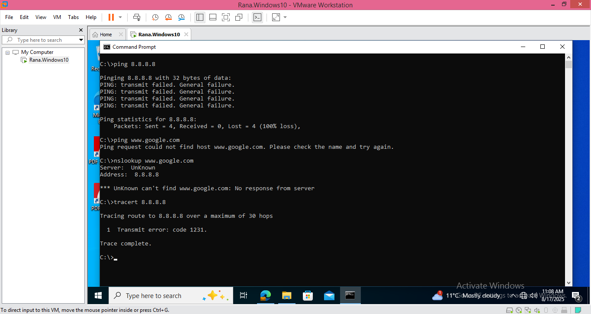

---

### 7. Resolve and Verify — Restore the Default Gateway

Restored the default route from an elevated Command Prompt and confirmed it took effect:

```bat
route add 0.0.0.0 mask 0.0.0.0 192.168.40.2
ipconfig | findstr "Default Gateway"
```

`ipconfig` now reports **Default Gateway 192.168.40.2**.

> **Production note:** `route add` without `-p` is not persistent — the route disappears on reboot. It is the right tool for proving the diagnosis quickly; the permanent fix is to enter the gateway in the adapter's IPv4 properties (or return the adapter to DHCP) so the ticket does not reopen after the next restart.

**Screenshot:**
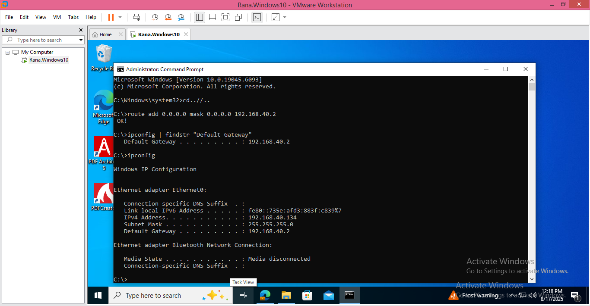

Verified end-to-end: `nslookup google.com` answered from 8.8.8.8, and `tracert google.com` showed the first hop as **192.168.40.2** — the restored gateway — reaching Google's Melbourne edge (`mel04s02-in-f14.1e100.net`) at hop 12.

**Screenshot:**
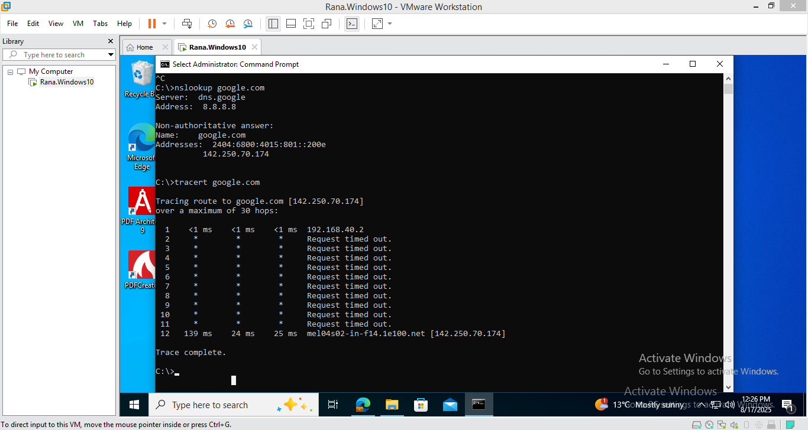

Final check: `ping 8.8.8.8` and `ping google.com` both returned 4/4 replies, matching the baseline. Ticket 2 closed.

**Screenshot:**
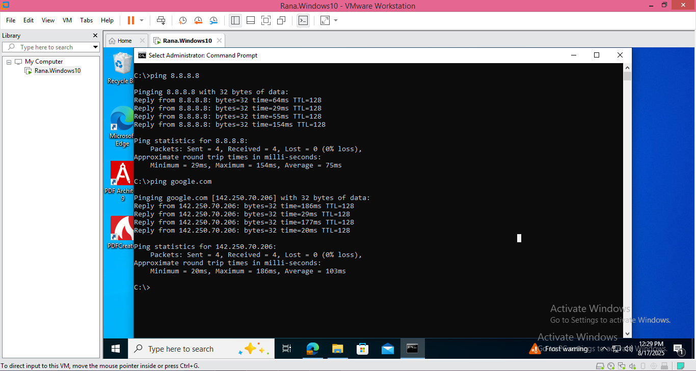

---

## Root Cause Summary

| | Ticket 1 | Ticket 2 |
|---|---|---|
| **User symptom** | Websites won't load | Websites won't load |
| **`ping 8.8.8.8`** | ✅ Replies | ❌ General failure |
| **`ping <name>`** | ❌ Could not find host | ❌ Could not find host |
| **Root cause** | Invalid DNS server (10.255.255.10) | No default gateway configured |
| **Fix** | Restore valid DNS server | Restore default route via 192.168.40.2 |

The single test that separates the two is **pinging a public IP address**.

---

## Key Takeaways

- **Same symptom, different layers.** Both tickets would arrive worded identically. Testing bottom-up — loopback, self, gateway, public IP, name — finds the broken layer in minutes instead of guessing.
- **"Could not find host" does not always mean DNS.** With no gateway, the DNS server is unreachable, so name resolution fails as a *side effect*. Pinging an IP address first prevents a technician from "fixing" DNS that was never broken.
- **Read the error text precisely.** "Request timed out" means packets left and nothing came back; "General failure" and "code 1231" mean the packet never left the machine. They point at different problems.
- **A baseline turns opinions into evidence.** Saving healthy output before the incident made it possible to prove each fix returned the machine to its known-good state, not just "it seems to work now."

---

## Skills Demonstrated

`Network Troubleshooting` · `TCP/IP Fundamentals` · `DNS` · `Default Gateway / Routing` · `ipconfig · ping · tracert · nslookup` · `Layered (OSI) Diagnosis` · `Root Cause Analysis`
