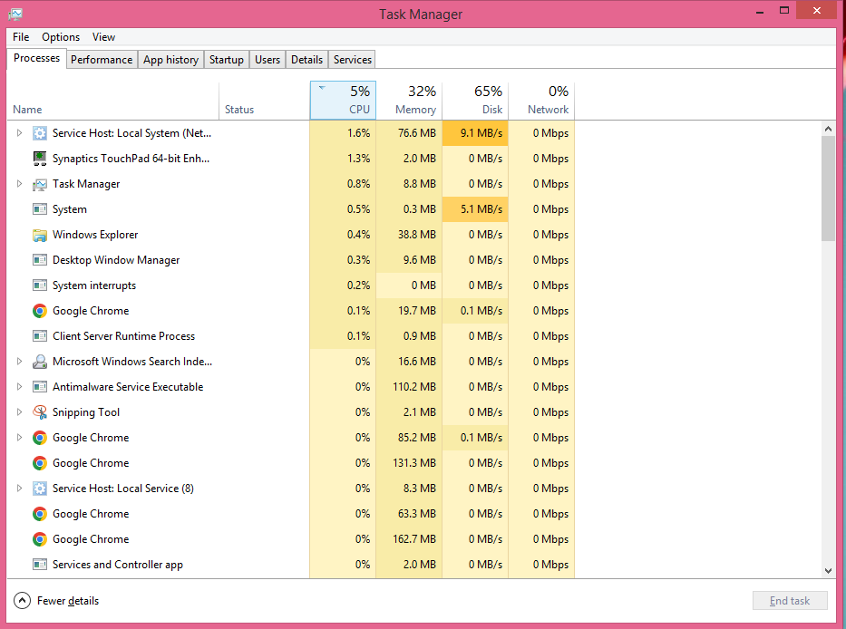
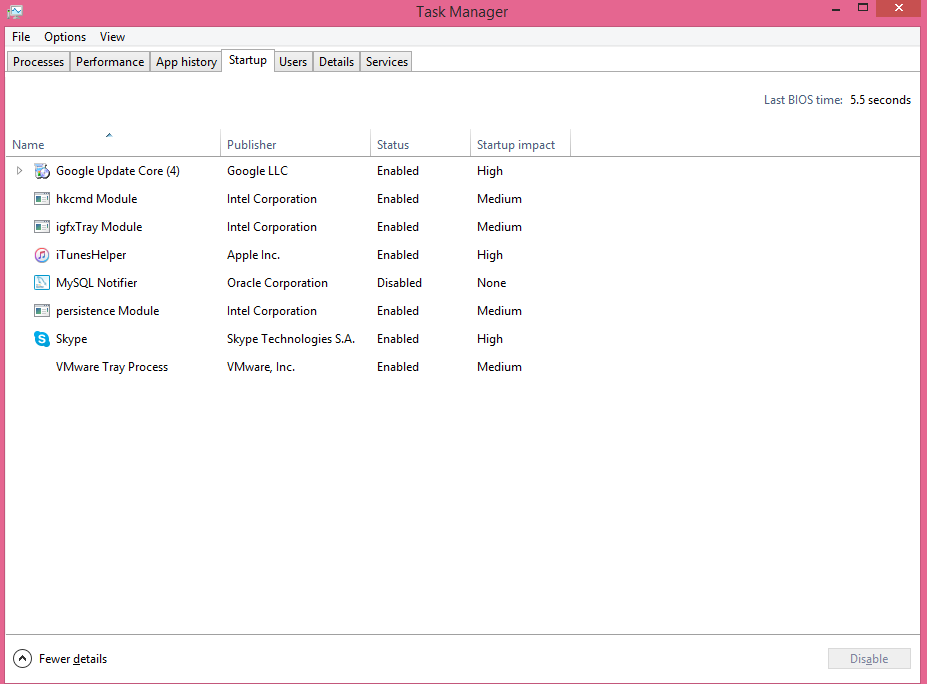
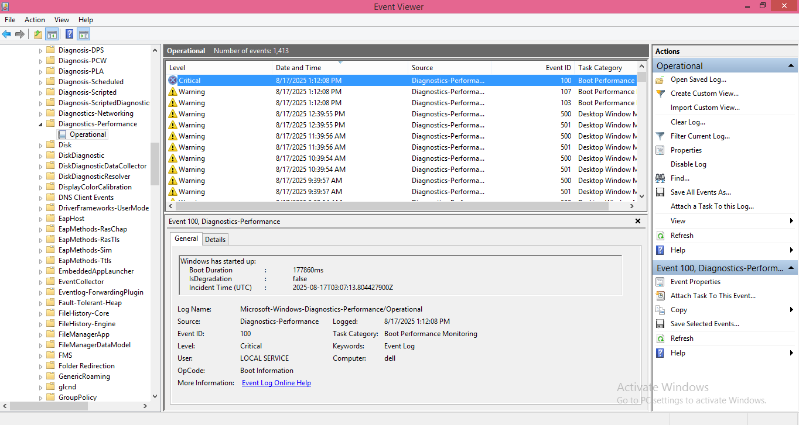
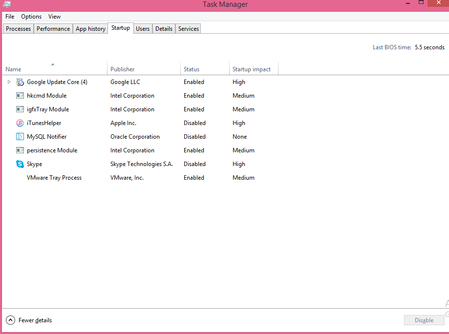
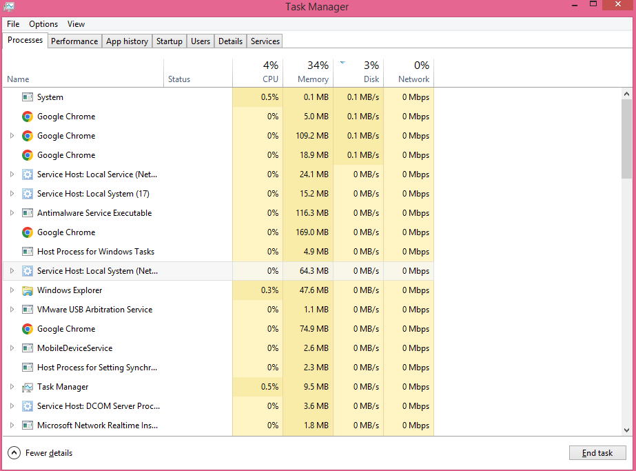
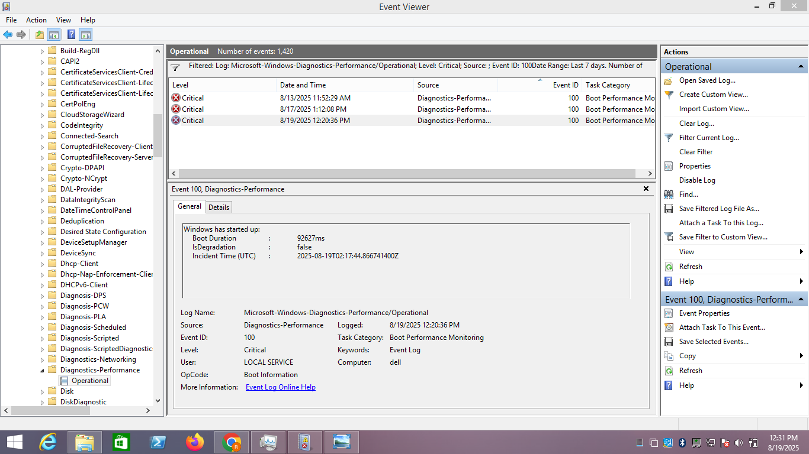

# Lab 02 - PC Performance Troubleshooting (Local Host, Windows OS)

## Overview
In this lab, I performed PC performance troubleshooting on my personal computer (local host) instead of a VM.  
The objective was to identify high resource usage, disable unnecessary startup applications, and measure the impact on system performance.  
The main bottleneck observed was **high disk usage** and **long boot duration**, which were significantly improved after applying fixes.

---

## Lab Steps

### 1) Baseline (Before Fix)
- **Task Manager (Processes → Disk)**  
    
  - Disk usage was at **65%** during idle.
 
      

- **Task Manager (Startup)**  
    
  - Startup apps included iTunesHelper and Skype (enabled).
 
    

- **Event Viewer (Event ID 100 – Boot Duration)**  
  
  - Boot Duration was **177,860 ms (~177 seconds)**.
 
       

---

### 2) Action (Fix Applied)

- Disabled **iTunesHelper** and **Skype** from Task Manager → Startup tab.  

    

---

### 3) Results (After Fix)

- **Task Manager (Processes → Disk)**  
    
  - Disk usage dropped to **3%**, with CPU/Memory stable.
 
     

- **Event Viewer (Event ID 100 – Boot Duration)**  
    
  - Boot Duration improved to **92,627 ms (~92 seconds)**.  

   
---

## Conclusion

This lab demonstrated a successful **performance improvement** on Windows OS using GUI-only troubleshooting:  
- Identified high disk usage and long boot duration.  
- Found unnecessary startup programs (iTunesHelper, Skype) as contributing factors.  
- Disabled them to reduce resource usage.  
- Verified improvements:  
  - Boot Duration improved by **85 seconds (48% faster)**.  
  - Disk usage at idle dropped from **65% → 3%**.  

This is a clear example of real-world troubleshooting that IT support staff perform to speed up user systems.
