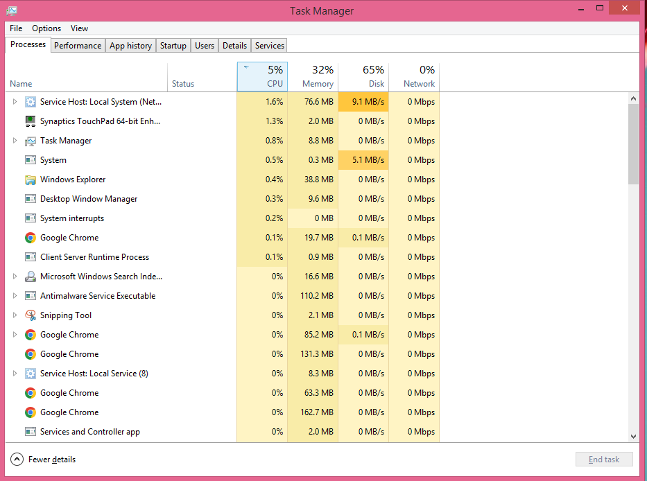
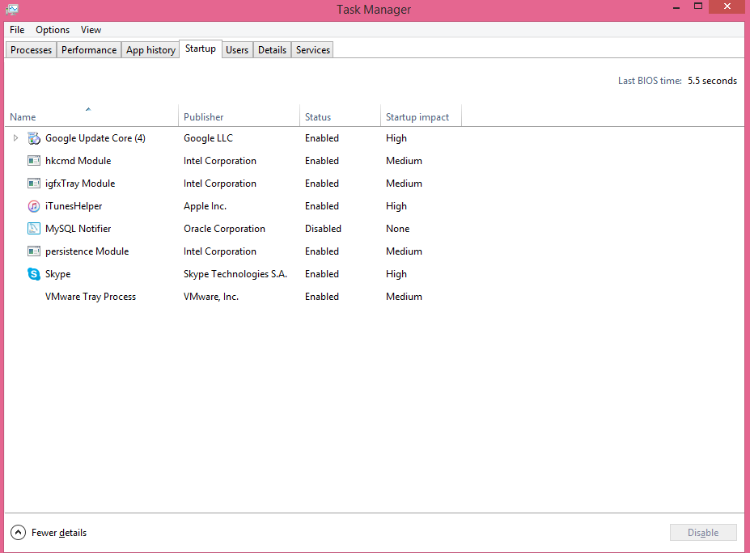
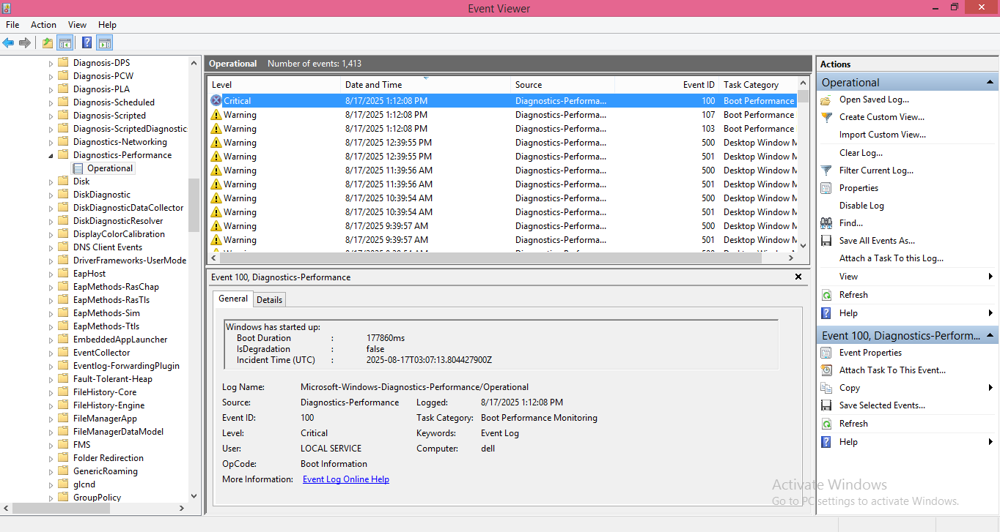
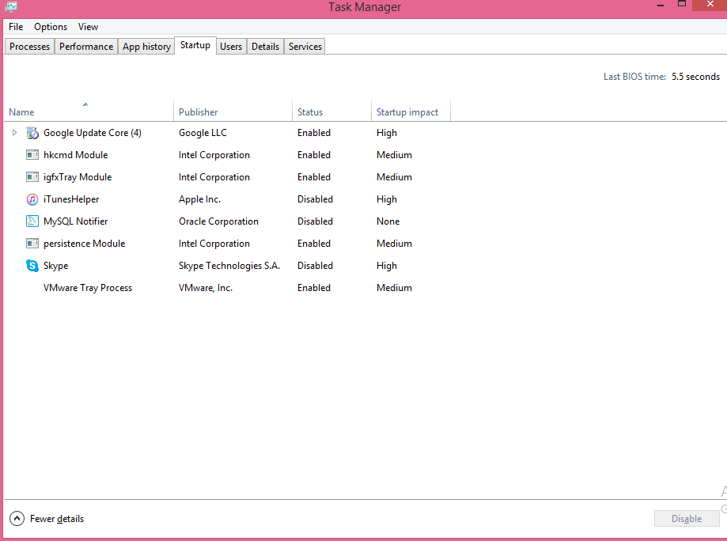
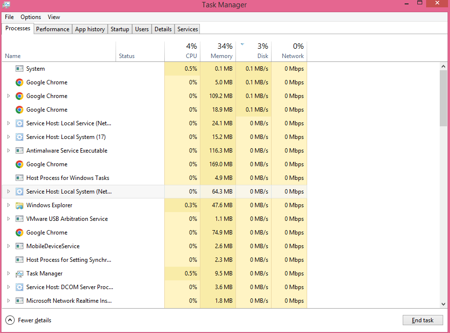
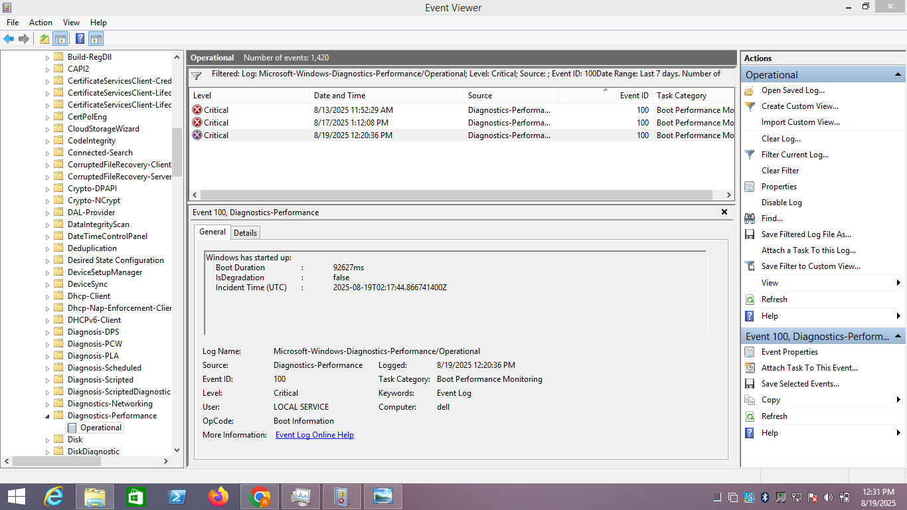

# Slow Startup Complaint — Cutting Boot Time 48% by Removing Startup Bloat

| Field | Detail |
|---|---|
| **Ticket Subject** | "My laptop takes forever to start and the disk light never stops" |
| **Category** | Hardware / Performance |
| **Priority** | P3 — Productivity Impacted |
| **Environment** | Physical Dell laptop (Windows 8.x) — a real machine, not a VM. Measurements taken 17 Aug 2025 (before) and 19 Aug 2025 (after) |

---

## Problem Statement

A user reports that their laptop takes several minutes to become usable after switching on, and that it stays sluggish afterwards with the disk constantly busy. "It's slow" is not a diagnosis, so the task is to **measure** the problem with Windows' own tools, identify what is consuming resources at startup, apply the least disruptive fix, and **prove** the improvement with the same measurements after a reboot.

This lab was performed on a real, in-use laptop rather than a clean VM, so the numbers below are genuine before-and-after readings.

---

## Tools Used

- **Task Manager** (Processes tab — live CPU, memory and disk usage; Startup tab — startup programs and their impact)
- **Event Viewer** (Diagnostics-Performance log, Event ID 100 — boot duration)
- **Snipping Tool** (evidence capture)

---

## Technical Steps

### 1. Measure Resource Usage at Idle (Before)

Opened **Task Manager → Processes** with no user applications doing work and sorted by resource use. Disk usage sat at **65%** at idle, with **Service Host: Local System** writing 9.1 MB/s and **System** 5.1 MB/s. CPU (5%) and memory (32%) were normal — so the bottleneck is disk, not processor or RAM.

**Screenshot:**

---

### 2. Review What Launches at Startup

Opened **Task Manager → Startup**. Several applications launch with every sign-in, and three were rated **High** startup impact: **Google Update Core**, **iTunesHelper** and **Skype**. iTunesHelper and Skype are not needed by the user at sign-in and can be started on demand when they are actually used.

**Screenshot:**

---

### 3. Get a Hard Number for Boot Time

Task Manager shows "Last BIOS time" (5.5 seconds), but that covers only the firmware stage. The real figure is in **Event Viewer → Applications and Services Logs → Microsoft → Windows → Diagnostics-Performance → Operational**, **Event ID 100**, which Windows writes after every boot.

The event for the 17 Aug boot recorded **Boot Duration: 177,860 ms (~178 seconds)** — almost three minutes before the desktop was usable.

**Screenshot:**

---

### 4. Apply the Fix — Disable Unneeded Startup Programs

In **Task Manager → Startup**, disabled **iTunesHelper** and **Skype**. Both remain installed and fully usable; they simply no longer launch automatically at every sign-in. Driver-related entries (Intel graphics modules, VMware Tray) and Google Update were left alone — disabling components the user or the system depends on trades one ticket for another.

**Screenshot:**

---

### 5. Verify — Resource Usage After Reboot

After a reboot, Task Manager showed disk usage at idle down to **3%**, with CPU (4%) and memory (34%) unchanged — the change removed disk load without side effects.

**Screenshot:**

---

### 6. Verify — Boot Duration After Reboot

Filtered the Diagnostics-Performance log to **Critical, Event ID 100, last 7 days** to line up every boot side by side. The 19 Aug boot recorded **Boot Duration: 92,627 ms (~93 seconds)**.

**Screenshot:**

---

## Results

| Metric | Before (17 Aug) | After (19 Aug) | Change |
|---|---|---|---|
| Boot duration (Event ID 100) | 177,860 ms | 92,627 ms | **−85 s (48% faster)** |
| Disk usage at idle | 65% | 3% | **−62 points** |
| CPU at idle | 5% | 4% | No change |
| Memory in use | 32% | 34% | No change |

---

## Key Takeaways

- **Measure first, fix second.** Event ID 100 turns "it's slow" into a number that can be compared before and after. Without a baseline, "it feels faster" is the only possible closing note.
- **Find the actual bottleneck.** CPU and memory were healthy; the disk was saturated. Looking at all four columns prevented chasing the wrong resource.
- **Choose the least disruptive fix.** Disabling startup entries is reversible and leaves the applications installed. Uninstalling software, or disabling drivers, carries far more risk of creating a new ticket.
- **Be honest about what the data shows.** This is one boot before and one after, and idle disk usage is a snapshot in time. The improvement is large and consistent with the change, but in production I would confirm it over several boots and check the disk's health (SMART status) before closing, as a failing drive produces the same symptoms.

---

## Skills Demonstrated

`Windows Performance Troubleshooting` · `Task Manager` · `Startup Optimisation` · `Event Viewer (Event ID 100)` · `Before/After Measurement` · `End-User Support`
