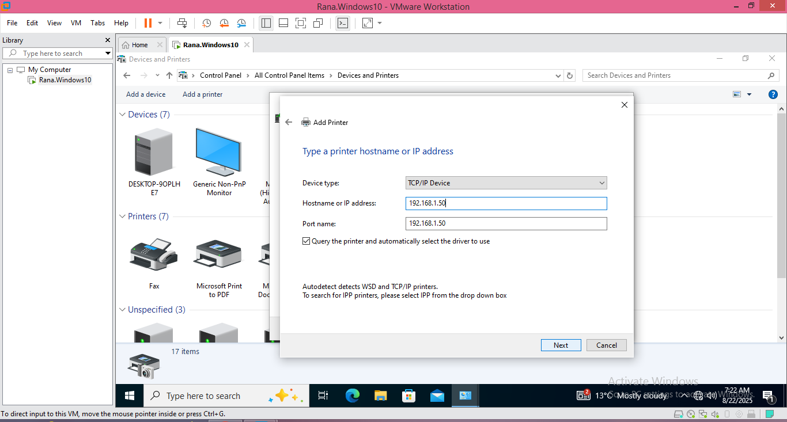
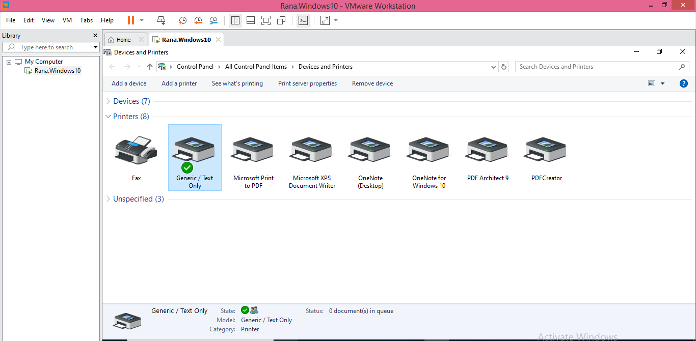
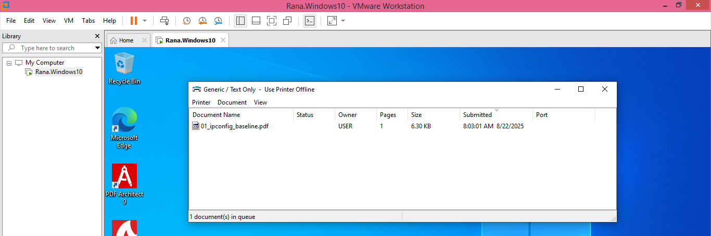
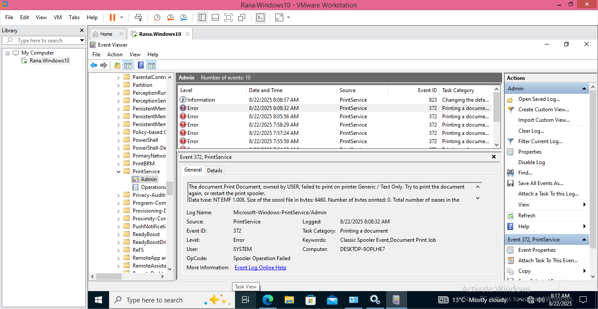
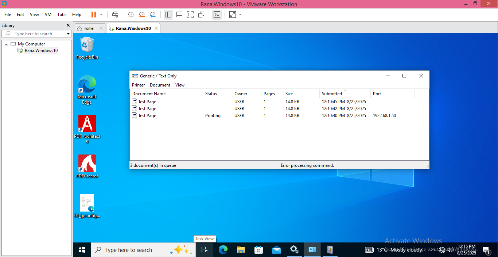
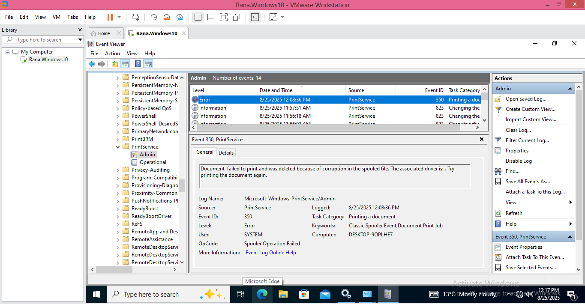
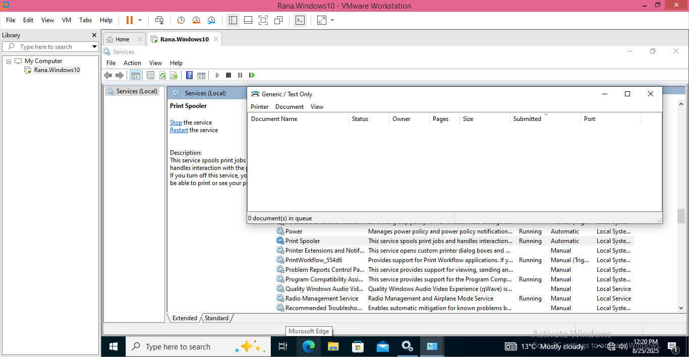

## Lab 03 - Printer Troubleshooting Lab

## Objective
Practice adding a printer via IP, simulating offline and stuck jobs, and using Event Viewer to troubleshoot issues.

---

## Step 1 – Add Printer Using TCP/IP
Go to **Control Panel → Devices and Printers → Add Printer → The printer that I want isn’t listed → Add a printer using a TCP/IP address or hostname**.

---

## Step 2 – Select Driver
For simulation purposes, the **Generic / Text Only** driver was selected.

---

## Step 3 – Installed Printer via IP
Printer successfully installed via a dummy IP address.

**Note:** I was not able to print a test page because the IP was dummy and there was no actual printer to receive the job, so the print never executed.

---

## Step 4 – Simulate Printer Offline Mode
The printer was manually set to **Use Printer Offline**. A test job was sent and got stuck in the queue.

---

## Step 5 – Event Viewer Log (Failed Print)
In Event Viewer → **Applications and Services Logs → Microsoft → Windows → PrintService → Operational**, a log entry shows the failed print attempt.

---

## Step 6 – Simulate Stuck Jobs in Queue
Multiple jobs were queued, then the **Print Spooler service was stopped**, leaving jobs stuck in the queue. "Cancel All Documents" option was not able to get executed

---

## Step 7 – Event Viewer Log (Spooler Stopped)
Event Viewer recorded a log entry for spooler-related issues.

---

## Step 8 – Fix by Restarting Print Spooler
The **Print Spooler service** was restarted, clearing the stuck jobs. Printing functionality was restored.

---

##  Lab Outcome

- Successfully added printer via TCP/IP  
- Simulated **Offline** and **Stuck Job** issues  
- Used **Event Viewer** for troubleshooting logs  
- Resolved issue by restarting **Print Spooler**  

This lab demonstrates real-world printer troubleshooting steps a help desk technician would encounter.
