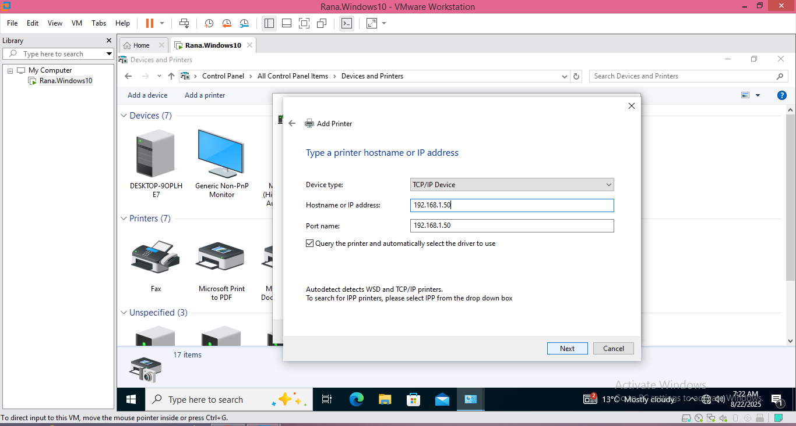
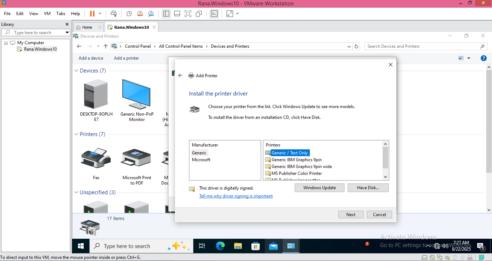
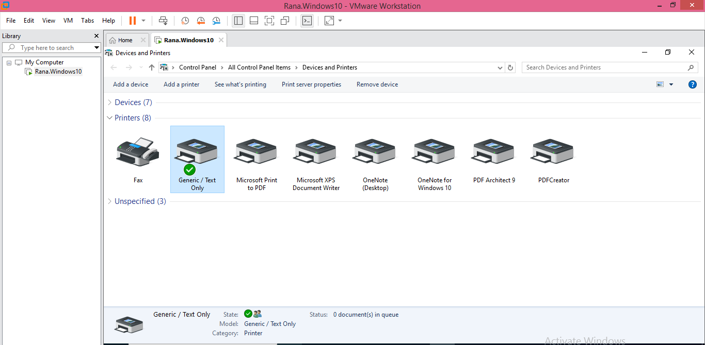
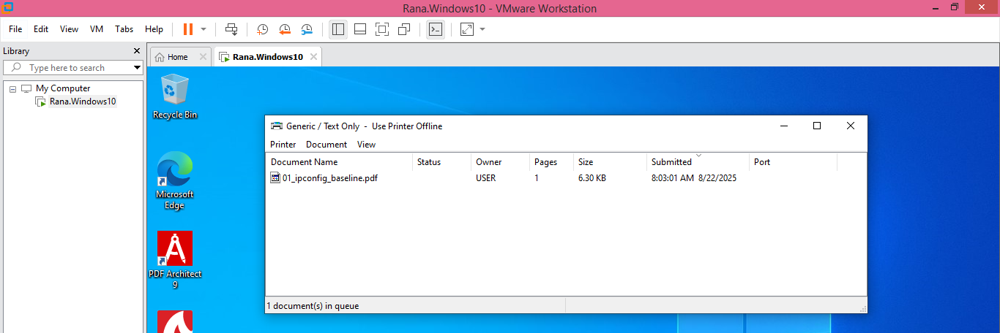
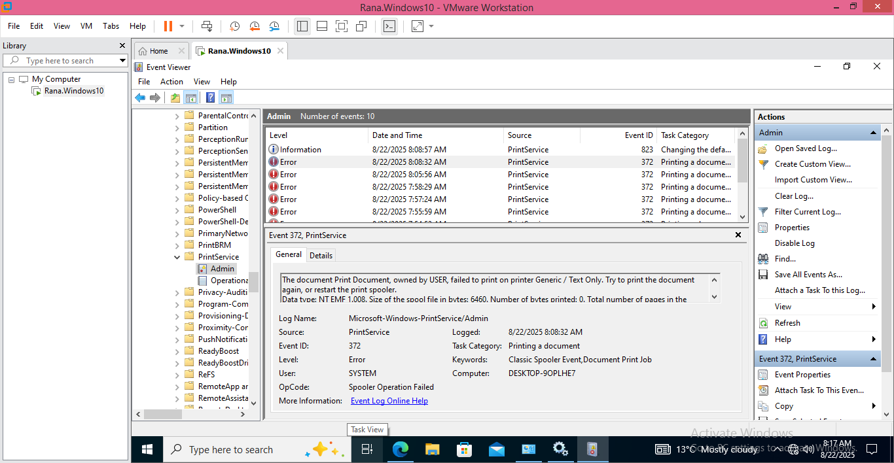
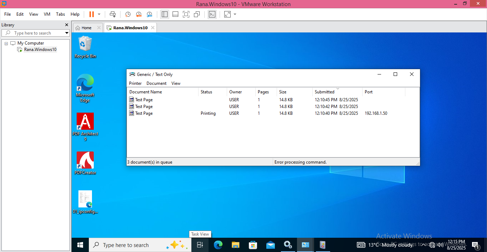
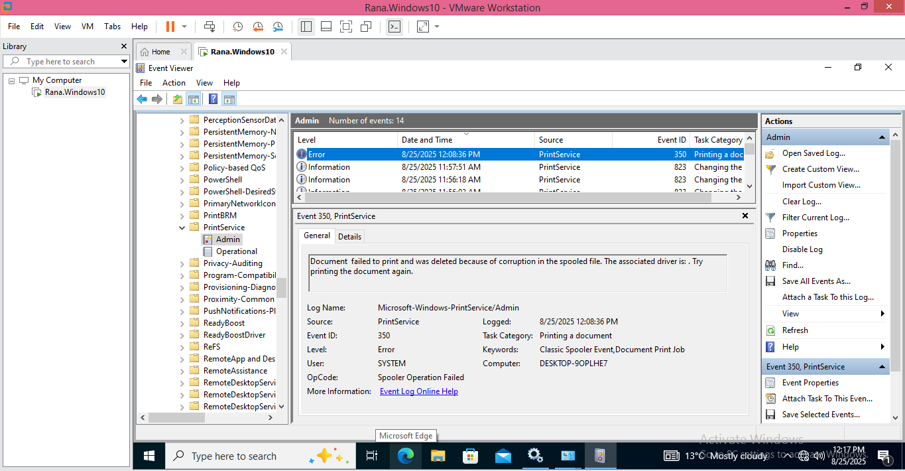
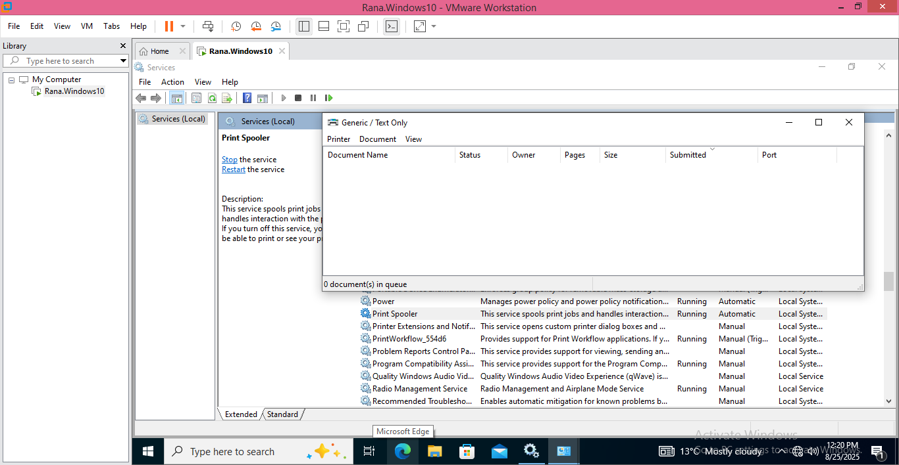

# Print Jobs Stuck in the Queue — Printer Setup, Event Logs & Spooler Recovery

| Field | Detail |
|---|---|
| **Ticket Subject** | New network printer added — "my documents never come out and I can't cancel them" |
| **Category** | Hardware / Printing |
| **Priority** | P3 — Single User Impacted |
| **Environment** | Windows 10 VM (DESKTOP-9OPLHE7) on VMware Workstation Pro. No physical printer — a TCP/IP printer at a placeholder address (192.168.1.50) was used so that faults could be reproduced safely |

---

## Problem Statement

A user needs a network printer added to their workstation. Once it is installed, their documents sit in the queue and never print, and later the queue jams completely — jobs cannot even be cancelled. Printing is one of the most common help desk ticket types, and the task is to install the printer correctly, then use the print queue and the **PrintService event logs** to identify what is failing, and clear the jammed queue without rebooting the user's PC.

> **Lab note:** there was no real printer at 192.168.1.50, so jobs could never physically print. That is what made it possible to reproduce an offline printer and a stuck queue on demand — the diagnosis and recovery steps are the same ones used against a real device.

---

## Tools Used

- **Devices and Printers** (Add Printer wizard — TCP/IP printer installation)
- **Print queue** (job status, offline mode)
- **Event Viewer** (Microsoft → Windows → PrintService → Admin log)
- **Services console** (services.msc — Print Spooler service)

---

## Technical Steps

### Part A — Install the Network Printer

### 1. Add the Printer by IP Address

In **Control Panel → Devices and Printers → Add a printer → The printer that I want isn't listed → Add a printer using a TCP/IP address or hostname**, selected device type **TCP/IP Device** and entered **192.168.1.50** as both the hostname/IP and the port name.

**Screenshot:**

---

### 2. Select the Driver

Because no device answered the driver query, Windows could not auto-detect a model, so the **Generic / Text Only** driver was selected manually. (With a real printer, the manufacturer's driver would be installed here — the wrong driver is itself a common cause of garbled or failed prints.)

**Screenshot:**

---

### 3. Confirm the Installation

The printer appeared in Devices and Printers as **Generic / Text Only**, set as the default printer, with **0 documents in queue**.

**Screenshot:**

---

### Part B — "My Documents Never Print"

### 4. Check the Queue

The user's test document (`01_ipconfig_baseline.pdf`) was sitting in the queue and not moving. The title bar of the queue window gave the answer immediately: **Generic / Text Only — Use Printer Offline**. The printer had been placed in offline mode, so Windows was holding jobs instead of sending them.

**Screenshot:**

---

### 5. Confirm with the PrintService Log

Opened **Event Viewer → Applications and Services Logs → Microsoft → Windows → PrintService → Admin**. It showed a run of **Error, Event ID 372** entries: *"The document Print Document, owned by USER, failed to print on printer Generic / Text Only. Try to print the document again, or restart the print spooler."* The event records **Number of bytes printed: 0** — nothing ever reached the printer.

Read together, the queue and the log describe two layers of the same problem: the jobs that *were* sent failed with zero bytes delivered because nothing answered at 192.168.1.50, and the printer was then left in offline mode, so new jobs were simply held. The fix order is therefore: confirm the device is powered on and reachable (`ping 192.168.1.50`), then clear **Use Printer Offline** so held jobs are released.

**Screenshot:**

---

### Part C — "The Queue Is Jammed and Won't Cancel"

### 6. Reproduce the Jammed Queue

Three test pages were queued, then the **Print Spooler** service was stopped mid-job. The first job stuck on **Printing** against port **192.168.1.50**, the queue reported **"Error processing command"**, and **Cancel All Documents** had no effect — the classic symptom a user describes as "I can't get rid of it."

**Screenshot:**

---

### 7. Read the Spooler Error

The PrintService Admin log recorded **Error, Event ID 350**: *"Document failed to print and was deleted because of corruption in the spooled file."* This confirms the spooler — not the application or the user — is the component that has failed, which is why cancelling from the queue window cannot work.

**Screenshot:**

---

### 8. Resolve — Restart the Print Spooler

In **services.msc**, started the **Print Spooler** service again (Status: **Running**, Startup type: **Automatic**). The queue cleared to **0 documents** and printing was restored — without rebooting the user's PC.

**Screenshot:**

> **If a restart alone does not clear it:** stop the spooler, delete the files in `C:\Windows\System32\spool\PRINTERS`, then start the spooler again. This removes corrupted spool files that would otherwise jam the queue again as soon as the service comes back.

---

## Root Cause Summary

| Symptom | Evidence | Root Cause | Fix |
|---|---|---|---|
| Documents wait in the queue and never print | Queue title shows **Use Printer Offline**; **Event ID 372**, 0 bytes printed | Printer not reachable at its IP, then left in offline mode | Confirm the device responds at its IP; clear "Use Printer Offline" |
| Queue jammed, jobs can't be cancelled | "Error processing command"; **Event ID 350** | Print Spooler service stopped / spool files corrupted | Restart the Print Spooler; clear the spool folder if needed |

---

## Key Takeaways

- **The queue window tells you more than the user does.** The title bar and the Status column ("Use Printer Offline", "Printing", "Error processing command") point straight at the problem before any logs are opened.
- **PrintService → Admin is the printing log.** Event ID 372 (a job failed to print) and Event ID 350 (a spooled file was corrupted) separate a device problem from a spooler problem.
- **When cancel doesn't work, it's the spooler.** A jammed queue is a service problem, and restarting the Print Spooler fixes it in seconds — far less disruptive for the user than a reboot.
- **Work bottom-up on printers too:** Is the device on and reachable? Is it online in Windows? Is the right driver installed? Is the spooler running?

---

## Skills Demonstrated

`Printer Installation (TCP/IP)` · `Print Queue Management` · `Event Viewer — PrintService Logs` · `Print Spooler Service` · `Windows Services` · `Root Cause Analysis`
