# Windows 11 Installation & Configuration Lab

## Overview
This lab demonstrates a clean installation and configuration of Windows 11 in a VMware Workstation Pro environment. 
It reflects a real-world IT Service Desk scenario where a new user device is provisioned, updated, and configured with 
the necessary drivers and user accounts.

## Steps and Screenshots

### 1. Creating a New Virtual Machine

I began by creating a new VM in VMware Workstation Pro and selected the Windows 11 ISO image.

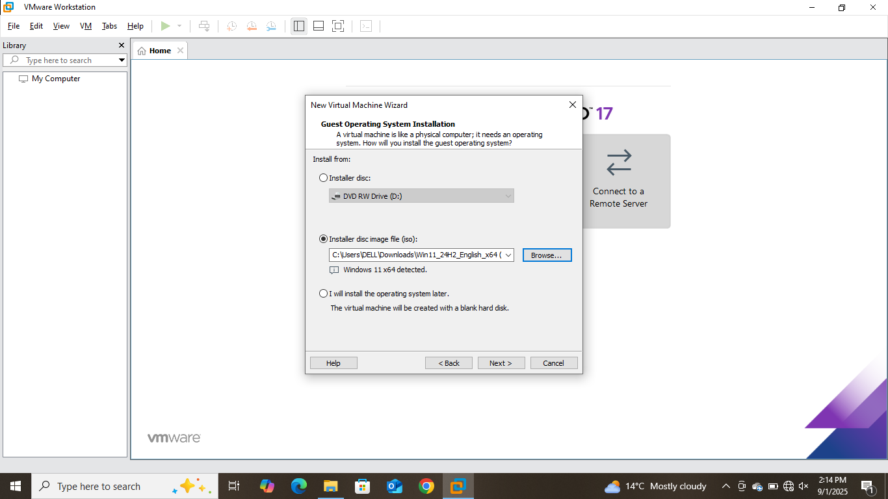

### 2. Starting Windows Setup

When the VM booted, I proceeded with the installation and selected the language and regional preferences.  

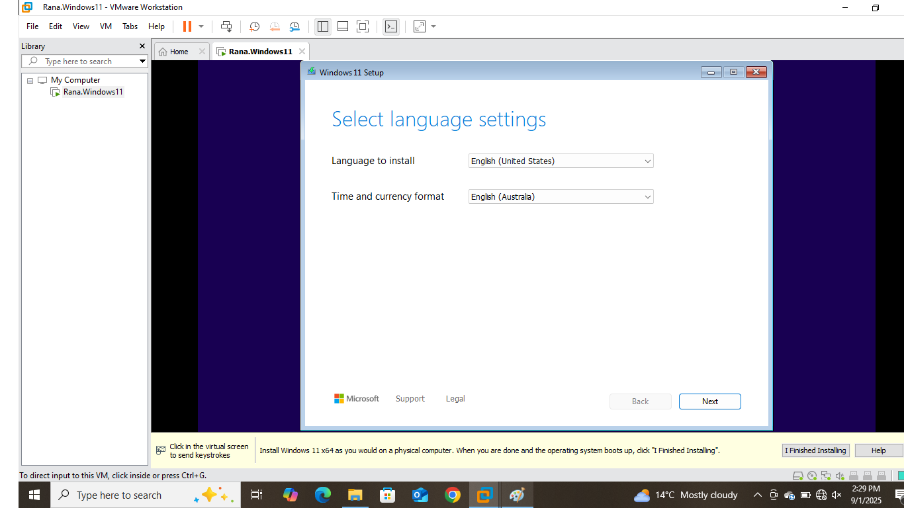

### 3. Choosing Installation Option

I chose to install Windows 11 as a new installation.  

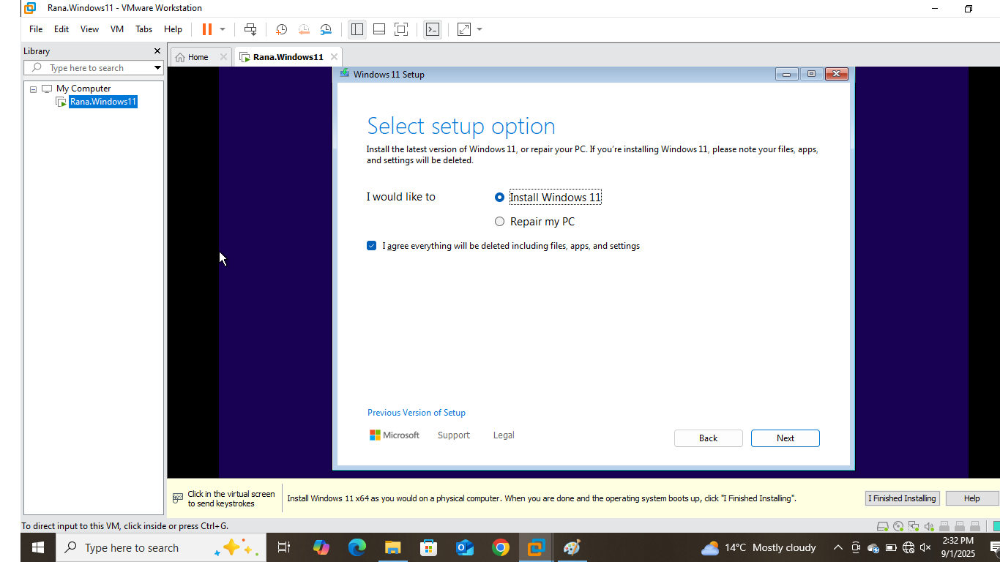

### 4. Selecting Windows 11 Edition

I selected **Windows 11 Pro** from the available images to match enterprise environments.  

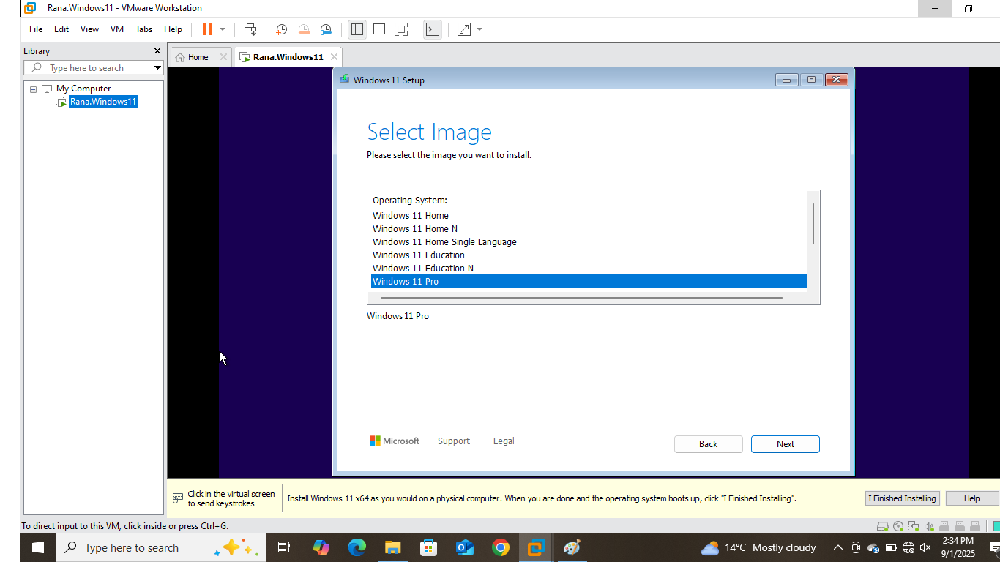

### 5. Installation in Progress

The setup began installing Windows 11 files and features.  

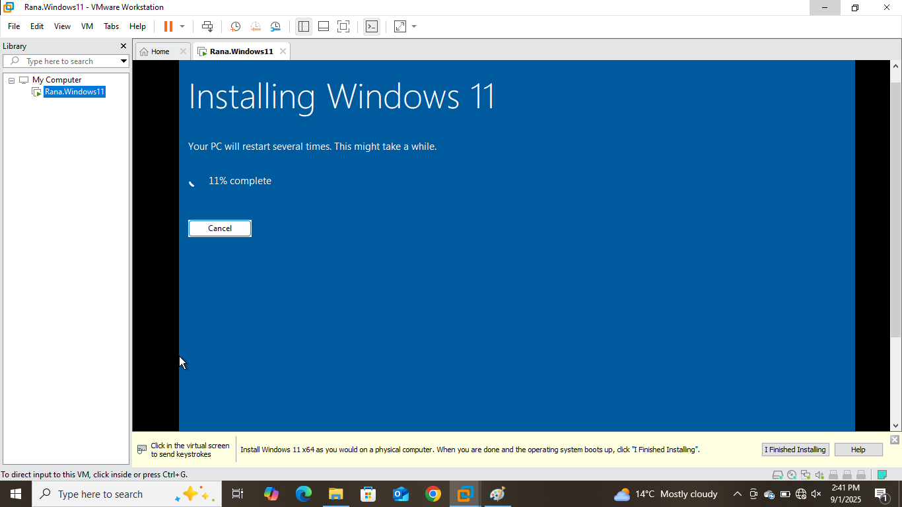

### 6. Naming the Device

After installation, I named the device. The device name can later be changed to simulate a corporate naming convention.

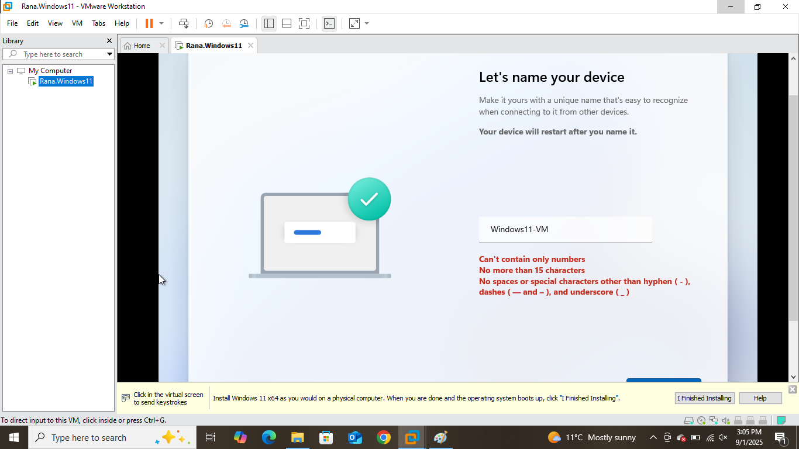

### 7. Windows Updates

I launched **Windows Update** and allowed the system to download the latest patches. 

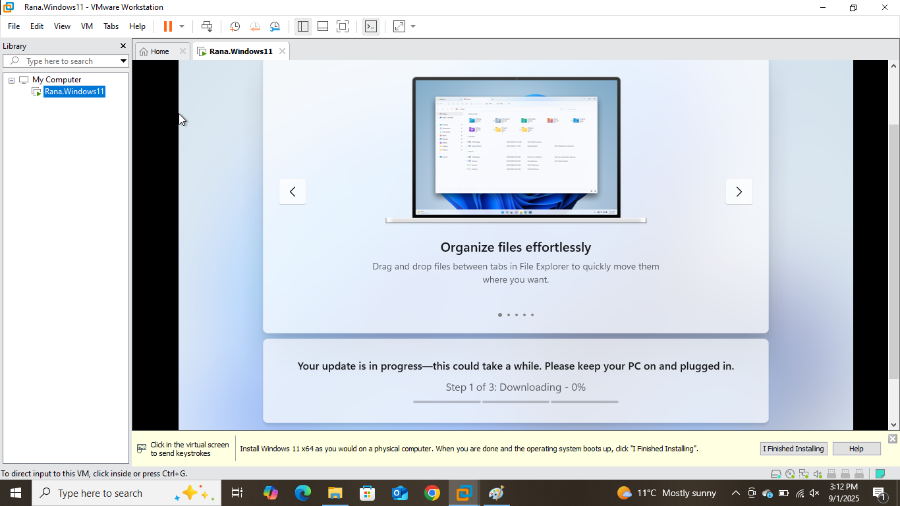  

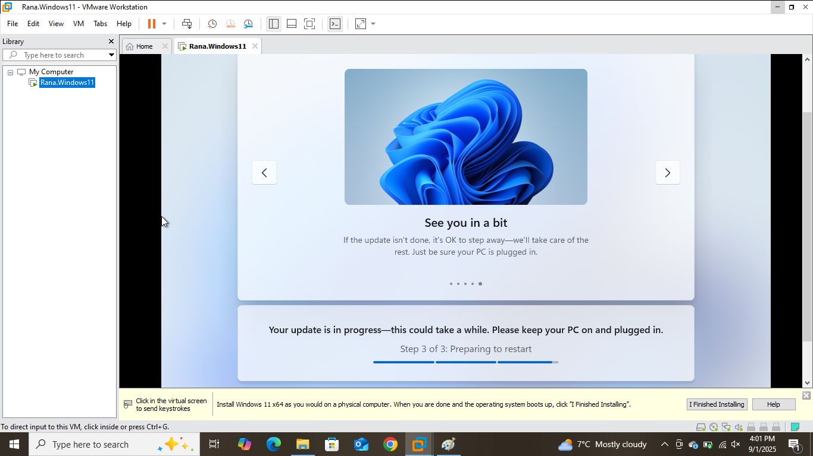

### 8. User Account Setup

I created a local user account and configured login with a PIN.  

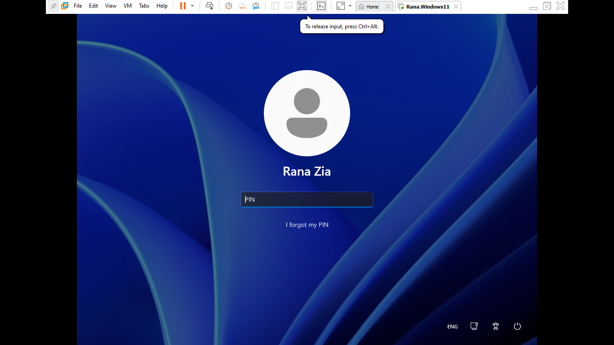

### 9. First Login to Windows 11

The system loaded to the Windows 11 desktop after initial configuration.  

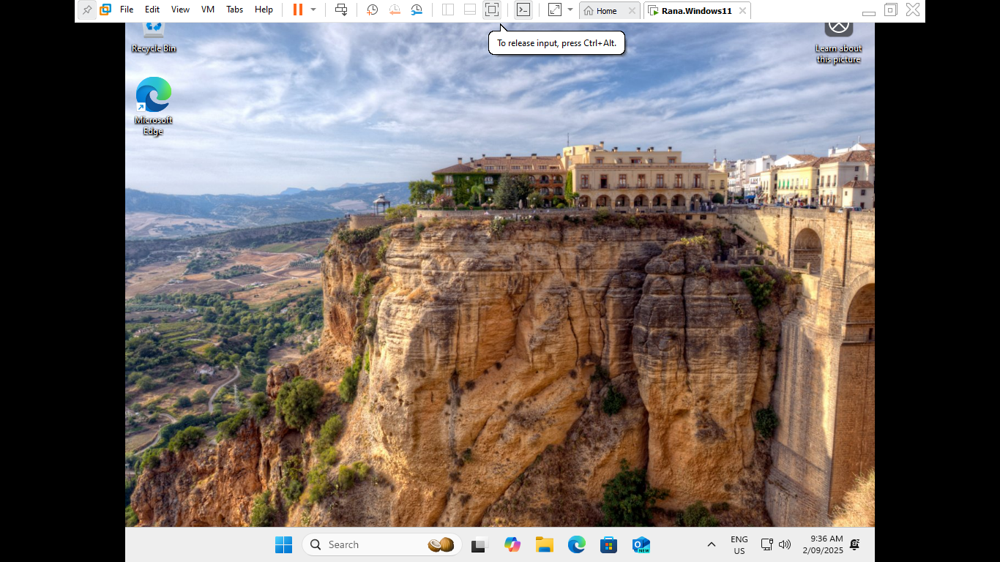

### 10. Post-Installation Updates

I checked for updates again to ensure the system was up-to-date.  

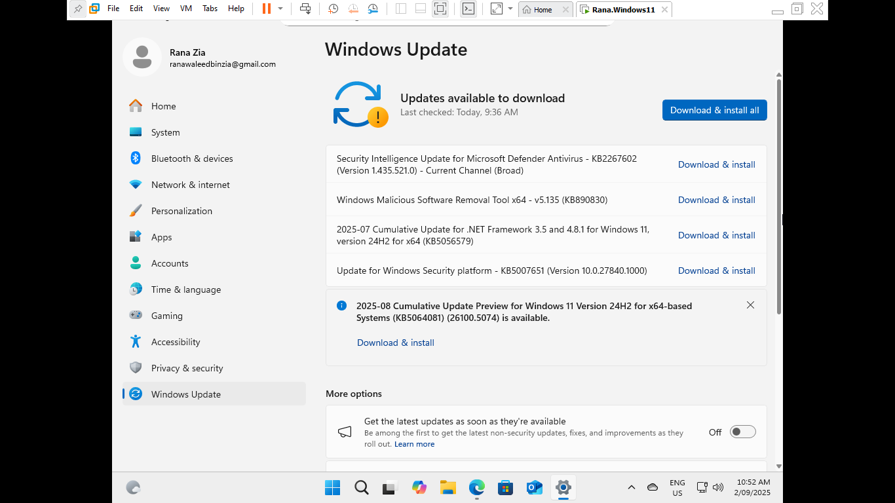  

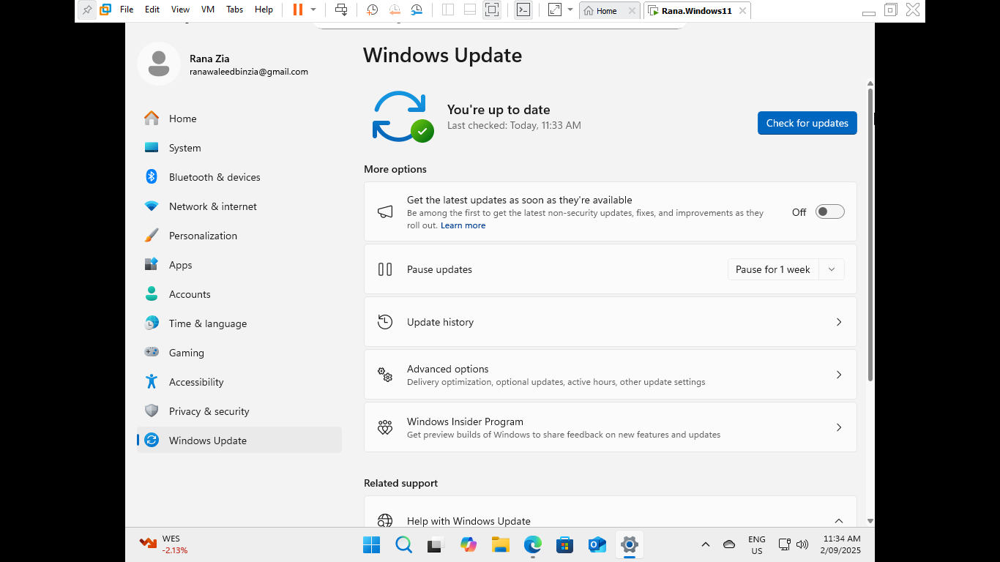

### 11. Creating an Additional Standard User

To follow security best practices, I added another standard user account in addition to the administrator.

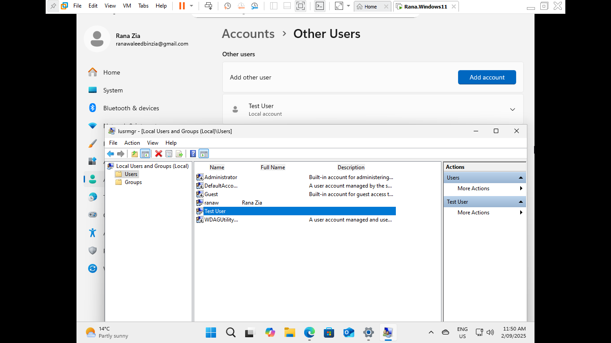

## Conclusion

This lab successfully demonstrates the end-to-end process of deploying a new Windows 11 workstation: 
- Performing a clean installation
- Applying updates
- Configuring user accounts
- Ensuring the system is ready for use in a professional environment. 

This mirrors real-world IT administration tasks when preparing machines for end-users.
