# New Starter Workstation — Windows 11 Pro Build, Patching & Standard User Setup

| Field | Detail |
|---|---|
| **Ticket Subject** | Service request — build a Windows 11 workstation for a new starter |
| **Category** | Endpoint / Device Provisioning |
| **Priority** | P3 — Scheduled Request |
| **Environment** | Windows 11 Pro 24H2 (Win11_24H2_English_x64.iso) in VMware Workstation Pro 17 — the VM stands in for a new physical PC. Built 1–2 Sep 2025 |

---

## Problem Statement

A new employee starts next week and needs a workstation. The request is to deliver a machine that is **clean-installed with the business edition of Windows 11, fully patched, recognisably named, and set up so the user works from a standard account** rather than an administrator. Handing over an unpatched machine, or one where the user runs as admin, creates security risk from day one.

---

## Tools Used

- **VMware Workstation Pro 17** (New Virtual Machine Wizard)
- **Windows 11 Setup** (clean installation, edition selection)
- **Windows OOBE** (out-of-box experience — device naming, account and PIN setup)
- **Windows Update** (patching to current)
- **Local Users and Groups** (lusrmgr.msc and Settings → Accounts — standard user account)

---

## Technical Steps

### Part A — Install the Operating System

### 1. Create the Machine and Attach the Installation Media

In VMware Workstation Pro, ran the **New Virtual Machine Wizard** and pointed it at the **Win11_24H2_English_x64** ISO. VMware detected **Windows 11 x64**, confirming the image was valid before any time was spent installing.

**Screenshot:**
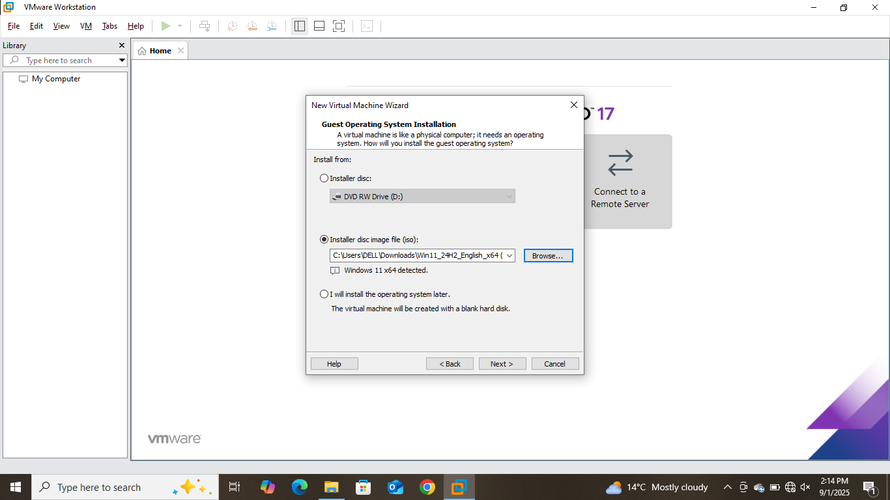

---

### 2. Set Language and Regional Preferences

Booted from the ISO and chose the language, time/currency format and keyboard layout in Windows Setup — getting regional settings right at install avoids date-format and keyboard complaints later.

**Screenshot:**
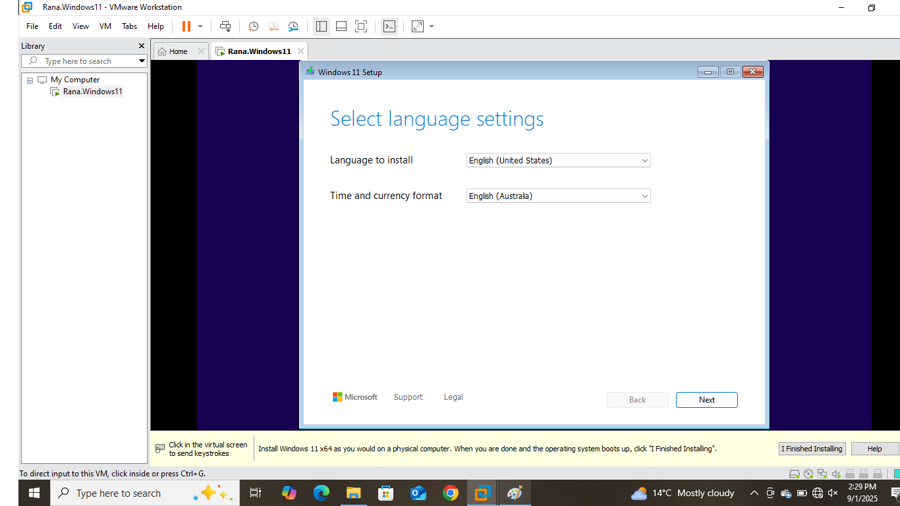

---

### 3. Choose a Clean Install

Selected **Install Windows 11**, a clean installation rather than an upgrade. A clean install guarantees a known-good starting state with no leftover software or settings from a previous user.

**Screenshot:**
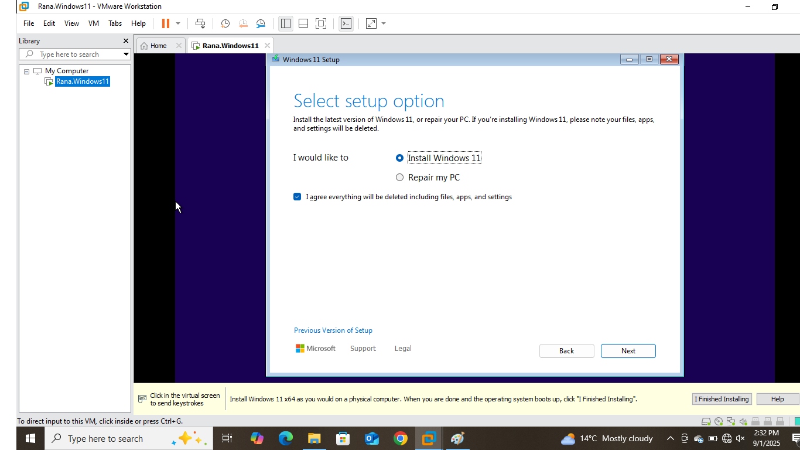

---

### 4. Select the Business Edition

Selected **Windows 11 Pro**. The Home edition cannot join an Active Directory domain or Entra ID tenant, and lacks Group Policy and BitLocker management — all features a business device needs.

**Screenshot:**
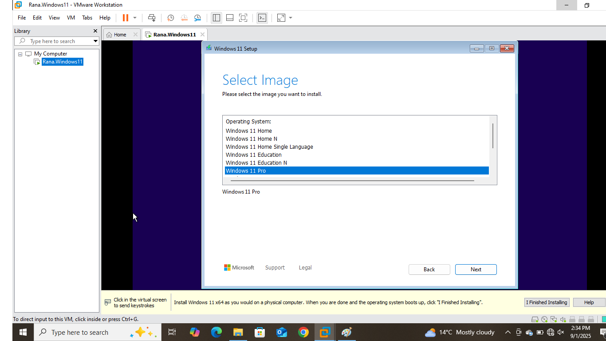

---

### 5. Installation

Setup copied and installed the Windows files and features, then restarted into the out-of-box experience.

**Screenshot:**
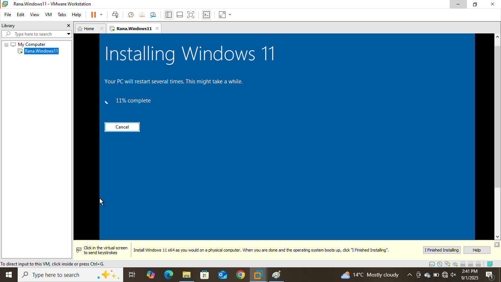

---

### Part B — Configure the Device

### 6. Name the Device

Named the device **Windows11-VM**. Windows enforces the same rules as NetBIOS — no more than 15 characters, not only numbers, and no spaces or special characters other than hyphens and underscores. In a business, this is where the organisation's naming convention (for example site-type-number) would be applied so the device is identifiable in the network and in management tools.

**Screenshot:**
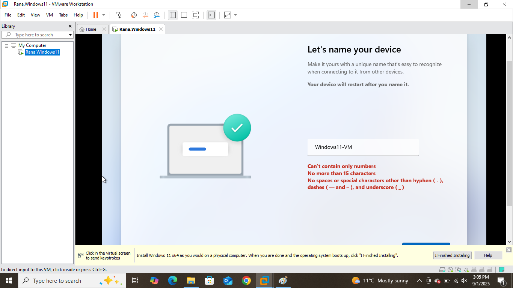

---

### 7. Patch the Machine

Opened **Windows Update** and installed all available updates, then restarted to complete them. A freshly installed image is already months behind on security fixes; patching before handover closes those holes before the user ever signs in.

**Screenshot:**
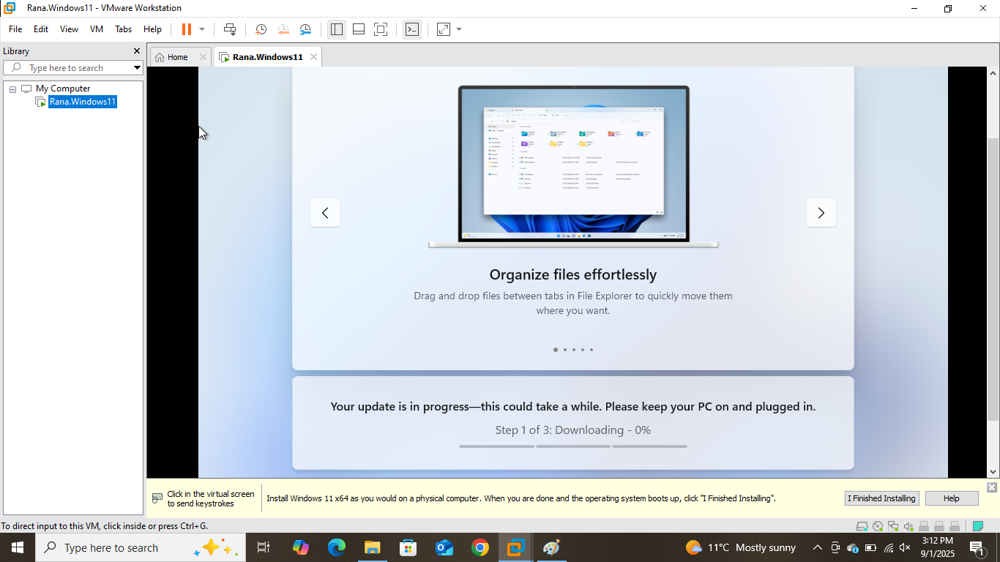

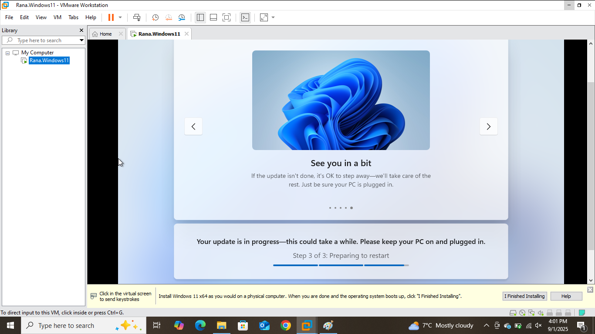

---

### 8. Set Up Sign-In

Completed account setup and configured **Windows Hello PIN** sign-in. A PIN is tied to this one device, so it is safer than a password that could be reused elsewhere.

**Screenshot:**
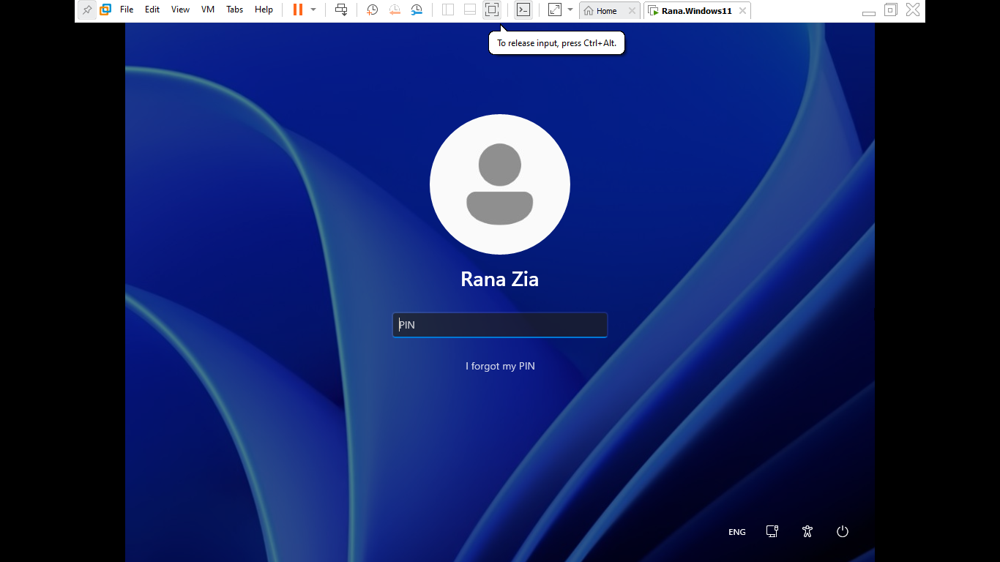

---

### 9. First Sign-In

Signed in and confirmed the Windows 11 desktop loaded correctly after setup.

**Screenshot:**
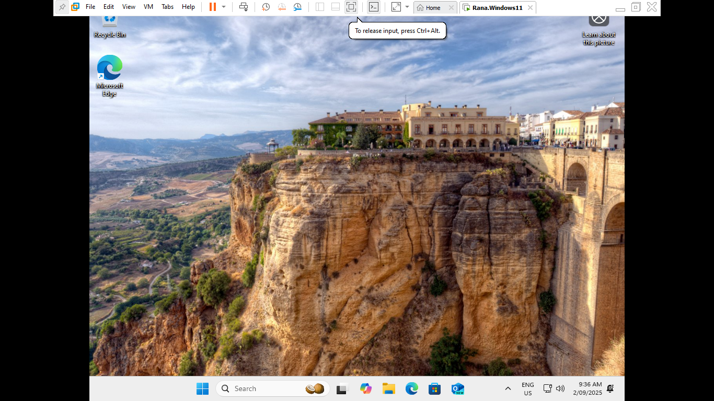

---

### Part C — Verify and Hand Over

### 10. Confirm the Machine Is Fully Patched

Checked for updates a second time after the restart. Some updates only become available once earlier ones are installed, so one pass is rarely enough. Windows Update reported **"You're up to date."**

**Screenshot:**
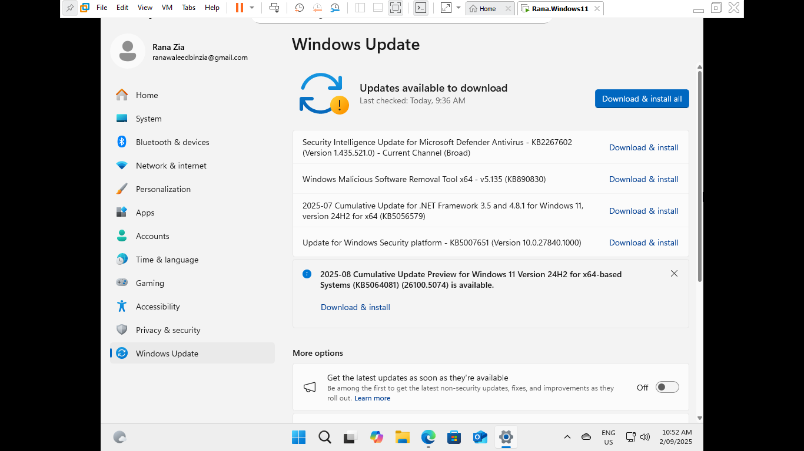

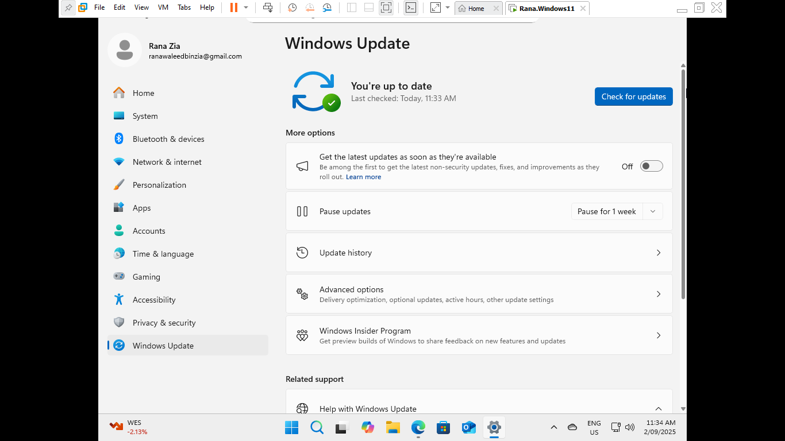

---

### 11. Create a Standard User Account for Daily Use

Created a separate local account, **Test User**, as a **standard (non-administrator)** account and confirmed it in both **Settings → Accounts → Other users** and **Local Users and Groups**. The user works day to day from this account; the administrator account is kept for installation and support tasks only.

**Screenshot:**
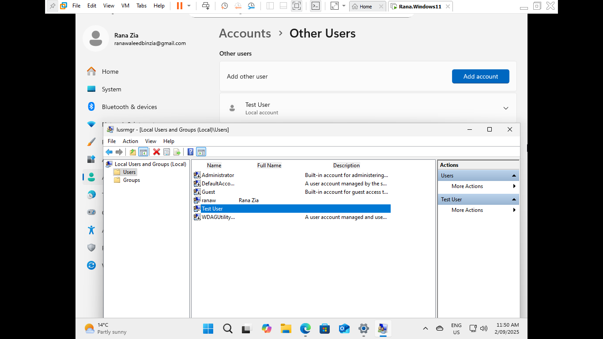

---

## Handover Checklist

| Check | Status |
|---|---|
| Clean install of the business edition (Windows 11 Pro 24H2) | ✅ |
| Device named to convention | ✅ |
| All available updates installed and verified | ✅ |
| PIN sign-in configured | ✅ |
| Daily-use account is a standard user, not an administrator | ✅ |

---

## Key Takeaways

- **Pick the edition for the job.** Windows 11 Pro is the minimum for a business device because Home cannot join a domain or be managed by Group Policy.
- **Never hand over an unpatched machine.** Check for updates, restart, and check again until Windows reports it is up to date.
- **Users should not run as administrators.** A standard account limits what malware, or a mistaken click, can do to the system — least privilege applies to endpoints as well as cloud accounts.
- **In production this is automated.** Here the admin account is a personal Microsoft account and the build is done by hand. At scale, the same outcome comes from Windows Autopilot/Intune or an imaging tool, with the device joined to Entra ID or Active Directory — but knowing each manual step is what makes those tools understandable and troubleshootable.

---

## Skills Demonstrated

`Windows 11 Deployment` · `OS Installation` · `VMware Workstation` · `Windows Update / Patching` · `Device Naming Conventions` · `Local Account Management` · `Least Privilege` · `Workstation Provisioning`
