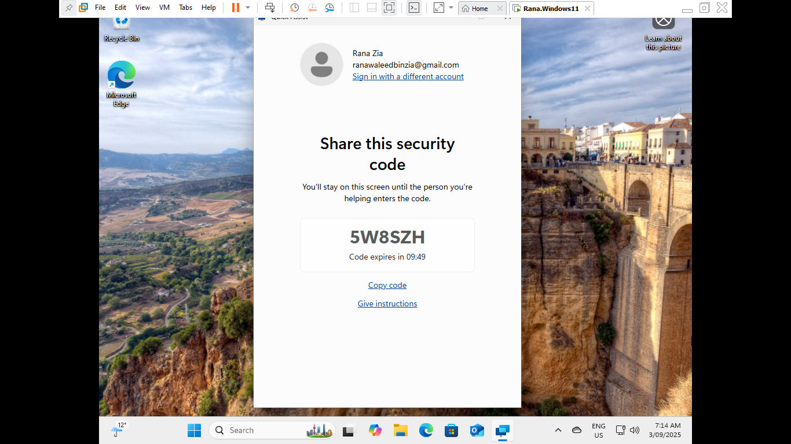
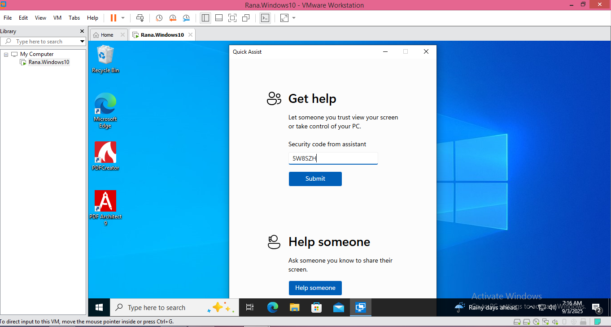
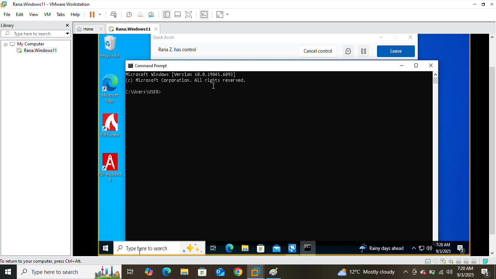
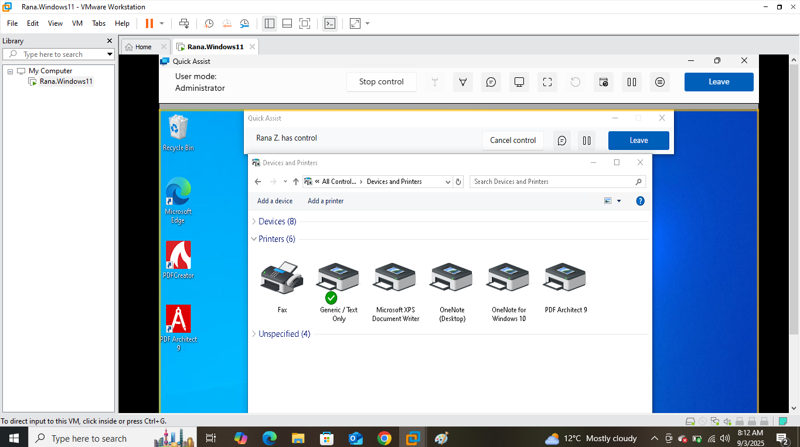
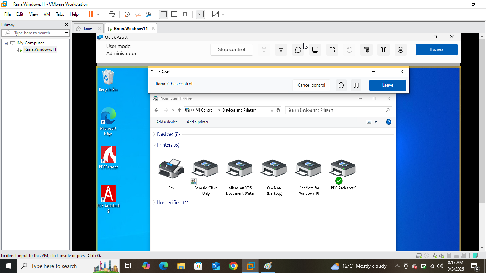
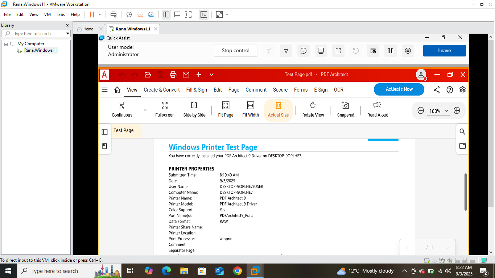

# "My Documents Won't Print" — Remote Default-Printer Fix with Quick Assist

| Field | Detail |
|---|---|
| **Ticket Subject** | Remote user — "I press Print and nothing comes out" |
| **Category** | Printing / Remote Support |
| **Priority** | P3 — Single User Impacted |
| **Environment** | Technician: Windows 11 VM · End user: Windows 10 VM (DESKTOP-9OPLHE7, build 19045) · Microsoft Quick Assist over the internet. Completed 3 Sep 2025 |

---

## Problem Statement

A user working away from the office reports that whenever they press Print, nothing comes out. Walking a non-technical user through printer settings over the phone is slow and error-prone, so the task is to **connect to their PC remotely with Quick Assist**, find out where their print jobs are actually going, fix it, and **confirm with a test page before ending the session** — while the user watches.

---

## Tools Used

- **Microsoft Quick Assist** (remote screen sharing and control, built into Windows 10/11)
- **Command Prompt** (confirming control of the remote machine)
- **Devices and Printers** (default printer settings)
- **PDF Architect 9** (virtual printer used to produce the test page)

---

## Technical Steps

### 1. Start the Session and Share the Code

On the technician's PC, opened **Quick Assist → Help someone**. Quick Assist generated a six-character security code, **5W8SZH**, valid for 10 minutes. The code was read to the user over the phone.

**Screenshot:**

---

### 2. The User Enters the Code

On the user's PC, the user opened **Quick Assist → Get help**, typed **5W8SZH** into *Security code from assistant* and clicked **Submit**. The user then chose to allow full control — the session only starts once the user actively grants access, which keeps them in control of their own machine.

**Screenshot:**

---

### 3. Confirm Remote Control

The user's screen displayed the banner **"Rana Z. has control"**, with **Cancel control** and **Leave** buttons available to them at all times. Opened a Command Prompt on the remote PC to confirm keyboard input was reaching it; it reported **Microsoft Windows [Version 10.0.19045.6093]**, confirming which machine and build was being worked on.

**Screenshot:**

---

### 4. Find Where the Print Jobs Are Going

Opened **Devices and Printers** on the user's PC. The green tick — the **default printer** — was on **Generic / Text Only**, a printer pointed at a network address with no device behind it. Every time the user pressed Print, the job went to a printer that did not exist. The printer they actually use, **PDF Architect 9**, was installed but not the default.

**Root cause:** wrong default printer.

**Screenshot:**

---

### 5. Set the Correct Default Printer

Right-clicked **PDF Architect 9 → Set as default printer**. The green tick moved to PDF Architect 9.

**Screenshot:**

> **Why it may change back:** on Windows 10/11, **"Let Windows manage my default printer"** (Settings → Printers & scanners) automatically switches the default to the last printer used. If a user reports the problem returning, turning that setting off makes the choice stick.

---

### 6. Verify with a Test Page — Before Ending the Session

Printed a Windows test page to the new default. It came out as **Test Page.pdf** in PDF Architect, reading **"You have correctly installed your PDF Architect 9 Driver on DESKTOP-9OPLHE7"**, with printer name **PDF Architect 9**, user **DESKTOP-9OPLHE7\USER**, submitted **9/3/2025 8:19:40 AM**. Printing works, confirmed in front of the user, and the session was ended.

**Screenshot:**

---

## Resolution Summary

| | |
|---|---|
| **Symptom** | Pressing Print produces nothing |
| **Root cause** | Default printer was **Generic / Text Only**, a printer with no device behind it |
| **Fix** | Set **PDF Architect 9** as the default printer |
| **Verification** | Windows test page printed successfully during the remote session |
| **User impact** | Fixed in a single remote session, with no site visit |

---

## Key Takeaways

- **Remote tools turn a long phone call into a short fix.** Seeing the user's screen revealed the wrong default printer in seconds — something a user would struggle to describe.
- **Consent and visibility come first.** Quick Assist requires the user to enter the code and grant control, and shows them who has control with a way to stop it. Only ever connect when the user expects it; a request to "just read me the code" from an unexpected caller is a well-known scam pattern.
- **Check the default before the device.** When "nothing prints", the job is often going to the wrong printer — and a stale or phantom printer set as default is a common cause.
- **Verify before disconnecting.** A test page printed while still connected means the ticket is closed on evidence, and the user sees it work.

---

## Skills Demonstrated

`Remote Support` · `Microsoft Quick Assist` · `Printer Troubleshooting` · `Default Printer Configuration` · `Customer Communication` · `Verification Before Closure`
