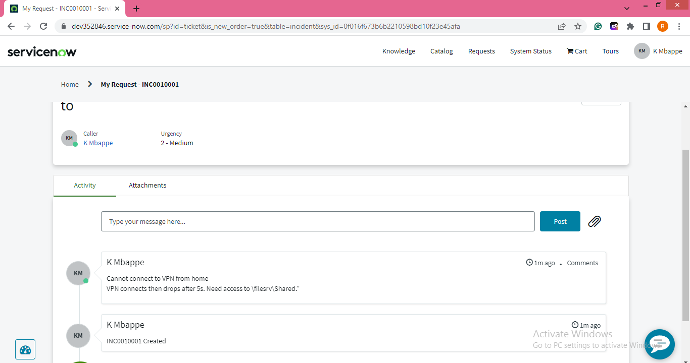
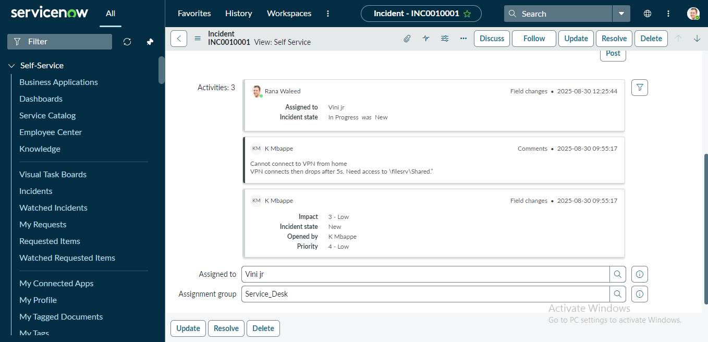
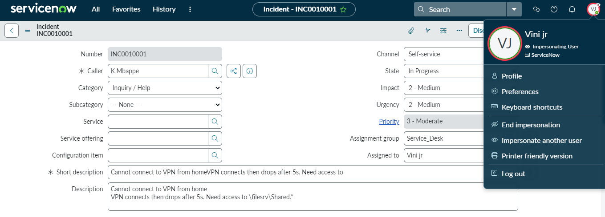
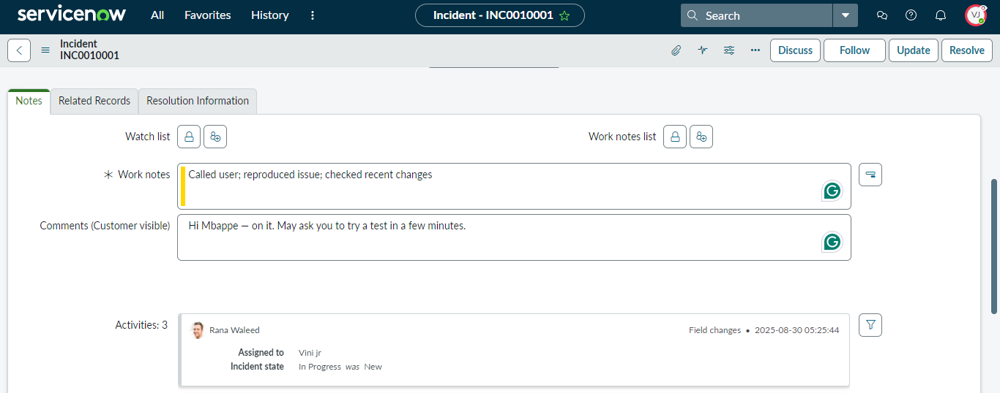
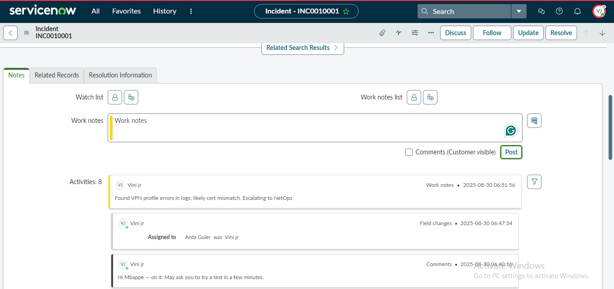
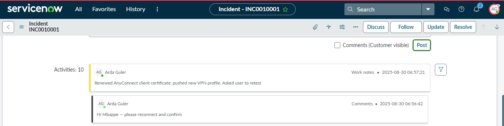
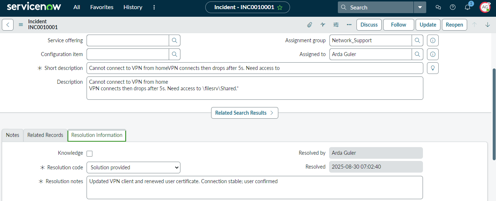

# ServiceNow Ticket Workflow Lab

## Overview
In this lab, I worked with ServiceNow to understand how incident management works in a real-world service desk environment.  
The lab began with the creation of three users and groups (not shown in screenshots), which helped set up the environment for ticket assignment and escalation.  

I then created, assigned, updated, escalated, and resolved an incident while capturing important parts of the workflow.

## Steps and Screenshots

### 1. Incident Created

An end-user reported an issue through the portal. The incident was successfully generated with a unique identifier. 

### 2. Assignment to Service Desk

The incident was assigned to the **Service Desk** group and a specific agent (Vini Jr).

### 3. Impact, Urgency, and Priority

The header of the incident showed **Impact, Urgency, and Priority** values which help determine the response level.  

### 4. Communication Fields

The difference between **Work Notes** (internal use) and **Additional Comments** (visible to customer) was demonstrated.  

### 5. Escalation to Tier 2

The incident was reassigned to the **Network Support** team for Tier 2 resolution.

### 6. Customer Confirmation

The customer was updated and asked to confirm if the issue was resolved.

### 7. Resolution and Closure

A resolution code was selected and notes were provided before marking the incident as resolved. 

## Conclusion

This lab allowed me to demonstrate the **full lifecycle of an incident** in ServiceNow:  
- Incident creation by an end-user  
- Assignment to Tier 1 (Service Desk)  
- Escalation to Tier 2 (Network Support)  
- Communication with end-user  
- Resolution and closure  

