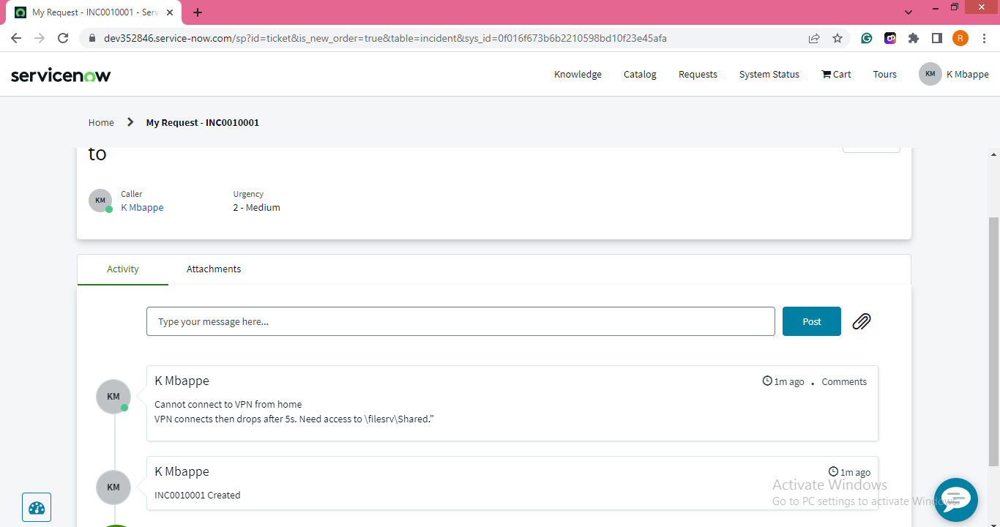
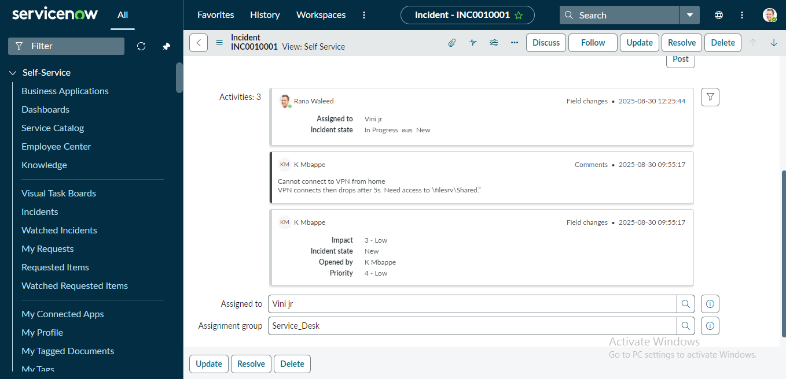
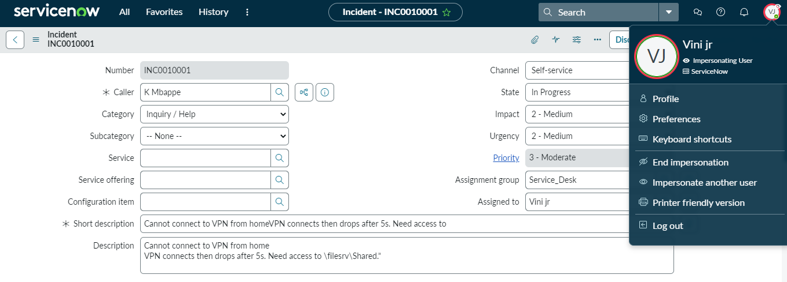
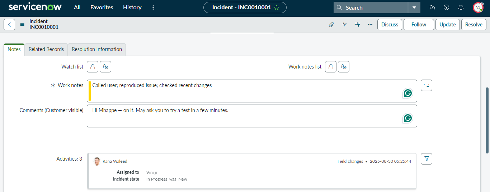
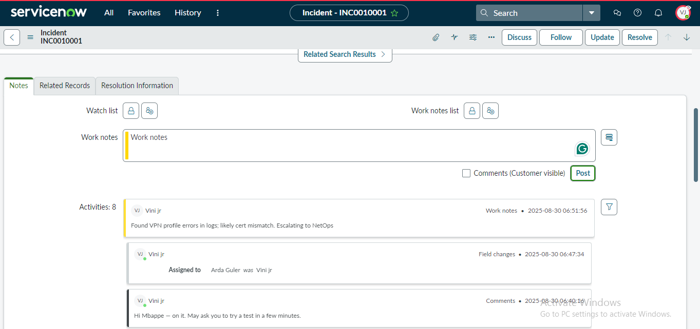
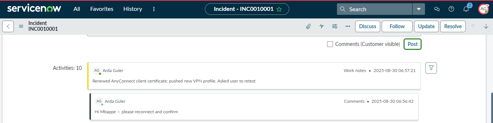
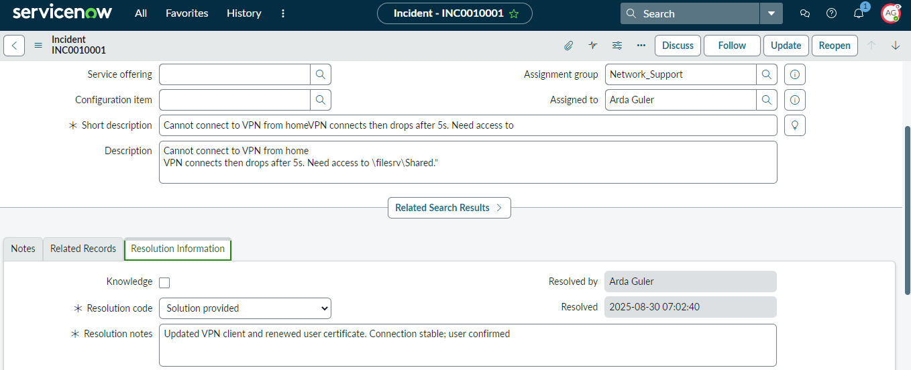

# INC0010001: VPN Drops After 5 Seconds — Full Incident Lifecycle in ServiceNow

| Field | Detail |
|---|---|
| **Ticket Number** | INC0010001 |
| **Ticket Subject** | Cannot connect to VPN from home — connects, then drops after 5 seconds |
| **Category** | Network / Remote Access |
| **Priority** | Logged as 4 – Low → triaged to **3 – Moderate** |
| **Environment** | ServiceNow Personal Developer Instance. Three users and two assignment groups created for the lab; each role played using impersonation. Worked 30 Aug 2025 |

---

## Problem Statement

A remote employee, **K Mbappe**, raises a ticket through the self-service portal:

> Cannot connect to VPN from home. VPN connects then drops after 5s. Need access to `\\filesrv\Shared`.

They cannot reach the file server they need to work.

This lab follows the ticket through its **whole lifecycle** exactly as a service desk would handle it — logging, triage and re-prioritisation, Tier 1 investigation, escalation to the network team, resolution, and customer confirmation — with every step recorded on the incident.

**Lab setup:** three users — **K Mbappe** (caller), **Vini jr** (Tier 1, *Service_Desk* group) and **Arda Guler** (Tier 2, *Network_Support* group) — and two assignment groups were created beforehand (setup not shown). ServiceNow's **impersonation** feature was used to act as each person in turn, so every entry is attributed to the right role. The VPN fault itself is part of the scenario — this lab exercises the ServiceNow incident workflow, not a live VPN.

---

## Tools Used

- **ServiceNow Service Portal** (end-user ticket submission)
- **ServiceNow Incident Management** (incident form, assignment, state, resolution)
- **Assignment groups** (Service_Desk, Network_Support)
- **Work notes & Additional comments** (internal vs customer-facing communication)
- **User impersonation** (acting as caller, Tier 1 and Tier 2)

---

## Technical Steps

### 1. The User Logs the Incident

Impersonating **K Mbappe**, submitted the issue through the **Service Portal**. ServiceNow created **INC0010001** and showed it under *My Request*, with the caller's own description and **Urgency: 2 – Medium**. The user can follow progress and reply from this page without calling the service desk.

**Screenshot:**

---

### 2. Assign the Ticket to Tier 1

The ticket arrived as **State: New** with **Impact 3 – Low** and **Priority 4 – Low**. It was assigned to the **Service_Desk** group and to agent **Vini jr**, and the state moved from **New → In Progress** — the activity log records who made each change and when.

**Screenshot:**

---

### 3. Triage — Correct the Priority

Impersonating **Vini jr**, reviewed the classification. A user who cannot reach the file server cannot do their job, so **Impact** was raised to **2 – Medium** alongside **Urgency 2 – Medium**. ServiceNow calculates priority from the two, and it updated automatically to **3 – Moderate**. Channel **Self-service**, Category **Inquiry / Help**, Assignment group **Service_Desk**, Assigned to **Vini jr**.

**Screenshot:**

> **Why this matters:** priority is not the caller's opinion — it is Impact × Urgency. Correcting it at triage is what makes the ticket appear in the right queue with the right response time.

---

### 4. Investigate and Keep the User Informed

Two different notes were written, for two different audiences:

| Field | Audience | Entry |
|---|---|---|
| **Work notes** | Internal — IT staff only | *"Called user; reproduced issue; checked recent changes"* |
| **Additional comments (Customer visible)** | The caller | *"Hi Mbappe — on it. May ask you to try a test in a few minutes."* |

The technical detail stays internal, and the user gets a short, plain-English update so they know someone is working on it.

**Screenshot:**

---

### 5. Escalate to Tier 2 with a Clear Handover

Tier 1 checked the logs and found **VPN profile errors pointing to a certificate mismatch** — a fix that needs the network team. Vini jr reassigned the incident to **Arda Guler** in **Network_Support** and recorded the reason in the work notes: *"Found VPN profile errors in logs; likely cert mismatch. Escalating to NetOps."* The Tier 2 engineer starts with the evidence, not a blank ticket.

**Screenshot:**

---

### 6. Tier 2 Fix and Customer Confirmation

Impersonating **Arda Guler**, recorded the fix in the work notes — *"Renewed AnyConnect client certificate; pushed new VPN profile. Asked user to retest."* — and asked the user to confirm in a customer-visible comment: *"Hi Mbappe — please reconnect and confirm."* The ticket is not resolved until the user confirms the fix works for them.

**Screenshot:**

---

### 7. Resolve the Incident

With the user's confirmation, completed the **Resolution Information** tab: **Resolution code: Solution provided**; **Resolution notes:** *"Updated VPN client and renewed user certificate. Connection stable; user confirmed."* The incident was marked **Resolved by Arda Guler** at **2025-08-30 07:02:40**.

**Screenshot:**

---

## Incident Timeline

| Stage | Who | Group | Outcome |
|---|---|---|---|
| Logged | K Mbappe | — (Self-service) | INC0010001 created, Priority 4 – Low |
| Assigned | Vini jr | Service_Desk | State New → In Progress |
| Triaged | Vini jr | Service_Desk | Impact raised → **Priority 3 – Moderate** |
| Investigated | Vini jr | Service_Desk | Issue reproduced; VPN profile / certificate errors found |
| Escalated | Vini jr → Arda Guler | Network_Support | Handover recorded in work notes |
| Fixed | Arda Guler | Network_Support | Certificate renewed, new VPN profile pushed |
| Resolved | Arda Guler | Network_Support | Solution provided; user confirmed |

---

## Key Takeaways

- **The ticket is the record.** Every action — assignment, priority change, investigation, escalation, fix — is on the incident with a name and a timestamp. Anyone picking it up later can see exactly what happened.
- **Triage is a real decision.** The caller's classification is a starting point. Re-assessing Impact and Urgency moved this ticket from Low to Moderate, which is what gets it the correct response time.
- **Know your audience.** Work notes are for colleagues and can be technical; additional comments go to the customer and should be short and clear. Posting internal detail in the wrong field is a common and visible mistake.
- **Escalate with evidence.** A good escalation says what was checked, what was found and why it needs the next tier — so Tier 2 can act immediately.
- **Resolve on confirmation.** The incident was resolved only after the user confirmed the VPN was stable.

---

## Skills Demonstrated

`ServiceNow` · `ITIL Incident Management` · `Ticket Triage & Prioritisation` · `Tiered Escalation` · `Work Notes vs Customer Comments` · `Customer Communication` · `VPN Troubleshooting Awareness`
