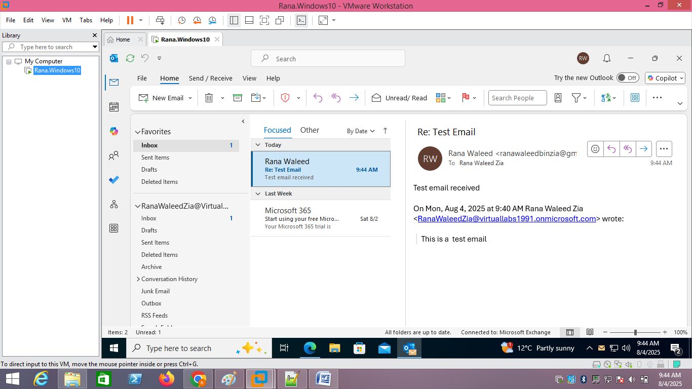

# Microsoft 365 Business Standard Setup Lab

## Objective
Set up and test email functionality using Microsoft 365 Business Standard trial with Outlook in a VMware Workstation Pro virtual lab.

## Steps Performed
1. Configured VMware Workstation Pro with a Windows 10 VM.
2. Installed Microsoft 365 apps, including Outlook, using the Business Standard trial account.
3. Configured Outlook on a Windows 10 VM to connect to the Microsoft 365 email account.
4. Sent and received test emails using Outlook Desktop app.

## Results
- Successfully configured Outlook with a Microsoft 365 Business email account.
- Sent and received emails using Outlook desktop app.

## Screenshots

## Tools Used
- VMware Workstation Pro
- Windows 10 VM
- Microsoft 365 Business Standard trial
- Outlook desktop app
