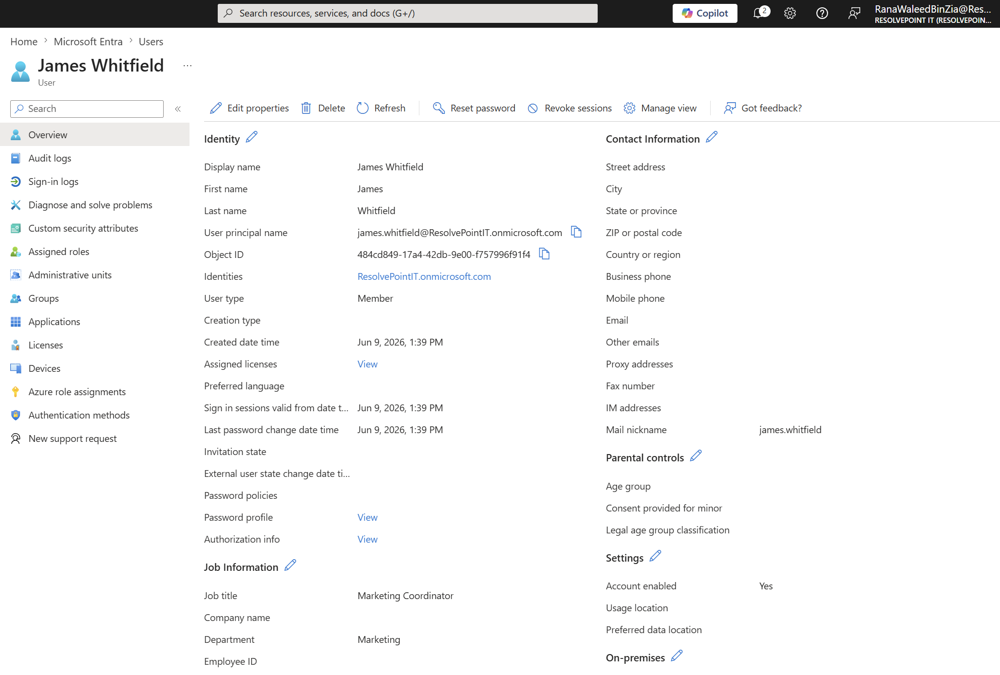
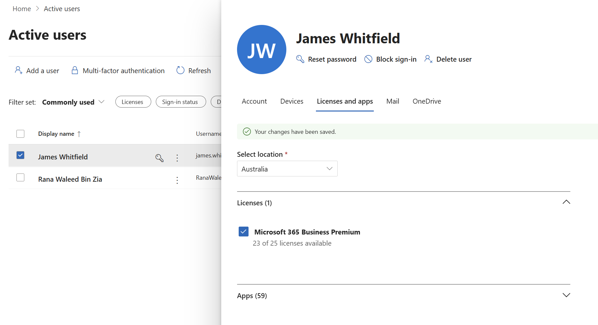
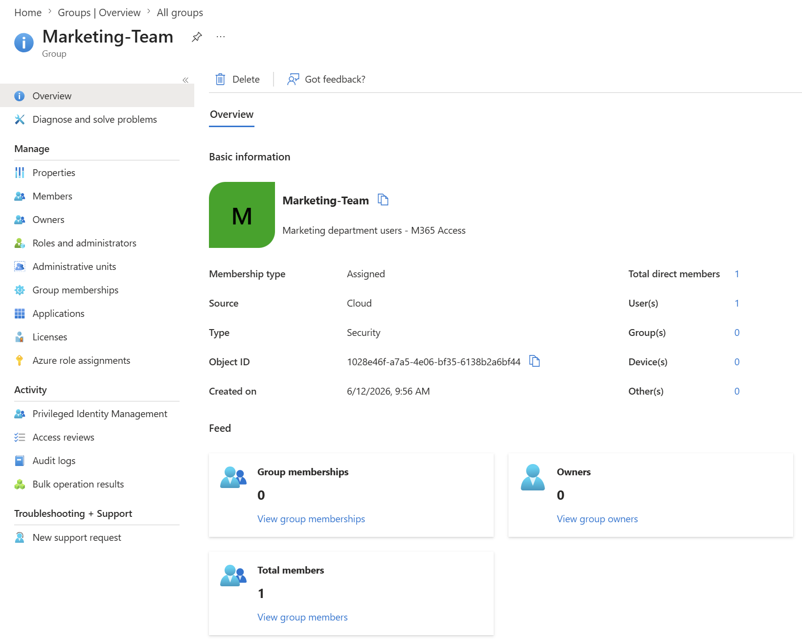
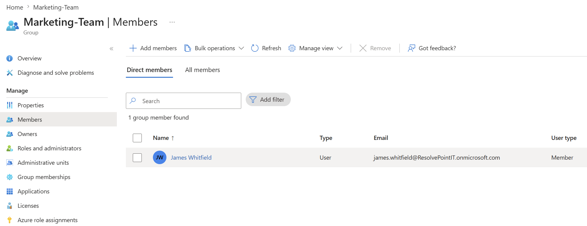
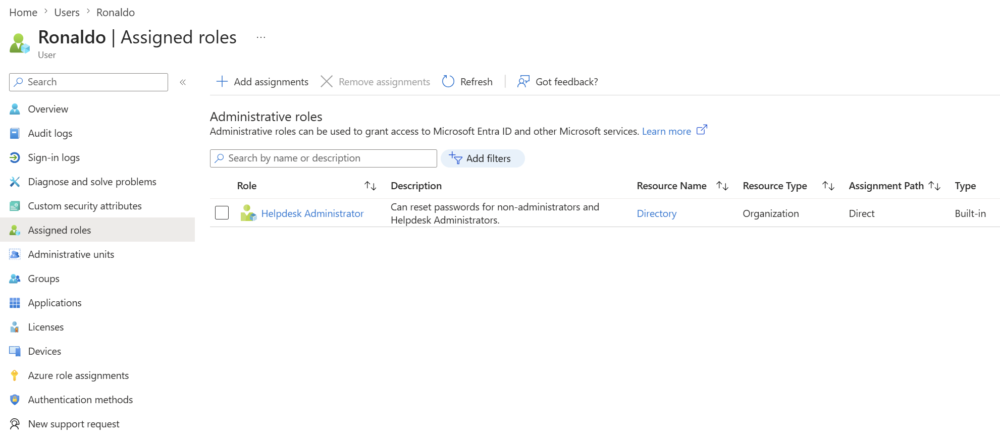
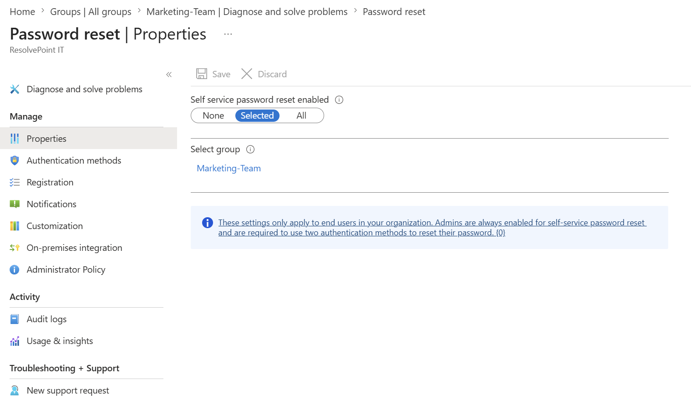
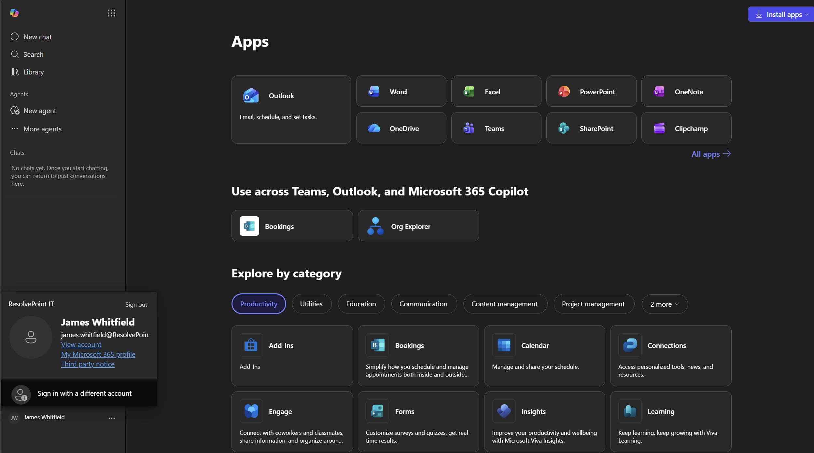
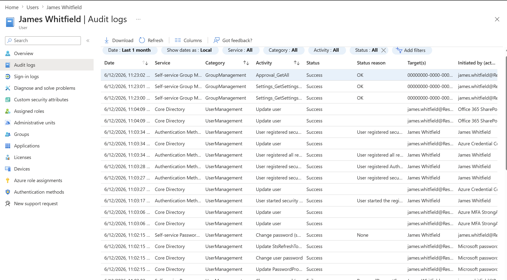

New Hire Provisioning — End-to-End Entra ID Onboarding with RBAC & SSPR

Ticket Subject: New Hire Provisioning — Marketing Coordinator
Category: Identity & Access Management
Priority: P2 — Business Impact
Environment: Microsoft Entra ID / Microsoft 365 (ResolvePoint IT tenant)
---
Problem Statement
A new employee, James Whitfield, is starting Monday as a Marketing Coordinator and requires a fully provisioned Microsoft 365 account before his first day. The task is to create his identity in Entra ID, assign the correct license and group-based access following the principle of least privilege, enable Self-Service Password Reset to reduce future helpdesk load, and verify the account works end-to-end. A failure to provision correctly results in a P1 ticket on the new hire's first day.
---
Tools Used
Microsoft Entra ID (identity management, RBAC, SSPR)
Microsoft 365 Admin Center (license assignment)
Microsoft 365 User Portal (verification)
Web browser (host machine — cloud admin tasks require no local VM)
---
Technical Steps
1. Create the New User in Entra ID
Navigated to the Entra ID portal → Users → All Users → New User → Create new user. Populated the user principal name, display name, job title (Marketing Coordinator), and department (Marketing). Set a temporary password with "Require password change on first sign-in" enabled.
Screenshot:

---
2. Assign a Microsoft 365 License
Switched to the Microsoft 365 Admin Center → Users → Active Users → James Whitfield → Licenses and apps. Assigned the available Microsoft 365 license and saved changes, granting access to Outlook, Teams, SharePoint, and OneDrive.
Screenshot:

---
3. Create a Security Group
Returned to Entra ID → Groups → All Groups → New Group. Created a Security group named Marketing-Team with Assigned membership type. Security groups are the modern method for managing access and license assignment at scale, rather than configuring each user individually.
Screenshot:

---
4. Add the User to the Security Group
Added James Whitfield as a member of the Marketing-Team security group. Through group membership he inherits the department's shared access to SharePoint sites and file resources.
Screenshot:

---
5. Assign an RBAC Role (Least Privilege Demonstration)
To demonstrate Role-Based Access Control, assigned the Helpdesk Administrator role to a separate test account (Ronaldo). James, as a standard user, correctly receives no administrative role — he only needs standard user access to do his job. This is the Principle of Least Privilege in practice: administrative roles are scoped and granted only where the job function requires them.
Screenshot:

---
6. Configure Self-Service Password Reset (SSPR)
Navigated to Protection → Password reset. Set SSPR to Selected and scoped it to the Marketing-Team group. Configured authentication methods and the registration policy so users are prompted to register their reset methods on sign-in.
Screenshot:

> **Troubleshooting Note — Trial Tenant Limitation:**
> During SSPR configuration, the Email and Mobile Phone authentication methods appeared briefly then reverted, leaving Security Questions as the only selectable option. This is a known limitation of trial/developer tenants, which restrict certain authentication methods. In a **production environment**, Mobile Phone (SMS) and Email would be the recommended methods, with Microsoft Authenticator as the strongest option. Security Questions were configured here to complete the lab; the configuration logic is identical regardless of method.
---
7. Verify the Account (First Login)
Opened a private browser window and signed in to the Microsoft 365 portal as James Whitfield using the temporary password. Completed the forced password change and confirmed the account landed on the M365 home portal with the full app suite (Outlook, Word, Excel, Teams, SharePoint, OneDrive) visible and accessible.
Screenshot:

---
8. Review the Audit Log
Reviewed James Whitfield → Audit logs to confirm the full provisioning trail. The log shows timestamped, successful entries for user creation, password change, security method registration, and user attribute updates — providing a complete, auditable record of the onboarding.
Screenshot:

---
Key Takeaways
Least Privilege is a mindset, not a checkbox. James received only the access his role required; administrative roles were scoped to a separate account. Over-provisioning is one of the most common security failures in identity management.
Group-based access scales; per-user access does not. Assigning license and resource access through the Marketing-Team security group means future hires inherit correct access simply by joining the group — no manual reconfiguration.
SSPR is proactive ticket reduction. Configuring Self-Service Password Reset directly reduces the single highest-volume helpdesk category. Thinking about prevention, not just resolution, is what distinguishes L2-level operational thinking.
The audit log is the proof. Verification and audit review are the steps junior techs skip. They are what turn "I think it worked" into "here is the timestamped evidence that it worked."
---
Skills Demonstrated
`Microsoft Entra ID` · `Microsoft 365 Administration` · `RBAC / Least Privilege` · `Group-Based Access Management` · `Self-Service Password Reset (SSPR)` · `User Lifecycle Management` · `Audit & Verification`
