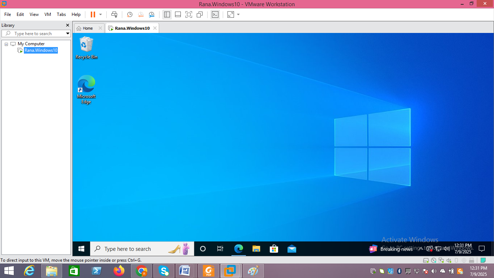
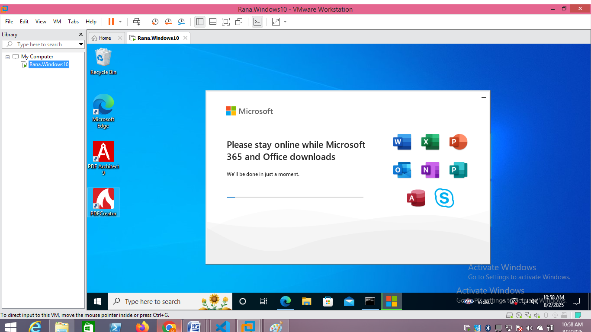
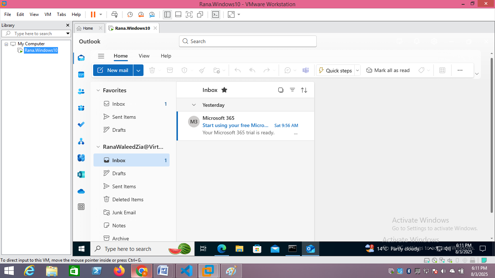
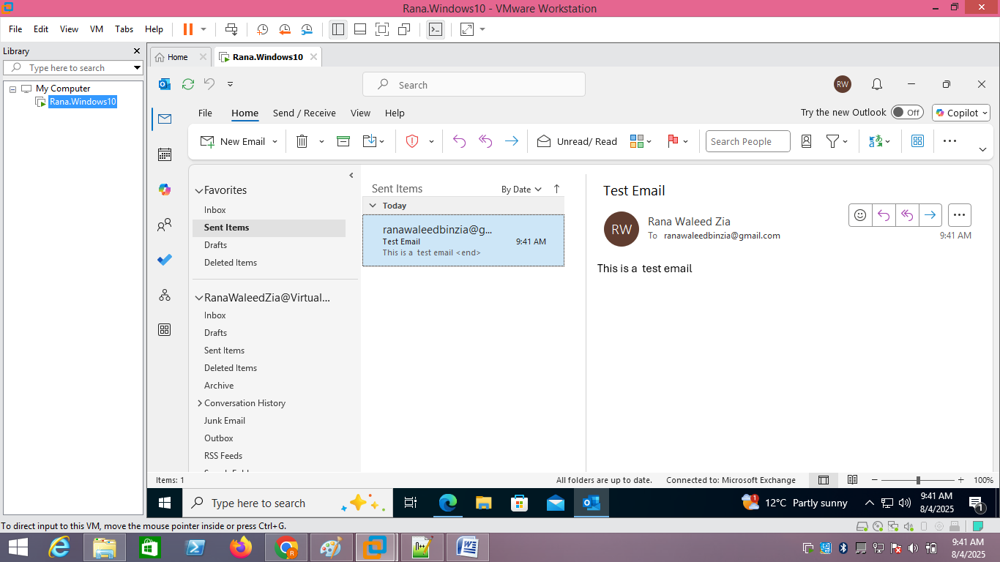
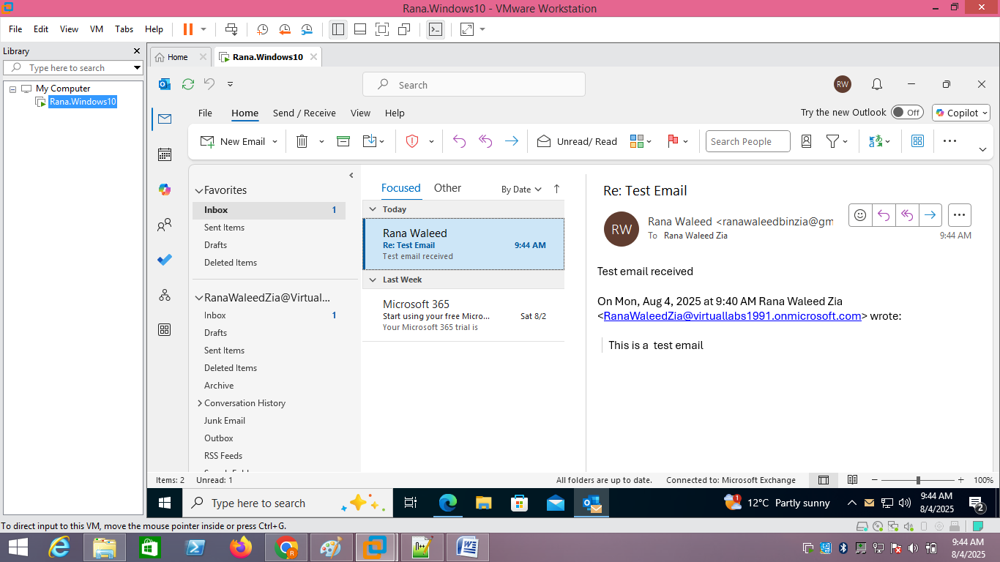

# Microsoft 365 Email Setup Lab

## Overview
This lab demonstrates the process of setting up and testing email functionality using **Microsoft 365 Business Standard** trial with the **Outlook Desktop app** in a **VMware Workstation Pro** virtual lab environment running **Windows 10**.  
The goal is to simulate a real-world IT support scenario where email services need to be configured and verified within a corporate setup.

---

## Tasks Performed

### 1. Configure VMware Workstation Pro with a Windows 10 VM
- Created a Windows 10 virtual machine in **VMware Workstation Pro**.
- Adjusted system resources (RAM, CPU, storage) for smooth performance.
- Installed the Windows 10 operating system.

**Screenshot:**  

---

### 2. Install Microsoft 365 Apps (Including Outlook)
- Signed in with a **Microsoft 365 Business Standard trial account**.
- Downloaded and installed Microsoft 365 apps on the Windows 10 VM.
- Verified that **Outlook** was successfully installed.

**Screenshot:**  

---

### 3. Configure Outlook to Connect to Microsoft 365 Email Account
- Launched the **Outlook Desktop app**.
- Signed in with the Microsoft 365 email account credentials.
- Allowed Outlook to auto-configure the account settings.

**Screenshot:**  

---

### 4. Send a Test Email
- Composed and sent a test email from the Microsoft 365 account.
- Verified that the message was sent successfully.

**Screenshot:**  

---

### 5. Receive a Test Email
- Checked the inbox for incoming messages.
- Verified that the test email was successfully received.

**Screenshot:**  

---

## Lab Conclusion
- Configured a Windows 10 virtual machine in VMware Workstation Pro.
- Installed Microsoft 365 apps using a Business Standard trial account.
- Set up and verified email functionality in Outlook.
- Successfully sent and received test emails in a virtualized lab environment.

This workflow replicates a common IT support task, providing hands-on experience with Microsoft 365 email configuration and troubleshooting in a controlled environment.
