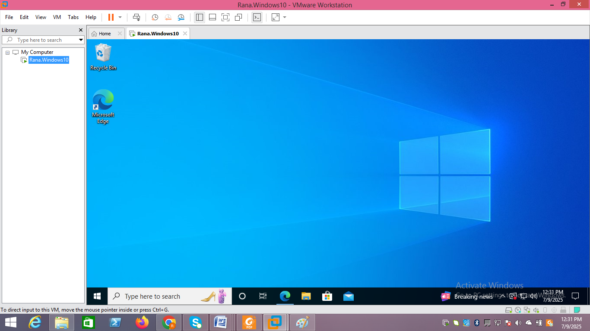
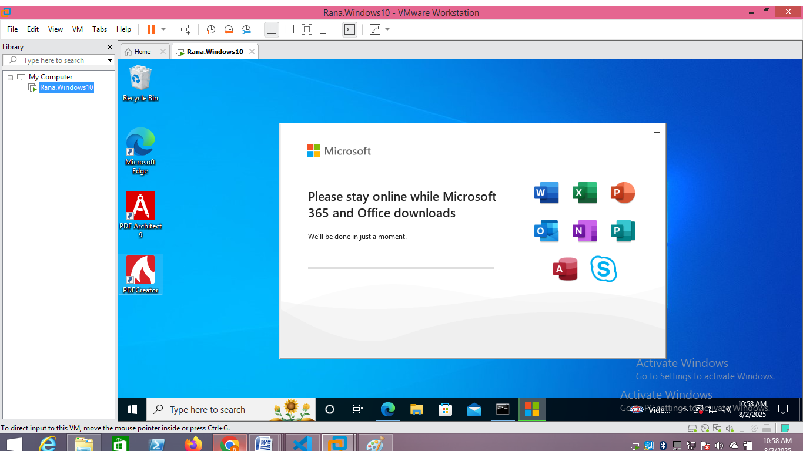
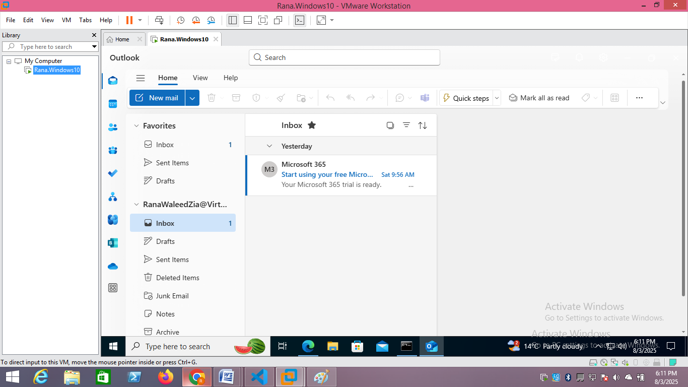
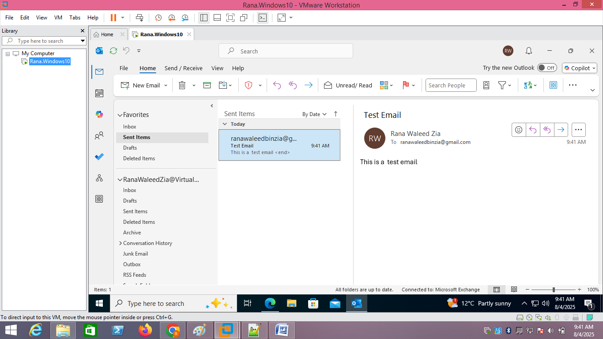
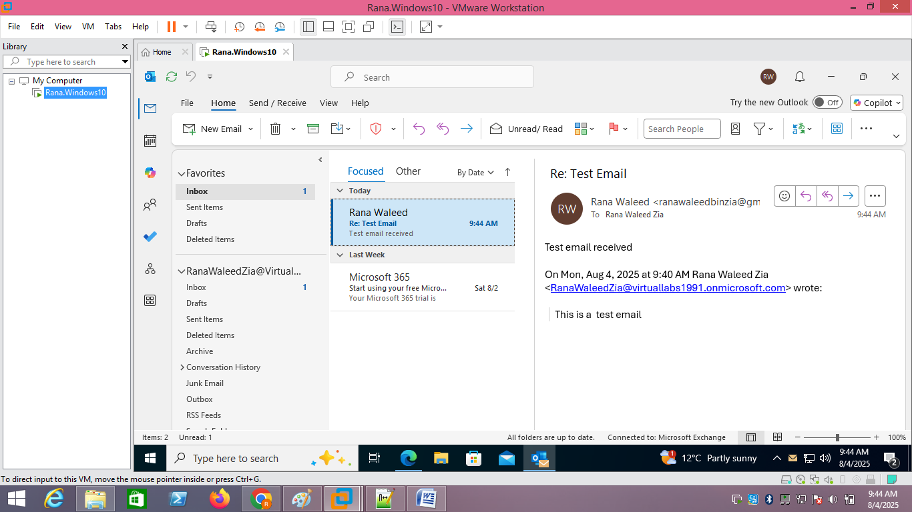

# Outlook Not Set Up — Microsoft 365 Apps Deployment & Mail Flow Test

| Field | Detail |
|---|---|
| **Ticket Subject** | "I've got a new PC but no Outlook — I can't send or receive email" |
| **Category** | Messaging / Microsoft 365 |
| **Priority** | P3 — Single User Impacted |
| **Environment** | Windows 10 VM on VMware Workstation Pro, Microsoft 365 Business Standard trial tenant (VirtualLabs1991.onmicrosoft.com). Completed 9 Jul – 4 Aug 2025 |

---

## Problem Statement

A user has been given a newly built Windows 10 workstation. It has no Office applications, so they have no desktop Outlook and cannot work through their email. The task is to deploy the **Microsoft 365 apps** from the user's licence, connect **Outlook** to their **Exchange Online** mailbox, and prove that **mail flows in both directions with an external address** — not just that Outlook opens.

---

## Tools Used

- **VMware Workstation Pro** (Windows 10 workstation)
- **Microsoft 365 portal** (app installation from the user's licence)
- **Outlook desktop app** (mail client, Exchange Online connection)
- **External mailbox (Gmail)** (independent send/receive test)

---

## Technical Steps

### 1. Confirm the Workstation Is Ready

Started from a clean **Windows 10** workstation in VMware Workstation Pro with the desktop loaded and internet access available. No Office applications were installed — matching the user's report.

**Screenshot:**

---

### 2. Install Microsoft 365 Apps from the User's Licence

Signed in to the Microsoft 365 portal with the **Business Standard** account and started the Microsoft 365 apps installation. The Click-to-Run installer downloaded and installed **Word, Excel, PowerPoint, Outlook, OneNote, Publisher, Access and Skype** — the full suite included in the licence.

**Screenshot:**

---

### 3. Connect Outlook to the Mailbox

Launched Outlook and signed in with the Microsoft 365 account (**RanaWaleedZia@VirtualLabs1991.onmicrosoft.com**). Outlook discovered and configured the Exchange Online connection automatically (Autodiscover) — no manual server settings were needed. The mailbox loaded with the tenant's welcome message (*"Your Microsoft 365 trial is ready"*) in the Inbox, confirming the account and licence were both active.

**Screenshot:**

---

### 4. Test Outbound Mail to an External Address

Sent a test email, **"Test Email"**, to an external Gmail address. It appeared in **Sent Items**, and the status bar read **"All folders are up to date. Connected to: Microsoft Exchange."** Sending to an *external* address matters: internal mail can work while outbound internet mail is still broken.

**Screenshot:**

---

### 5. Test Inbound Mail from the External Address

Replied from the Gmail account. The reply, **"Re: Test Email — Test email received"**, arrived in the Outlook **Focused** Inbox at 9:44 AM — three minutes after the original was sent — quoting the original message. Mail flow is confirmed in both directions, and the user's issue is resolved.

**Screenshot:**

---

## Verification Summary

| Check | Evidence | Result |
|---|---|---|
| Apps installed from licence | Microsoft 365 installer completed | ✅ |
| Outlook connected to Exchange Online | "Connected to: Microsoft Exchange" | ✅ |
| Outbound to external domain | "Test Email" in Sent Items | ✅ |
| Inbound from external domain | "Re: Test Email" in Inbox | ✅ |

---

## Key Takeaways

- **"Outlook opens" is not the same as "email works."** The ticket is closed on a round-trip test, not on a successful install.
- **Test with an external address.** Internal-only tests can pass while outbound internet mail, spam filtering or DNS (MX) records are broken. An external round trip exercises the whole path.
- **Autodiscover does the configuration.** For Exchange Online, signing in is enough. If Outlook asks for server names or loops on the password prompt, Autodiscover (and its DNS record) is the first thing to check.
- **The status bar is a diagnostic tool.** "Connected to: Microsoft Exchange" versus "Disconnected" or "Trying to connect…" tells you instantly whether the problem is the client or the connection.

---

## Skills Demonstrated

`Microsoft 365 Apps Deployment` · `Outlook Configuration` · `Exchange Online` · `Autodiscover` · `Mail Flow Testing` · `End-User Support`
