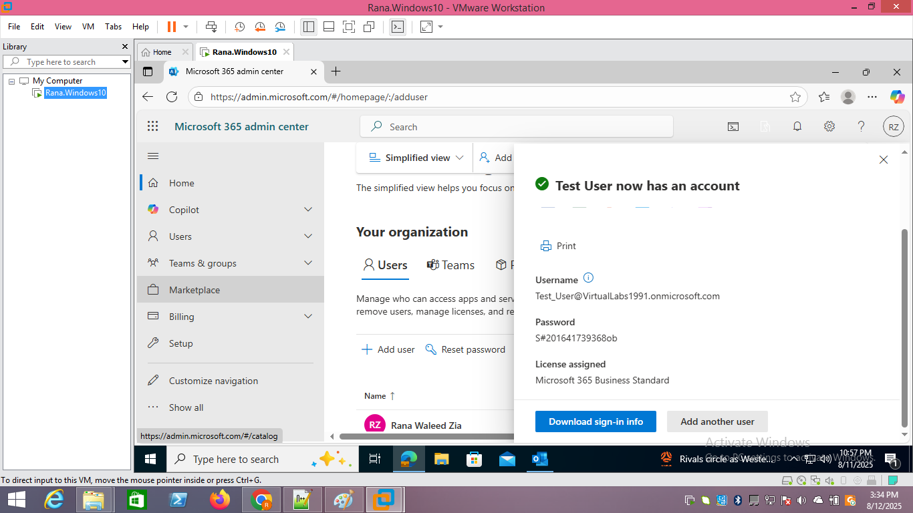
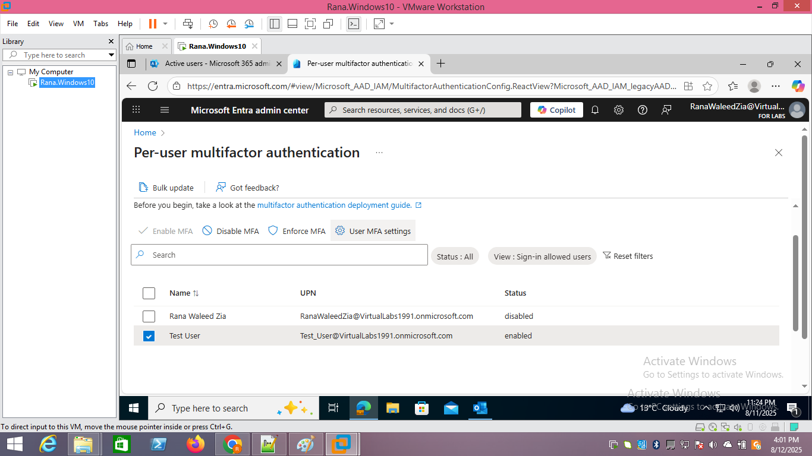
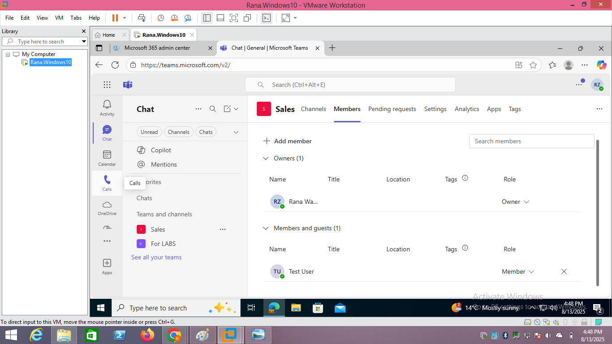
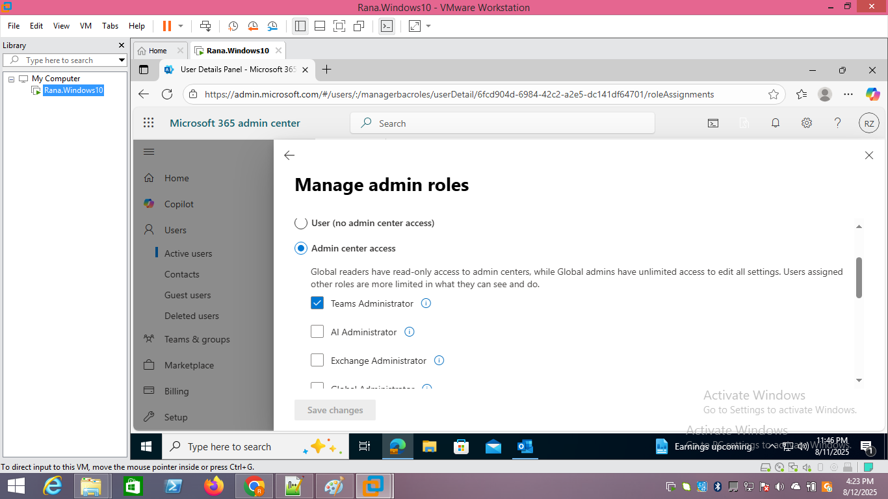
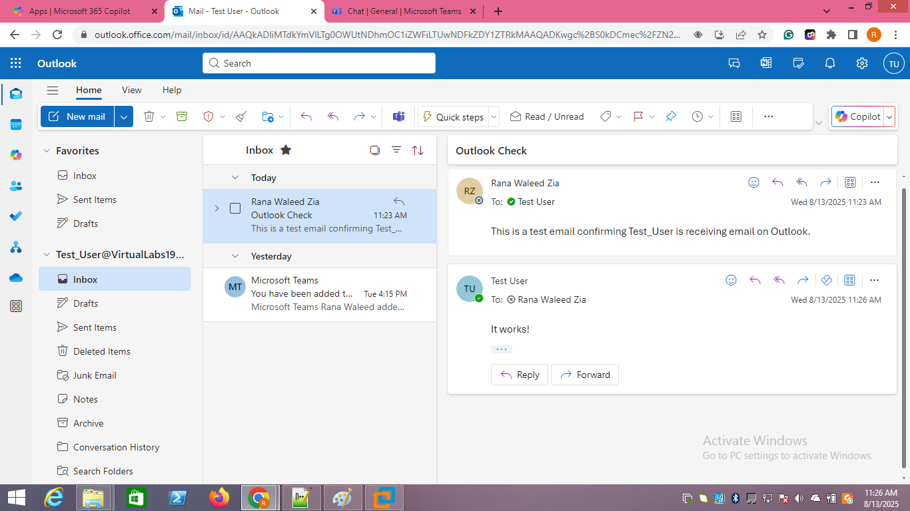
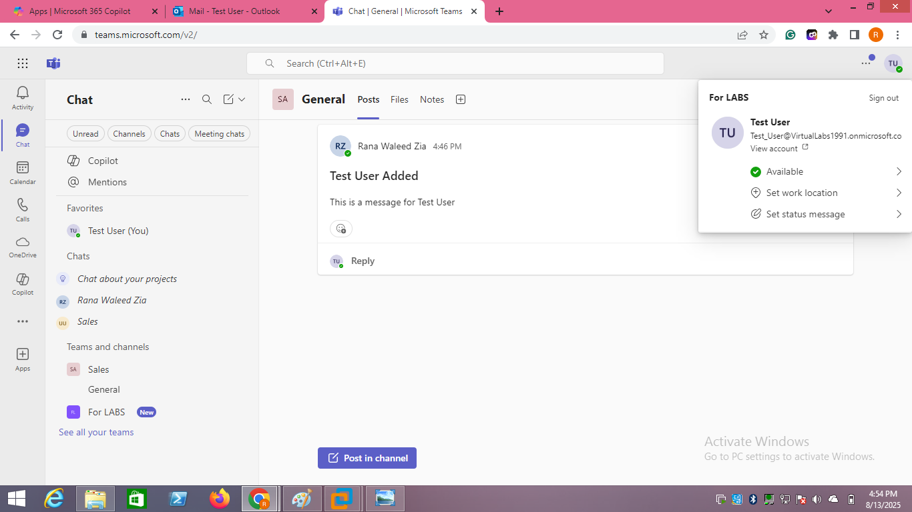
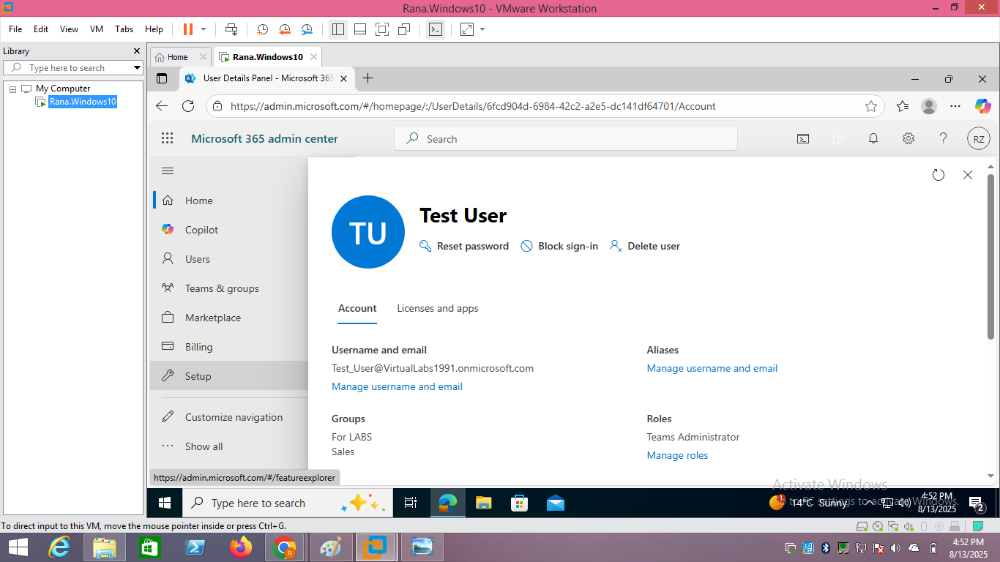

# Sales New Starter — Microsoft 365 Account, MFA, Teams Access & Mailbox Verification

| Field | Detail |
|---|---|
| **Ticket Subject** | New starter — Sales team member who will also look after the team's Microsoft Teams setup |
| **Category** | Identity & Access Management / Microsoft 365 |
| **Priority** | P3 — Scheduled Onboarding |
| **Environment** | Microsoft 365 Business Standard trial tenant (VirtualLabs1991.onmicrosoft.com), administered from a Windows 10 VM. Completed 11–13 Aug 2025 |

---

## Problem Statement

A new employee is joining the Sales team. Before their first day they need a licensed Microsoft 365 account protected by **multi-factor authentication**, membership of the **Sales** team in Microsoft Teams, and — at the sales manager's request — the ability to manage the team's Teams setup. The task is to provision all of this and then **sign in as the user** to prove that email and Teams actually work, rather than assuming they do.

The new account is **Test User** (`Test_User@VirtualLabs1991.onmicrosoft.com`).

---

## Tools Used

- **Microsoft 365 Admin Center** (user creation, licensing, admin roles)
- **Microsoft Entra admin center** (Per-user MFA page — enabling MFA)
- **Microsoft Teams** (team creation and membership)
- **Outlook on the web** (mailbox verification)

---

## Technical Steps

### 1. Create and License the Account

In the **Microsoft 365 Admin Center → Users → Active users → Add a user**, entered the name and username and assigned a **Microsoft 365 Business Standard** licence in the same wizard. The confirmation panel read **"Test User now has an account"**, with username **Test_User@VirtualLabs1991.onmicrosoft.com** and licence **Microsoft 365 Business Standard**.

**Screenshot:**

> **Credential handling:** this panel displays the temporary password. In production it is sent to the user or their manager through a separate channel (never in the same email as the username), and the user is forced to change it at first sign-in.

---

### 2. Enable Multi-Factor Authentication

Opened **Per-user multifactor authentication** in the Microsoft Entra admin center, selected **Test User** and chose **Enable MFA**. The status column changed to **enabled**, so the user is required to register an MFA method at their next sign-in.

**Screenshot:**

> **Modern approach:** per-user MFA is Microsoft's legacy method and has to be switched on for each account individually. At scale, MFA is enforced for everyone through **Security Defaults** or **Conditional Access** — covered in the MFA, TAP & Conditional Access lab in this portfolio.

---

### 3. Add the User to the Sales Team

In Microsoft Teams, created a private team named **Sales** and added **Test User** as a **Member**, with the administrator as the team **Owner**. Teams also emails the user to let them know they have been added.

**Screenshot:**

---

### 4. Grant the Requested Admin Role

The sales manager asked for the new starter to be able to manage the team's Teams setup. In **Admin Center → Active users → Test User → Manage roles**, selected **Admin center access** and assigned the **Teams Administrator** role only — not Exchange Administrator, and not Global Administrator.

**Screenshot:**

> **Least-privilege review:** Teams Administrator is a *tenant-wide* role — it can change settings for every team in the organisation, not just Sales. If the real need is only to manage the Sales team's channels and members, making the user a **team Owner** grants that without any admin role. In production I would confirm the requirement with the manager before assigning a tenant-wide role.

---

### 5. Verify Email — Signed In as the User

Signed in to **Outlook on the web** as Test User. The Inbox contained the **"Outlook Check"** email sent by the administrator (*"This is a test email confirming Test_User is receiving email on Outlook"*), and Test User's reply, **"It works!"**, was sent back successfully — mailbox receive and send both confirmed. The Teams notification email ("You have been added to…") was also present.

**Screenshot:**

---

### 6. Verify Teams Collaboration — Signed In as the User

Opened Teams as Test User. The **Sales → General** channel showed the administrator's post **"Test User Added — This is a message for Test User"**, with a Reply option available, and the profile card confirmed the account **Test_User@VirtualLabs1991.onmicrosoft.com** with status **Available**.

**Screenshot:**

---

### 7. Final Check — Review the Account in the Admin Center

Opened the user's account page in the Admin Center to confirm the end state in one place: **Groups: For LABS, Sales** and **Roles: Teams Administrator**, alongside the account's username and email.

**Screenshot:**

---

## Onboarding Checklist

| Requirement | Evidence | Status |
|---|---|---|
| Account created and licensed | "Test User now has an account", Business Standard | ✅ |
| MFA required | Per-user MFA status **enabled** | ✅ |
| Member of the Sales team | Teams Members list; Groups: Sales | ✅ |
| Requested admin role | Roles: **Teams Administrator** (only) | ✅ |
| Mailbox sends and receives | "Outlook Check" received, "It works!" reply | ✅ |
| Teams access works | Sales → General visible as the user | ✅ |

---

## Key Takeaways

- **Verify as the user, not as the admin.** An account can look perfect in the Admin Center and still fail at sign-in. Opening Outlook and Teams *as the user* is what proves the onboarding worked.
- **Security is set before first sign-in.** MFA is enabled before the user ever logs in, so the account is never exposed with only a password.
- **Assign the smallest role that meets the need — and question the request.** Teams Administrator was granted instead of Global Administrator, but a team Owner role may have been enough. Challenging over-broad access requests is part of the job.
- **Know the legacy from the modern.** Per-user MFA works, but Conditional Access is how organisations enforce MFA consistently.

---

## Skills Demonstrated

`Microsoft 365 Administration` · `User Provisioning & Licensing` · `Multi-Factor Authentication` · `Microsoft Teams Administration` · `Admin Roles / Least Privilege` · `Exchange Online` · `End-to-End Verification`
