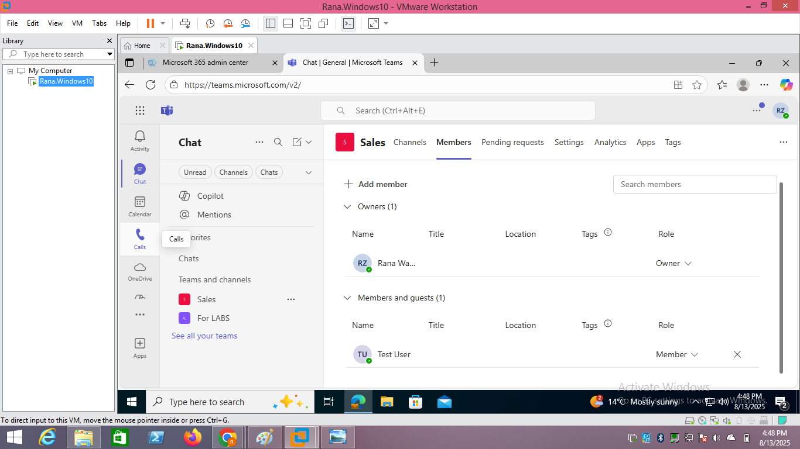

# Microsoft 365 – New User Creation, Team Assignment, MFA, and Access Verification

## Overview
This lab demonstrates the process of:
- Creating a new Microsoft 365 user in a Business Standard environment.
- Enabling Multi-Factor Authentication (MFA) for security.
- Adding the user to a Sales team in Microsoft Teams.
- Assigning administrative roles.
- Verifying access to Microsoft 365 email and collaboration tools.

---

## **1. Create New User Account**
1. Log in to the **Microsoft 365 Admin Center** ([admin.microsoft.com](https://admin.microsoft.com)) as a Global Admin.
2. Navigate to **Users → Active Users → Add a user**.
3. Enter user details (Name, Username, Password settings).
4. Assign **Microsoft 365 Business Standard** license.
5. Save and confirm user creation.

**Screenshot:**  

---

## **2. Enable MFA for the User**
1. In the Admin Center, go to **Users → Active Users**.
2. Click **Multi-factor authentication** (above user list).
3. Select the user and click **Enable** → confirm.
4. Optionally enforce MFA immediately so the user is prompted on next login.

**Screenshot:**  

---

## **3. Create a Sales Team and Add the User**
1. Open Microsoft Teams ([teams.microsoft.com](https://teams.microsoft.com)) as an admin.
2. Click **Join or create a team** → **Create team** → From scratch.
3. Choose **Private** → Name it **Sales** → **Create**.
4. Add the newly created user as a member.

**Screenshot:**  

---

## **4. Assign Teams Admin Role**
1. Go to **Microsoft 365 Admin Center → Users → Active Users**.
2. Select the new user → **Manage roles**.
3. Assign **Teams Administrator** role and save changes.

**Screenshot:**  

---

## **5. Verify Email Access**
1. Log in as the new user at [Outlook Web](https://outlook.office.com).
2. Check Inbox for test email.
3. Send and receive emails to confirm mailbox functionality.

**Screenshot:**  

---

## **6. Verify Collaboration Tools**
- **Teams:** Confirm the user can see and post in the Sales team.

**Screenshot:**

---

## **7. Lab Conclusion**
In this lab, I successfully:
- Created and licensed a new M365 user.
- Secured the account with MFA.
- Added the user to the Sales team in Teams.
- Granted administrative privileges.
- Verified access to email and collaboration platforms.

This process demonstrates essential Microsoft 365 administration tasks for user onboarding.

