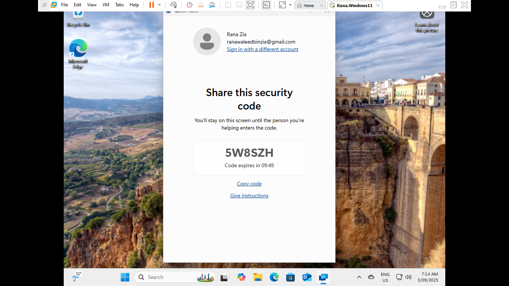
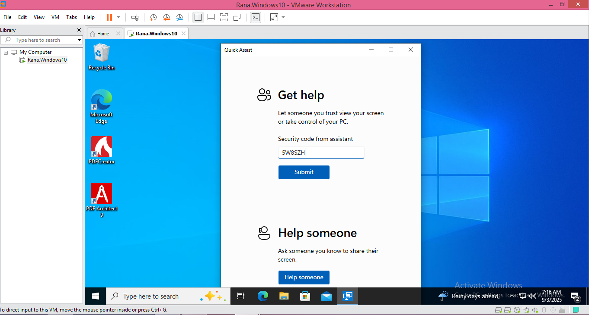
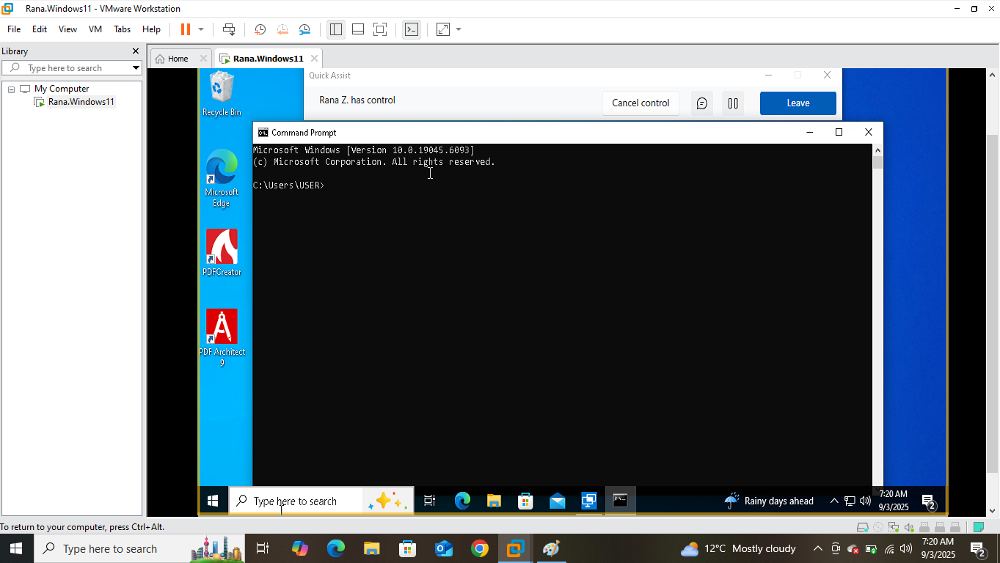
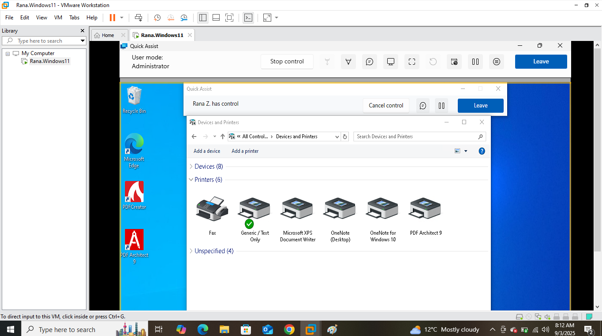
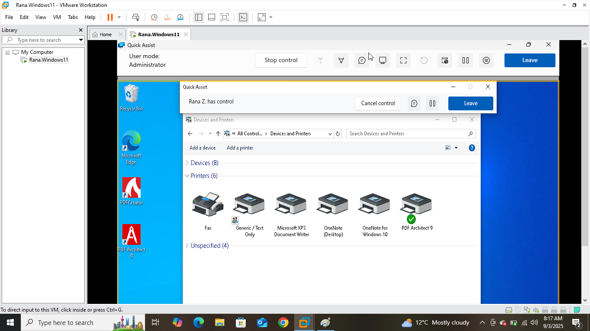
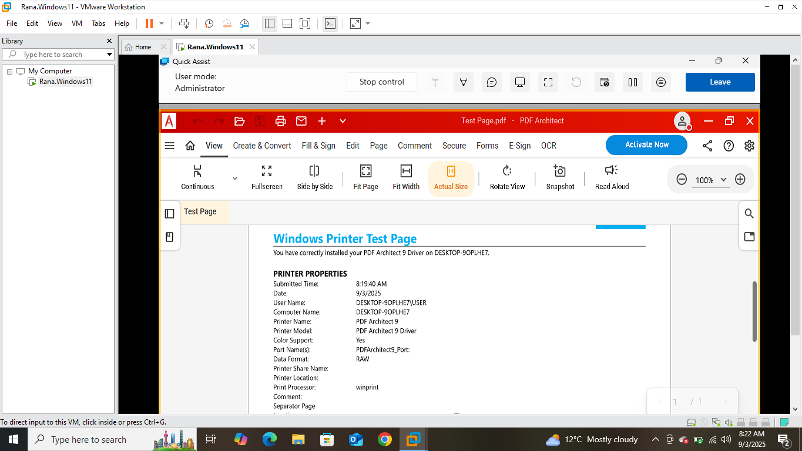

# Remote Support Tools Lab — Quick Assist (Windows 10/11)

## Overview
This lab demonstrates the use of **Quick Assist** to remotely support an end-user by setting a default printer and confirming functionality.

I connected from the Tech-PC to the End-User PC using Quick Assist. Once the session was established, I guided the user’s computer to configure the correct default printer and tested it successfully.

---

## Steps and Screenshots

1. On the Tech-PC, I generated a Quick Assist code and shared it with the End-User. 

   

2. The End-User entered the code to allow the remote session.  

   

3. After gaining full control, I accessed the End-User’s command prompt to validate control.  

   

4. I navigated to the **Devices and Printers** window on the End-User PC.  

   

5. I set **PDF Architect 9** as the default printer.  

   

6. Finally, I printed a test page to confirm the default printer was working correctly. 
 
   

---

## Conclusion
This lab successfully demonstrated how Quick Assist can be used to remotely set a default printer and verify functionality on an end-user’s machine. It replicates a real-world IT support scenario where users face printing issues, and remote troubleshooting is required.
