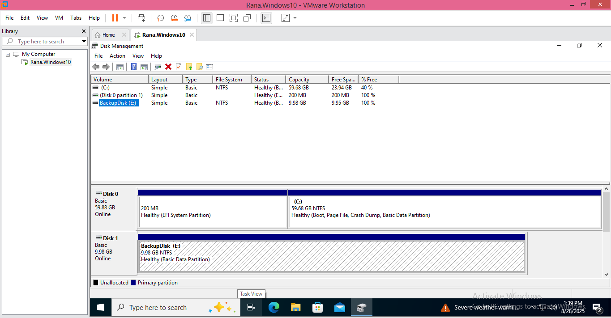
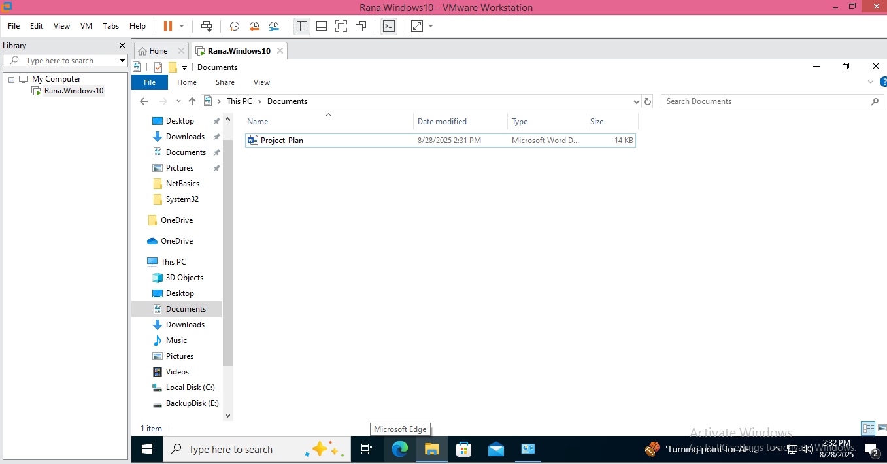
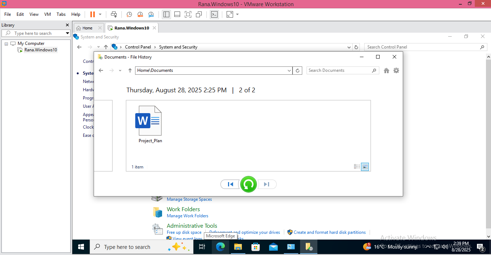

# Deleted Project File — Enabling File History and Restoring Lost User Data

| Field | Detail |
|---|---|
| **Ticket Subject** | (1) Request: set up backups on a workstation · (2) Incident: "I deleted my project plan" |
| **Category** | Data Protection / Backup & Recovery |
| **Priority** | P3 (backup request) → P2 (lost business document) |
| **Environment** | Windows 10 VM (DESKTOP-9OPLHE7) on VMware Workstation Pro, with a second 10 GB virtual disk as the backup drive. Completed 28 Aug 2025 |

---

## Problem Statement

This lab covers two tickets that arrive in the order they would in real life.

**Ticket 1 — a backup request.** A manager asks for a user's workstation to be backed up after a near miss elsewhere in the team. The user's files live only on the local drive, so a deletion or disk failure would mean permanent loss.

**Ticket 2 — the incident, the same afternoon.** The user calls: they have deleted **Project_Plan.docx** from their Documents folder and cannot find it anywhere. The task is to recover the file **from the backup taken earlier that day** and restore it to its original location.

The lesson the two tickets teach together: a restore is only possible because the backup was put in place *before* it was needed.

---

## Tools Used

- **VMware Workstation Pro** (adding a second virtual disk)
- **Disk Management (diskmgmt.msc)** (initialising and formatting the backup disk)
- **File History** (Control Panel → System and Security → File History)
- **File Explorer** (confirming the deletion and the restore)

---

## Technical Steps

### Ticket 1 — Put a Backup in Place

### 1. Provision a Dedicated Backup Disk

Added a second virtual disk in VMware, then in **Disk Management** initialised it, created a simple volume, formatted it **NTFS**, and labelled it **BackupDisk (E:)** — 9.98 GB, status Healthy. Keeping backups on a separate disk means a problem with the system drive (C:) does not also take the backup with it.

**Screenshot:**

---

### 2. Turn On File History

In **Control Panel → System and Security → File History**, selected **BackupDisk (E:)** as the target and turned File History on. It confirmed: **File History is on**, copying **Libraries, Desktop, Contacts, and Favorites** to BackupDisk (E:), and began saving copies for the first time.

**Screenshot:**
.PNG)

---

### Ticket 2 — Recover the Deleted File

### 3. Confirm What the User Had

The user's working document **Project_Plan.docx** was in their **Documents** folder, which falls inside the Libraries that File History protects. File History captured a version of it at **2:25 PM**.

**Screenshot:**

---

### 4. Confirm the Loss

The file was deleted to reproduce the user's mistake. Documents now reads **"This folder is empty"** — confirming exactly what the user reported before attempting any recovery.

**Screenshot:**

---

### 5. Restore from File History

Opened **File History → Restore personal files**, browsed to **Home\Documents**, and navigated back through the saved versions to **Thursday, August 28, 2025 2:25 PM**, where **Project_Plan** is present. Selected it and clicked the green **Restore** button, which returns the file to its original location. The file was returned to the Documents folder.

**Screenshot:**

---

## Incident Timeline (28 Aug 2025)

| Time | Event |
|---|---|
| 1:39 PM | Backup disk BackupDisk (E:) provisioned |
| 2:17 PM | File History turned on |
| 2:25 PM | File History saves a version containing Project_Plan.docx |
| 2:33 PM | File deleted — Documents is empty |
| 2:39 PM | File restored from the 2:25 PM version |

---

## Key Takeaways

- **You can only restore what you backed up.** Ticket 2 was a six-minute fix only because Ticket 1 had been done first. Recovery is decided before the incident, not during it.
- **Recovery point matters.** File History restores the last saved copy — any edits after 2:25 PM would have been lost. Reviewing how often File History saves (Advanced settings) is part of setting it up properly.
- **Confirm the loss before you fix it.** Checking the folder (and the Recycle Bin) first shows what actually happened and rules out the file simply being moved.
- **Separate disk, not separate site.** A second internal disk protects against deletion and some disk failures, but not theft, fire or ransomware on the same machine. In a business, File History would be complemented by OneDrive Known Folder Move or a server-side backup — the 3-2-1 rule (3 copies, 2 media types, 1 off-site).

---

## Skills Demonstrated

`Backup & Recovery` · `File History` · `Disk Management` · `Data Loss Incident Handling` · `VMware Workstation` · `End-User Support`
