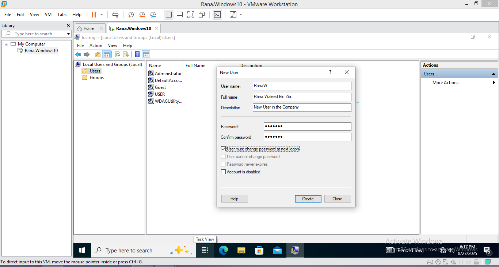
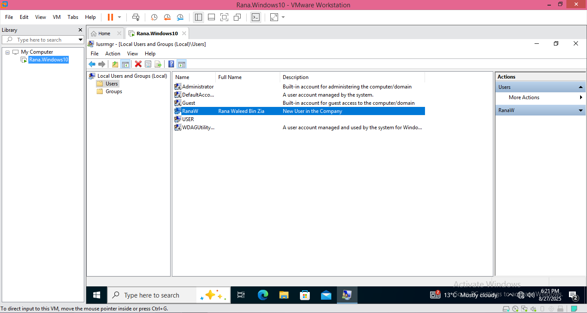
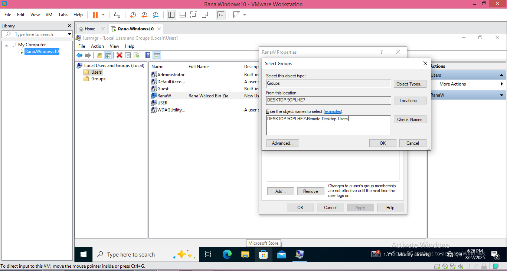
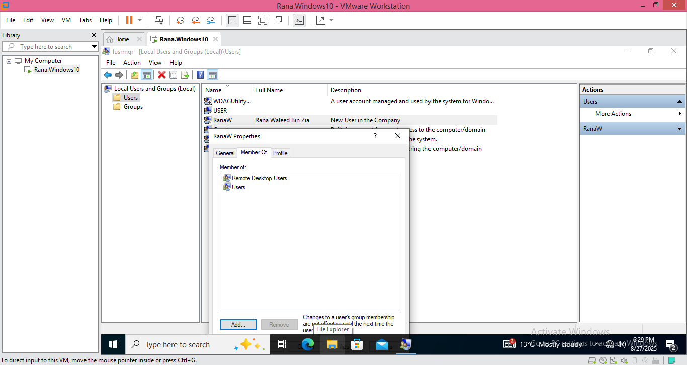
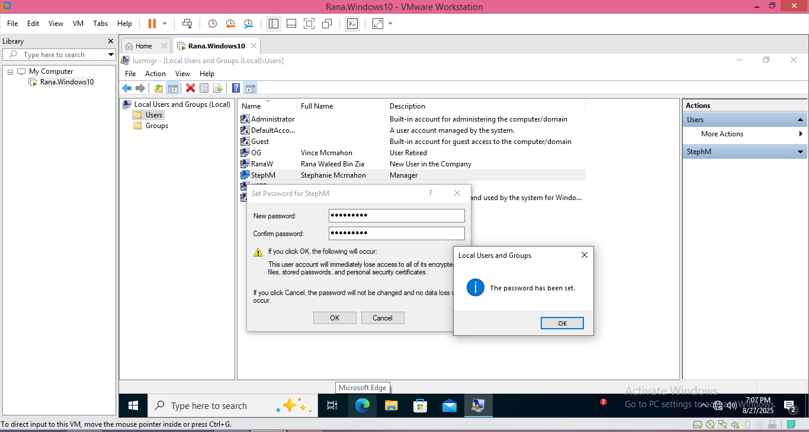
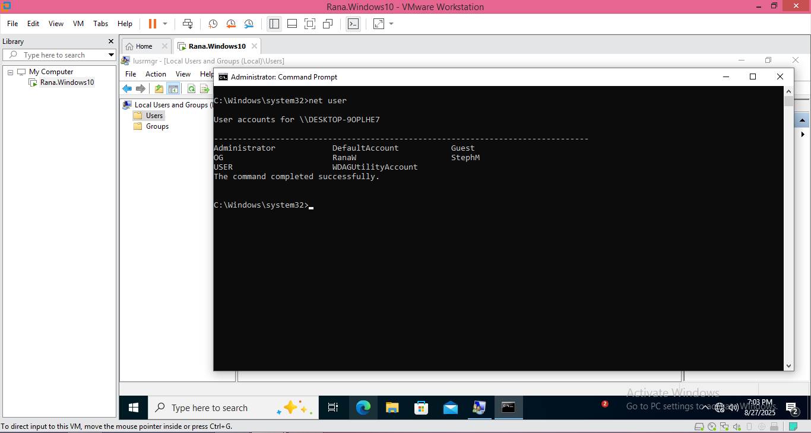
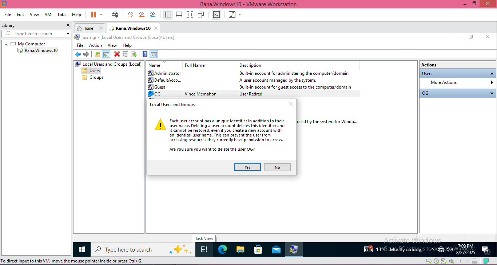
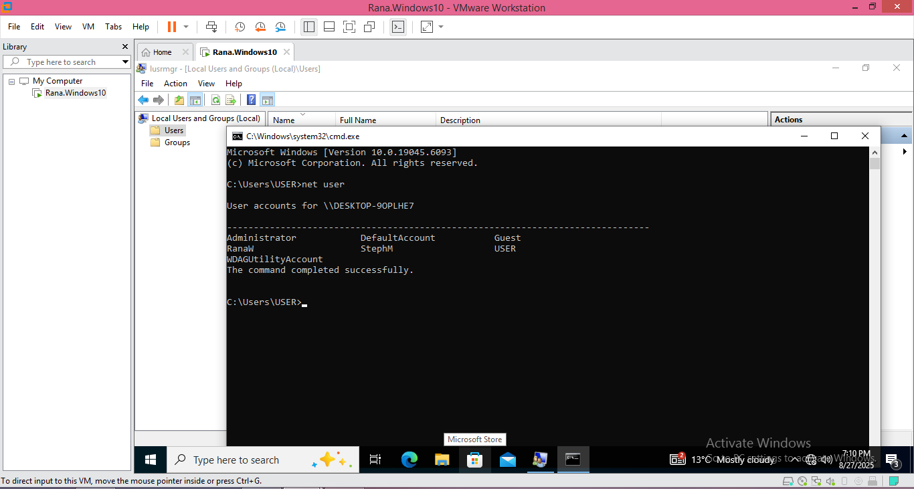

# Joiner, Leaver & Password Reset — Local Account Administration in Windows 10

| Field | Detail |
|---|---|
| **Ticket Subject** | Three requests for workstation DESKTOP-9OPLHE7: a new starter, a locked-out manager, and a retiree's account |
| **Category** | Identity & Access Management — Local Accounts |
| **Priority** | P3 — Standard Service Requests |
| **Environment** | Windows 10 VM (DESKTOP-9OPLHE7, build 19045) on VMware Workstation Pro — a stand-alone PC with no domain, so accounts are managed locally. Completed 27 Aug 2025 |

---

## Problem Statement

A small office shares a Windows 10 PC that is not joined to a domain, so every account lives on the machine itself. Three requests arrive together:

1. **Joiner** — a new starter, **Rana Waleed Bin Zia**, needs an account, and needs to be able to connect to this PC remotely.
2. **Password reset** — **Stephanie Mcmahon** (Manager, account `StephM`) has forgotten her password and cannot sign in.
3. **Leaver** — **Vince Mcmahon** (account `OG`) has retired, and his account must be removed so it cannot be misused.

The task is to complete all three with the least access necessary, understand the side effects of each action before confirming it, and verify the final account list.

---

## Tools Used

- **Local Users and Groups** (lusrmgr.msc — create, reset, group membership, delete)
- **net user** (Command Prompt — before-and-after verification)

---

## Technical Steps

### Request 1 — Joiner

### 1. Create the New Starter's Account

In **lusrmgr.msc → Users → New User**, created:

| Field | Value |
|---|---|
| User name | `RanaW` |
| Full name | Rana Waleed Bin Zia |
| Description | New User in the Company |
| Password | Temporary password |
| **User must change password at next logon** | ✅ Enabled |
| Account is disabled | ☐ Not ticked |

Forcing a password change at first logon means only the user ever knows their real password — the technician who set the temporary one does not.

**Screenshot:**

---

### 2. Grant Remote Access Through a Group

Opened **RanaW → Properties → Member Of → Add** and added the local group **DESKTOP-9OPLHE7\Remote Desktop Users**.

**Screenshot:**

The **Member Of** tab now shows **Remote Desktop Users** and **Users**. RanaW can connect remotely but is **not** in Administrators — remote access was granted without handing out admin rights. Windows notes that group changes take effect at the user's next logon.

**Screenshot:**

---

### Request 2 — Password Reset

### 3. Reset the Manager's Password

Right-clicked **StephM (Stephanie Mcmahon, Manager) → Set Password** and set a new password. Before confirming, Windows warns that the account **"will immediately lose access to all of its encrypted files, stored passwords, and personal security certificates."** The reset completed: **"The password has been set."**

**Screenshot:**

> **Why the warning matters:** an administrator reset on a local account breaks anything protected by the old password — EFS-encrypted files and saved credentials. Before resetting, check whether the user relies on either; if she can still remember the old password and is only locked out, unlocking the account is the safer fix. Always verify the caller's identity before any reset.

---

### Request 3 — Leaver

### 4. Capture the Accounts Before Removing Anything

Before deleting, ran `net user` from an elevated Command Prompt to record the accounts on `\\DESKTOP-9OPLHE7`: Administrator, DefaultAccount, Guest, **OG**, **RanaW** (created in Step 1), **StephM**, USER and WDAGUtilityAccount. This is the "before" evidence for the leaver change.

**Screenshot:**

---

### 5. Remove the Retired User's Account

Right-clicked **OG (Vince Mcmahon, "User Retired") → Delete**. Windows warns that every account has a unique security identifier (SID) that **cannot be restored**, even by recreating an account with the same name — so any permissions granted to it are lost for good. Confirmed with **Yes**.

**Screenshot:**

> **Production practice:** deletion is irreversible, so many organisations **disable** a leaver's account first, confirm nothing depends on it and that any data the business needs has been handed over, then delete it after a set retention period.

---

### 6. Verify the Final State

Ran `net user` again. **OG** no longer appears; **RanaW** and **StephM** remain. All three requests are complete and verified.

**Screenshot:**

---

## Change Summary

| Request | Account | Action | Verified by |
|---|---|---|---|
| Joiner | `RanaW` | Created, forced password change, added to Remote Desktop Users | Member Of tab |
| Password reset | `StephM` | Password set by administrator | "The password has been set" |
| Leaver | `OG` | Account deleted | `net user` before and after |

---

## Key Takeaways

- **Joiner, mover, leaver is the account lifecycle.** The same three events — someone starts, someone's access changes, someone leaves — drive most identity tickets, whether the accounts are local, in Active Directory, or in Entra ID.
- **Grant access through groups, and only the access needed.** RanaW got remote access via Remote Desktop Users, not by being made an administrator.
- **Read the warning dialogs.** Both the password reset and the deletion warn about irreversible side effects (lost encrypted data, a lost SID). Understanding them is the difference between fixing a ticket and causing a new one.
- **Verify with evidence.** `net user` before and after proves the change, rather than assuming the GUI action worked.

---

## Skills Demonstrated

`Local User Management` · `lusrmgr.msc` · `Password Resets` · `Group Membership` · `Joiner / Mover / Leaver` · `Least Privilege` · `net user` · `Change Verification`
