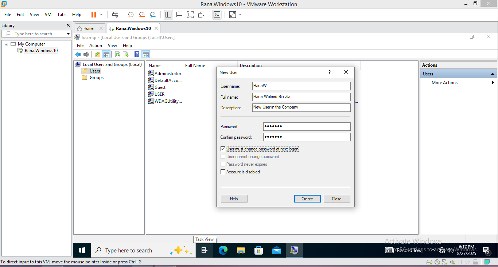

# Lab 01 – Local User Account Management in Windows 10

## Overview
This lab demonstrates how to perform common user account management tasks in Windows 10:
- Create and delete local user accounts
- Reset user passwords
- Add users to local groups
- Verify changes using Command Prompt

These are typical real-world tasks performed by Help Desk and Junior System Administrators.

---

## Steps & Screenshots

### 1. Create a New Local User Account
- Open **Local Users and Groups (lusrmgr.msc)** → **Users → New User…**  
- Created user: **RanaW**  
- Assigned initial password.  
 
  
  

---

### 2. Add User to Local Group
- Open **RanaW Properties → Member Of tab**.  
- Added user to **Remote Desktop Users** group.  
 
  
  

---

### 3. Reset a User Password
- Right-clicked user **StephM** → **Set Password** → entered new password.  
 
  

---

### 4. Delete an Old User Account
- Right-clicked **OG** account → **Delete** → Confirmed deletion.  
 
  

---

### 5. Verify Using Command Prompt
- Ran `net user` before and after deletion to verify user list.  

  
  

---

## Conclusion
This lab successfully demonstrated how to:  
✔ Create a new user account  
✔ Reset a user password  
✔ Add a user to local groups  
✔ Delete an obsolete account  
✔ Verify changes with Command Prompt  

These are essential skills for IT Support/Help Desk technicians to manage local accounts in a Windows environment.
