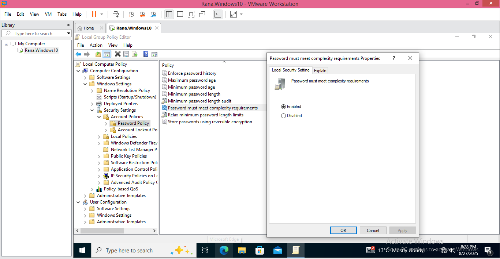
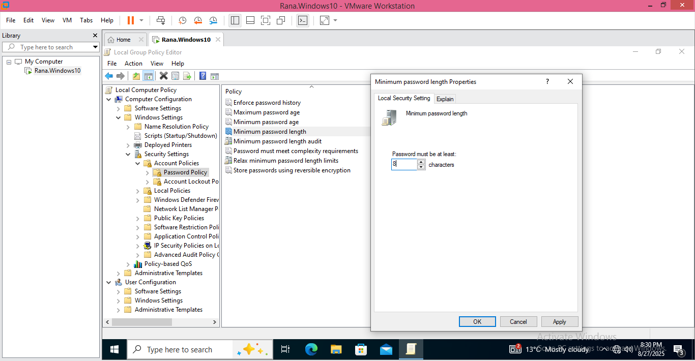
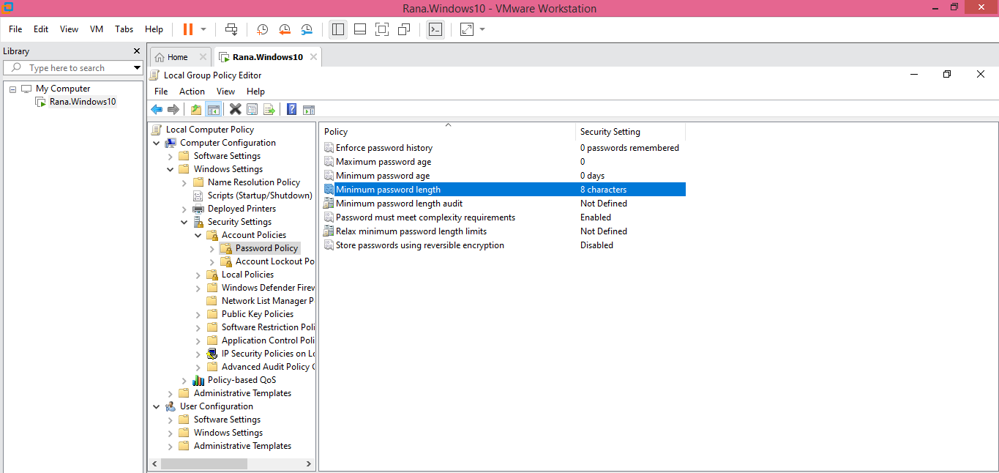
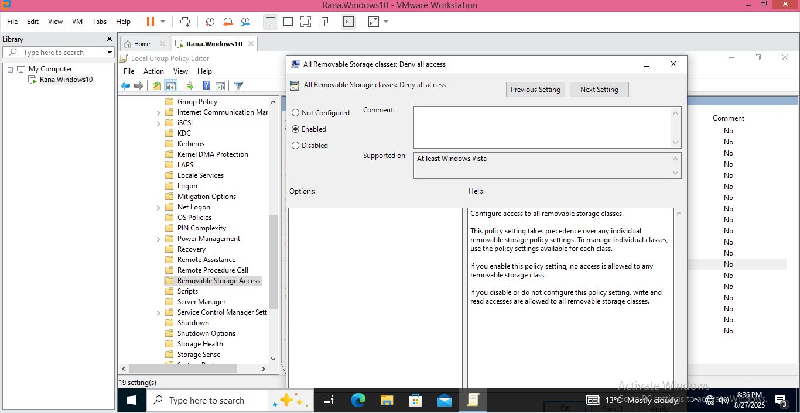
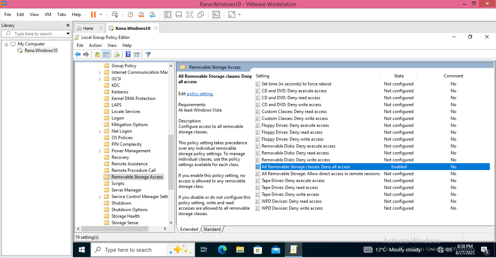
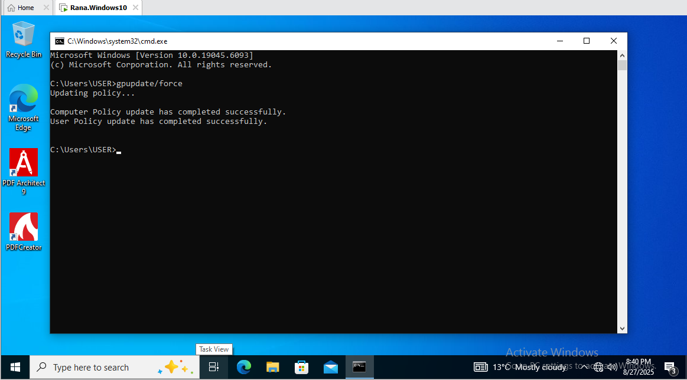
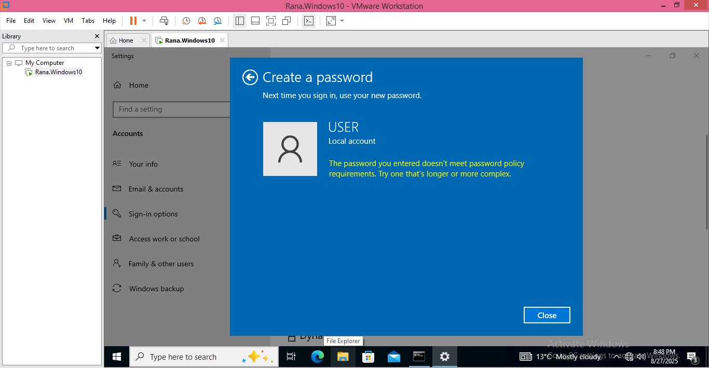
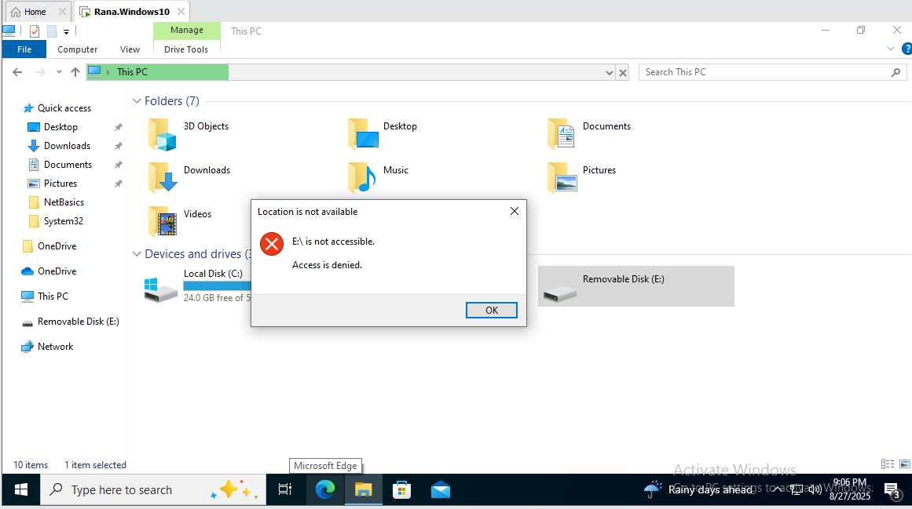

# 🧪 Windows Administration Lab: Local Group Policy for Security

## Overview
This lab demonstrates how to **secure a Windows 10 endpoint using Local Group Policy** by enforcing password complexity requirements and disabling USB storage devices. These are essential steps in hardening a system to prevent weak credentials and unauthorized data access.

---

## Steps and Screenshots

### Step 1: Access the Local Group Policy Editor
1. Open **Local Group Policy Editor (*gpedit.msc*)**
2. This will be used to manage security settings.

---

### Step 2: Enforce Password Complexity

1. Navigate to:  
**Computer Configuration → Windows Settings → Security Settings → Account Policies → Password Policy**

2. Enable **Password must meet complexity requirements**.  

  

3. I have set **Minimum Password Length** to **8 characters**.  

 

4. Password Policy changed.

---

### Step 3: Disable USB Storage Devices

1. Navigate to:  
**Computer Configuration → Administrative Templates → System → Removable Storage Access**

2. External storage policy is implemented by enabling **All Removable Storage classes: Deny all access**.  

3. Policy window confirming that the policy has been configured .

---

### Step 4: Verify the Policy

1. Policies are applied immediately by running **gpupdate/force** in **Command Prompt**

 

2. I tested **Password policy** by setting a weak password and it failed. 

 

3. Lastly, I tested **Removable Storage Policy** by plugging a USB drive. Access was denied.

---

## Conclusion
This lab successfully demonstrated **Windows Group Policy Implementation**. I:

- Enforced **Password Complexity** and minimum length requirements for stronger authentication.  
- Disabled **USB storage devices** to prevent unauthorized data access.  
- Verified applied policies to ensure endpoint security hardening is effective.  
