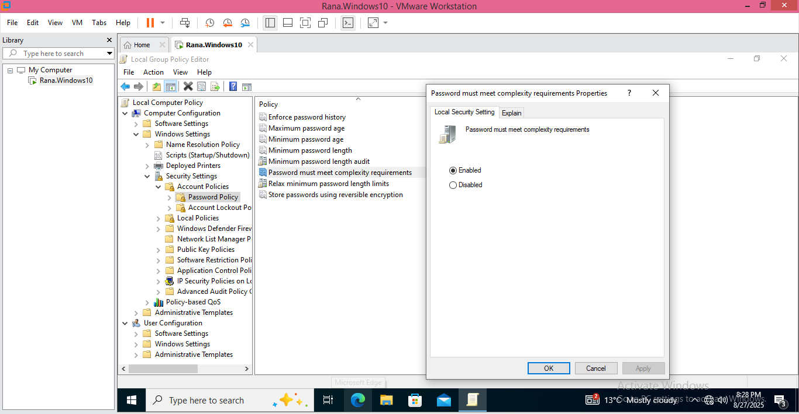
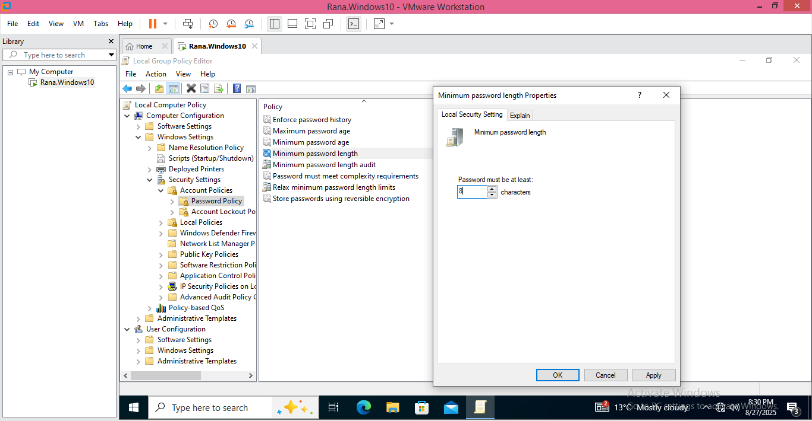
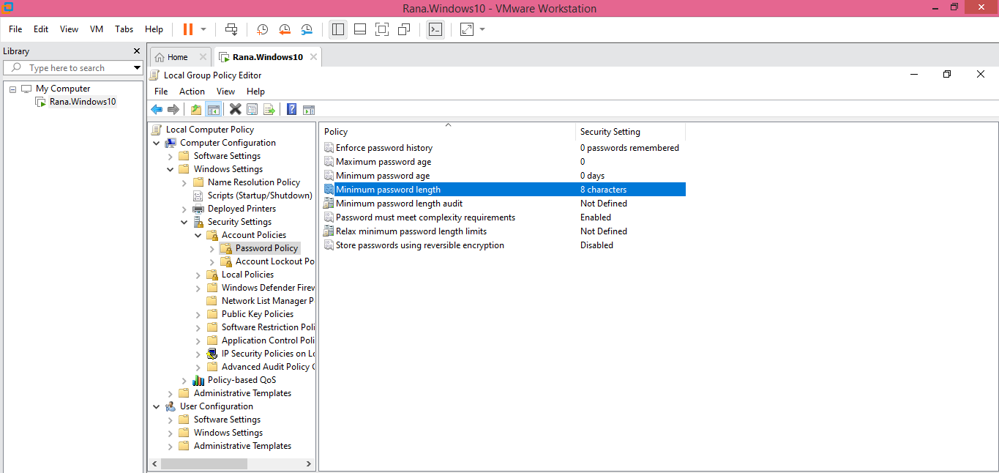
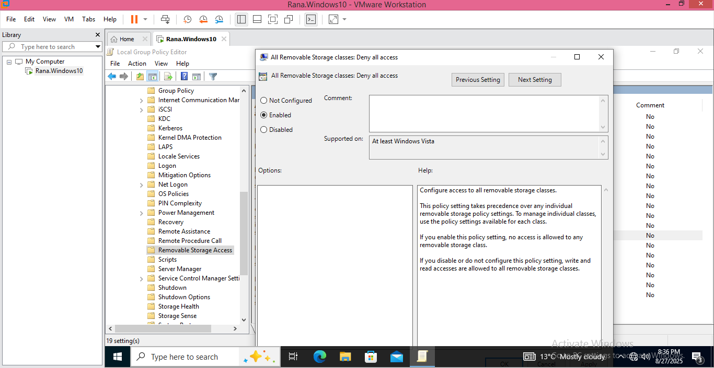
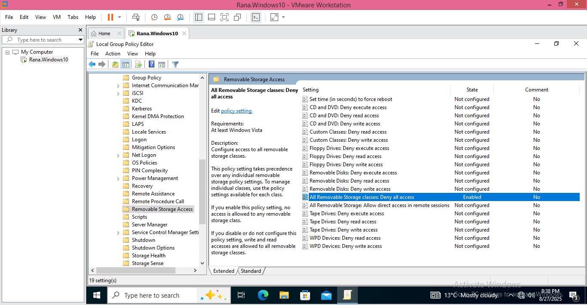
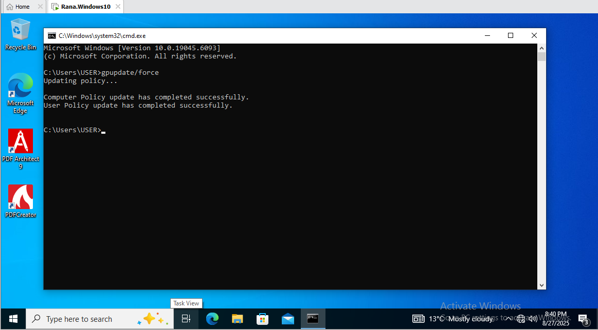
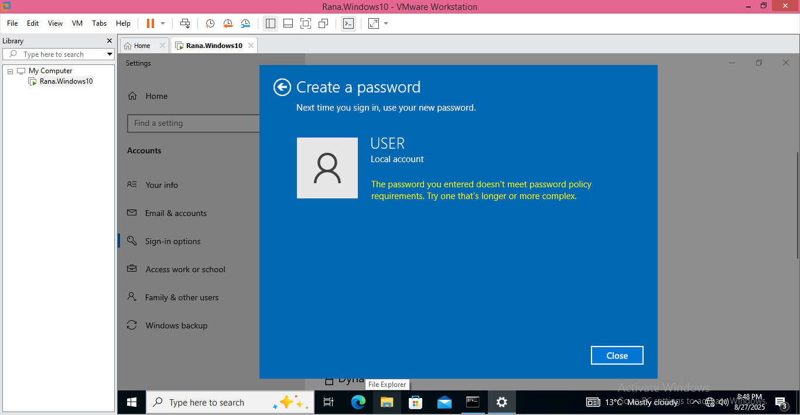
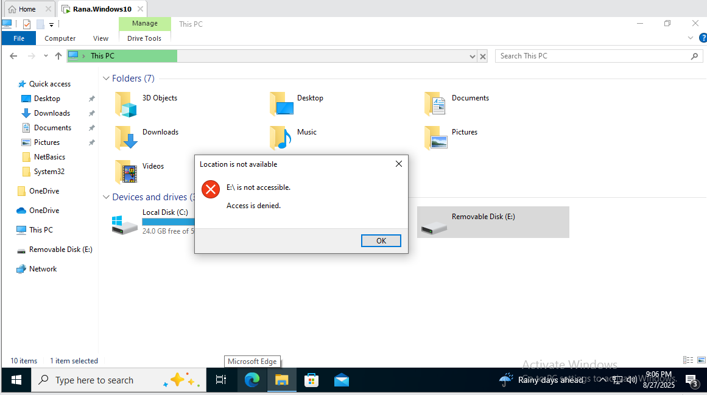

# Endpoint Hardening — Enforcing Password Complexity & Blocking USB Storage

| Field | Detail |
|---|---|
| **Ticket Subject** | Security request — stop weak passwords and USB data copying on a stand-alone workstation |
| **Category** | Security / Endpoint Hardening |
| **Priority** | P3 — Scheduled Change |
| **Environment** | Windows 10 VM (DESKTOP-9OPLHE7, build 19045) on VMware Workstation Pro — not domain-joined, so Local Group Policy is the control point. Completed 27 Aug 2025 |

---

## Problem Statement

After a security review, management raised two risks on a stand-alone workstation that holds business data:

1. **Weak passwords** — users can set short, simple passwords that are easy to guess.
2. **Data leaving on USB drives** — anyone can plug in a USB stick and copy files off the machine.

The machine is not joined to a domain, so there is no central Group Policy to push settings from. The task is to enforce both controls with **Local Group Policy**, apply them immediately, and **prove** each one works by testing it the way a user would.

---

## Tools Used

- **Local Group Policy Editor** (gpedit.msc — password policy and removable storage settings)
- **gpupdate** (`gpupdate /force` — apply policy immediately)
- **Windows Settings** (Accounts → Sign-in options — password policy test)
- **File Explorer** (USB storage test)

---

## Technical Steps

### Control 1 — Stronger Passwords

### 1. Require Complex Passwords

Opened **gpedit.msc** and went to **Computer Configuration → Windows Settings → Security Settings → Account Policies → Password Policy**. Set **Password must meet complexity requirements** to **Enabled** — passwords must now contain characters from at least three of: uppercase, lowercase, numbers and symbols, and must not contain the user's account name.

**Screenshot:**


---

### 2. Set a Minimum Length

In the same location, set **Minimum password length** to **8 characters**.

**Screenshot:**


---

### 3. Review the Resulting Password Policy

The Password Policy node now shows **Minimum password length: 8 characters** and **Password must meet complexity requirements: Enabled**. Reviewing the whole policy also shows what is still *not* enforced — **Enforce password history: 0 passwords remembered** — noted as a follow-up recommendation below.

**Screenshot:**


---

### Control 2 — Block USB Storage

### 4. Deny All Removable Storage

Went to **Computer Configuration → Administrative Templates → System → Removable Storage Access** and enabled **All Removable Storage classes: Deny all access**. This blocks reading from and writing to USB drives and other removable media, while leaving USB keyboards, mice and other non-storage devices working.

**Screenshot:**


---

### 5. Confirm the Setting

The Removable Storage Access list confirms the policy state is **Enabled**.

**Screenshot:**


---

### Apply and Verify

### 6. Apply the Policy Immediately

Ran `gpupdate /force` instead of waiting for the next background refresh or reboot:

```bat
gpupdate /force
```

Output: **"Computer Policy update has completed successfully. User Policy update has completed successfully."**

**Screenshot:**


---

### 7. Test Control 1 — Try to Set a Weak Password

Signed in as the local account **USER** and tried to change the password to a short, simple one in **Settings → Accounts → Sign-in options**. Windows refused: **"The password you entered doesn't meet password policy requirements. Try one that's longer or more complex."**

**Screenshot:**


---

### 8. Test Control 2 — Plug In a USB Drive

Connected a USB drive. It appeared in File Explorer as **Removable Disk (E:)**, but opening it returned **"E:\ is not accessible. Access is denied."** The device is detected, but its contents cannot be read or written.

**Screenshot:**


---

## Verification Summary

| Control | Setting | Test | Result |
|---|---|---|---|
| Password complexity | Complexity **Enabled**, minimum length **8** | Set a weak password as USER | ❌ Rejected — policy working |
| USB storage | All Removable Storage classes: **Deny all access** | Open a USB drive | ❌ Access denied — policy working |

---

## Recommendations (Follow-Up)

Step 3 showed that the password policy still has gaps, and one related control was outside this request. I would raise them with the requester rather than silently widen the approved change:

- **Enforce password history** (currently 0 passwords remembered) so users cannot immediately reuse an old password.
- **Account lockout policy** (Account Policies → Account Lockout Policy) to lock an account after repeated failed sign-ins, slowing down password guessing.

---

## Key Takeaways

- **A policy isn't done until it is tested.** Applying a setting proves nothing; failing a weak password and being denied a USB drive proves the controls work, from the user's side.
- **`gpupdate /force` saves waiting.** It applies policy immediately, so the change can be verified while the technician is still on the ticket.
- **Block the risk, not the hardware.** Denying removable *storage* stops data copying without breaking USB keyboards or mice — a blunt "disable USB ports" approach would create new tickets.
- **Local policy is the stand-alone answer; domain GPO is the scalable one.** The same settings exist in Active Directory Group Policy, where one GPO applies to every machine in an OU (see the Active Directory GPO lab in this portfolio).

---

## Skills Demonstrated

`Local Group Policy (gpedit.msc)` · `Password Policy` · `Removable Storage Control` · `Endpoint Hardening` · `gpupdate` · `Security Testing & Verification`
